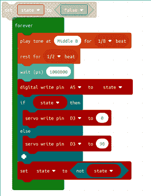

# 微软变得对黑客友好

> 原文：<https://hackaday.com/2018/01/20/microsoft-gets-hacker-friendly/>

你不会经常听到黑客说微软很多好话。当然，你可能会使用 Windows，尤其是当你有一份令人尴尬的日常工作时。但是晚上在一个黑客的秘密实验室里，你很可能会发现一些看起来更像 Unix 的东西，即使它的标签上有一只企鹅，一片水果，甚至是一个绿色的机器人。但我们会给予微软信任。他们新的 MakeCode 网站对教育工作者、学生和任何想学习如何编码的人来说都是一大福音。更重要的是，他们加入了许多熟悉的黑客面孔，包括 AdaFruit，Sparkfun 和 Seeed Studios。

这个想法是有教程，如果这就是它的全部，这将是一个简短的帖子。但该网站真正有趣的是，所有硬件都有基于网络的模拟器，所以你可以在浏览器中做项目，而不需要额外的硬件。你也可以从头开始做自己的项目。

这可能会让一些人感到沮丧，但是默认的界面是用于块语言的，在这里你可以拖动项目。但是如果你对此感到困扰，你可以随时点击 Javascript 按钮。你甚至可以来回切换。例如，这里有一个小的假雷达伺服系统，配有一个闪烁的灯和一个嘟嘟声:

[](https://hackaday.com/wp-content/uploads/2018/01/ms.png)

Javascript 中也是如此:

```
let state = false
loops.forever(function () {
 music.playTone(494, music.beat(BeatFraction.Eighth))
 music.rest(music.beat(BeatFraction.Half))
 control.waitMicros(1000000)
 pins.A5.digitalWrite(state)
 if (state) {
 pins.D3.servoWrite(0)
 } else {
 pins.D3.servoWrite(90)
 }
 state = !(state)
})

```

当你创建一个像伺服系统、LED 或温度传感器这样的东西时，模拟器会自动为你连接一个。您也可以下载目标板的代码。现在你可以使用 micro:bit、Adafruit 板、Seeed Grove Zero 或 Sparkfun Inventor 工具包。还有《我的世界》，赤壁芯片，和线索，如果你觉得冒险。

这些块还不错，Javascript 编辑器实际上相当复杂。如果你对块编码有 bug，可以用它试试 [3D 建模](https://hackaday.com/2015/10/10/scratch-your-itch-for-3d-modeling-with-beetleblocks/)。如果你喜欢的话，你甚至可以用这种方式给树莓派编程。