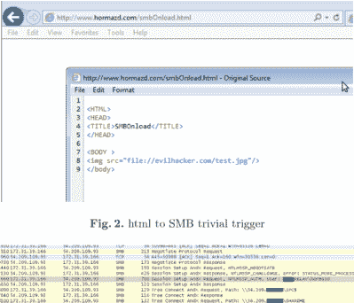

# Windows 8 及更高版本的 Microsoft Live 帐户凭据泄露

> 原文：<https://hackaday.com/2016/08/02/microsoft-live-account-credentials-leaking-from-windows-8-and-above/>

亚伦·斯潘格勒在 1997 年发现的 *WinNT/Win95 自动认证漏洞* ( [IE Bug #4](http://insecure.org/sploits/winnt.automatic.authentication.html) )无疑是一个极好的例子。在 Windows 8 和 10 中，现在发现同样的错误可能会[泄露用户的微软 Live 帐户登录和(哈希)密码信息](https://www.perfect-privacy.com/blog/2016/08/01/security-issue-in-windows-leaks-login-data/)，这些信息也被用于访问 OneDrive、Outlook、Office、Mobile、Bing、Xbox Live、MSN 和 Skype(如果与微软帐户一起使用)。

该 bug 本身似乎存在于 Windows 95 / NT 以来的所有 Windows 系统中，虽然只有 Windows 8 及以上版本被有效攻破。要想知道你的机器是否受到了影响，你可能需要查看漏洞利用的[公开演示，它是由来自【完美隐私】的家伙基于【ValdikSS】](https://msleak.perfect-privacy.com/)[原著](https://medium.com/@ValdikSS/deanonymizing-windows-users-and-capturing-microsoft-and-vpn-accounts-f7e53fe73834)创建的。

The exploit as demonstrated by Xiaoran Wang et al. in the [white paper](https://www.blackhat.com/docs/us-15/materials/us-15-Brossard-SMBv2-Sharing-More-Than-Just-Your-Files-wp.pdf).

基本上，Edge/Spartan(也是 Internet Explorer，Outlook)的默认*用户验证设置*允许浏览器连接到本地网络共享，但错误地无法阻止连接到远程共享。为了利用这一点，攻击者只需建立一个网络共享。然后，指向该网络共享的嵌入图像链接被发送给受害者，例如作为电子邮件或网站的一部分。一旦在 Edge/Spartan、Internet Explorer 或 Outlook 等微软产品中查看了准备好的内容，该软件就会尝试连接到该共享，以便下载图像。这样，它会以明文形式将用户的 Windows 登录用户名连同登录密码的 NTLMv2 哈希一起悄悄地发送到攻击者的网络共享。

尽管最初的问题存在，而且 20 多年前就已为人所知，但其严重性只是在最近才显现出来。回到 1997 年，攻击者只会获得你的本地 Windows 登录数据，但在 Windows 10 中，默认的登录方式是用户的 Microsoft Live 帐户。攻击者可能不得不求助于 GPU 辅助的哈希破解来从 NTLMv2 哈希([或者甚至不是](http://openwall.info/wiki/john/NTLM))中检索密码，但结果可能会彻底破坏，包括上述微软服务甚至远程访问。

为了缓解，使用防火墙，加强您的 Microsoft Live 帐户密码，并避免使用 Edge/Spartan、Internet Explorer 等 Microsoft 产品(只是说..)和 Outlook，以及通过 IPSec 的 VPN 连接，它们可能以同样的方式泄漏 VPN 凭据。火狐和 Chrome 不受影响。