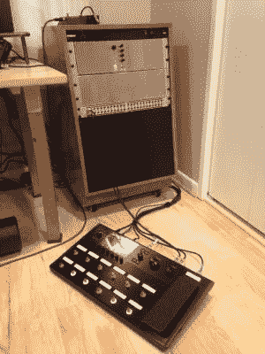

# MIDI 吉他踏板

> 原文：<https://hackaday.com/2016/11/20/midi-guitar-pedals/>

自从吉米·亨德里克斯将吉他失真带到摇滚乐的前沿，控制失真的踏板几乎成了每个吉他手的标准装备。现在，每种效果都有单独的模拟踏板，甚至有内置效果库的数字踏板。失真只是许多效果中的一种，如果你已经为其中的每一种制作了自己的踏板，你可能最终会得到类似于[Brian]: [一个模块化的吉他踏板架](http://m.imgur.com/a/7Qdp2)。

从模块化合成器中获得灵感，[Brian]用木头做了一个架子来放置踏板模块。机架使用 16U 机架导轨作为标准，带有 3U Eurorack 支架。看起来有足够的空间将 16 个定制的效果踏板放入架子中，并且[Brian]可以用脚踏开关随意切换它们。一切都与 MIDI 捆绑在一起，并以 Helix 编程。最终的结果看起来非常完美，并帮助[Brian]消除了他的老鼠窝电缆，这些电缆在他建造他的效果架之前到处都是。

MIDI 对于音乐家来说是一个非常有用的协议，尽管从 80 年代就已经存在，但没有任何放缓的迹象。如果你想自己进入其中，有各种各样的方法可以探索录音室空间，[即使你演奏的乐器通常不使用 MIDI](http://hackaday.com/2016/11/06/touchless-midi-the-secrets-in-the-mitten/) 。