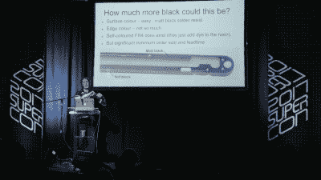
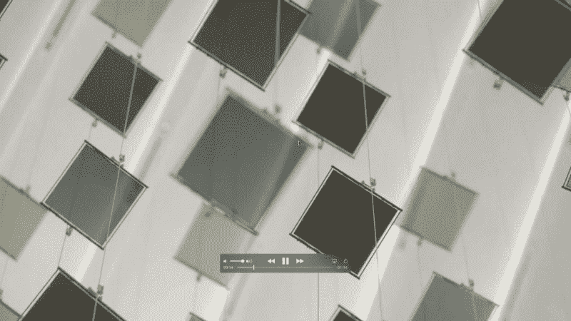

# 麦克·哈里森在超级会议上:飞行的液晶像素

> 原文：<https://hackaday.com/2017/12/11/mike-harrison-at-the-superconference-flying-lcd-pixels/>

迈克·哈里森(Mike Harrison)可能更为我们所知的是 YouTube 频道 mikeselectricstuff 的名义迈克，他是一名硬件黑客天才。他是今年超级大会徽章背后的人，他的攻击和破坏已经多次登上我们的页面。迈克最棒的一点是，他的日常工作是为大型艺术装置设计酷毙了的一次性硬件。他的顾客大部分是艺术家，这意味着只要技术能用，他们就不在乎。因此，当他和一群志同道合的黑客聚在一起时，他有许多被压抑的技术细节，他必须要说出来。我们的收获。

他最近在做一些液晶显示器的安装工作。虽然技术完全相同，但他没有使用我们都知道并喜欢的标准 LCD 计算器显示器，而是使用大约 4”平方的单像素。他的超级会议演讲深入到幕后的聪明之处，这些聪明使得一件艺术作品成为可能，这件作品需要数百个这样的东西，用细电线悬挂在半空中，一起工作来模拟一群鸟。你真的想看这个演讲。

 [https://www.youtube.com/embed/veEOLjxcWfg?version=3&rel=1&showsearch=0&showinfo=1&iv_load_policy=1&fs=1&hl=en-US&autohide=2&start=53&wmode=transparent](https://www.youtube.com/embed/veEOLjxcWfg?version=3&rel=1&showsearch=0&showinfo=1&iv_load_policy=1&fs=1&hl=en-US&autohide=2&start=53&wmode=transparent) 

 你看了《谈话》吗？Mike 分享的我最喜欢的机械技巧是他将液晶显示器夹在两个 PCB 之间的方式——用 1.6 毫米的铣刀在它们之间磨出一条弯曲的路径，以紧紧地夹住 1 毫米厚的液晶显示器玻璃。得到一个黑色的 PCB 是很容易的，但是你如何得到黑色的 FR4 呢？嗯，你可以花大价钱定制它，或者你可以用(等着瞧)黑色记号笔。

如果你以前从未玩过液晶显示器，请向上滚动并观看演讲，因为他还提供了大量关于这样做的电气要求的细节。LCD 面板需要交流驱动，对于单边供电的 IC 来说，这意味着以某种方式反转驱动方向。Mike 能够使用带有 PWM 和反向 PWM 信号的简单微控制器来产生“AC ”,并在 LCD 像素上实现漂亮的灰度。我打赌你的计算器不会这么做。(但有可能！)

设计的许多细节都是由这些像素需要“漂浮”在半空中这一事实驱动的。为了达到这种效果，它们被悬挂在两根不锈钢线上，数据和电力通过相同的线路传输。由于电线长达五米，Mike 担心发送的数据会从这些无意的天线辐射出去，还会受到干扰。20 千赫曼彻斯特编码传送数据。这是一个胜利，因为它保证了正脉冲之间的最大可能时间长度，这很重要，因为这些脉冲使器件保持供电。由此产生的电路是经过深思熟虑的，每个部分对它的成功都是至关重要的，是一个美丽的景观。

安装这样一个大规模的作品可能是一场后勤噩梦。这不是迈克的第一次竞技表演。他设计了一些功能，如从安装人员的有利位置可以看到的电源和数据 OK LEDs，使人们可以一目了然地对每排液晶显示器进行单独故障诊断。

 其中最深刻的一个技巧是 Mike 如何将每个面板的设备 ID 映射到需要知道它们物理位置的控制器中。要做到这一点，最难的方法是对一号器件编程，挂起它，对二号器件编程，挂起它，然后重复。简直是记账噩梦。取而代之的是，安装者按下单个设备上的“按钮”,控制器将地址发送到总线上，设备将该地址视为自己的地址。这意味着地址可以在一切就绪后*分配，这也使得替换变得轻而易举。但是这个系统真正的优点是“按钮”——一个触觉开关、磁传感器、光传感器——你可以使用节点上的任何输入。迈克建造了一个已经内置加速度计的装置，并点击每个节点来锁定入侵检测系统。*

在这里，这些都不是每个面板上的最小硬件和设置的高空中本质的良好匹配。Mike 想要一个可以部署在杆子末端的系统，但不需要电接触，这意味着类似电容传感。他没有依靠手指微小的电容变化，而是在一根棍子上安装了一个 CCFL 逆变器，LCD 面板检测产生的电场。最后一点是，控制器可以感知每个节点使用的电流，因此 LCD 像素可以发出信号，表明它已经收到了新的 ID，整个过程可以以有人可以在面板上挥动魔杖的速度进行。非常圆滑。

听 Mike 讲述他真正感兴趣的东西——硬件问题的巧妙解决方案，总是一种享受。每次我都能学到新的有用的东西。