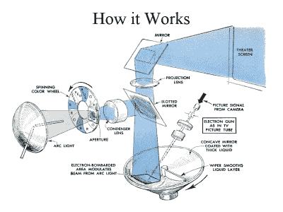
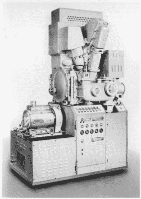

# 迈克·哈里森揭露古代直播放映机的热油和高压

> 原文：<https://hackaday.com/2016/04/19/mike-harrison-exposes-hot-oil-and-high-voltage-of-ancient-live-projector/>

令人惊讶的是，一个技术支点将会如此迅速地抹去曾经是现代奇迹的东西。一个很好的例子就是被称为 Eidophor 的实况视频投影技术。起初有胶片，如果你用一束光穿过胶片，再用一组镜头，你就可以投射出一个图像供所有人欣赏。但是如果你不想等待胶卷被冲洗出来呢？如果你想为一屋子人放映现场视频或实时数据，而这些人连当时最大的阴极射线管都无法接收到，那该怎么办？这个问题导致了 Eidophor 的发展，Eidophor 的故事几乎已经失传。

Mike Harrison 试图重现这一惊人工程壮举的细节，并在 [Hackaday | Belgrade](http://hackaday.io/belgrade) 会议上展示了他的发现。Mike 对“不切实际的、荒谬的、荒谬的或昂贵的”技术感兴趣，Eidophor 无疑符合所有这些条件。看看下面的内容，休息后加入我们，我们将触及基于热油和高压开发投影技术的无数挑战。

 [https://www.youtube.com/embed/3-BvMcqEc98?version=3&rel=1&showsearch=0&showinfo=1&iv_load_policy=1&fs=1&hl=en-US&autohide=2&wmode=transparent](https://www.youtube.com/embed/3-BvMcqEc98?version=3&rel=1&showsearch=0&showinfo=1&iv_load_policy=1&fs=1&hl=en-US&autohide=2&wmode=transparent)

如果我们已经有了阴极射线管，为什么不用其中的一个作为投影仪系统的光源呢？答案是，你无法从阴极射线管获得足够的光来实现这一点。为这种方法所做的尝试在非常高的电压下驱动它们，发出 X 射线，这意味着需要铅屏蔽，对组件的任何轻微错误处理都会立即烧毁系统。一个根本不同的解决方案是必要的，这将是 Eidophor。使用 Eidophor 的一些例子包括 1962 年约翰·格里恩在轨道上的广播，1969 年 NASA 任务控制中心的一些屏幕，以及 20 世纪 70 年代的拳击广播

 由弗里茨·菲舍尔博士在第二次世界大战前开始研制。该系统的要点是基于一个抛物面镜，它将光线聚焦在一个狭缝镜上。然后，光路在另一面涂有薄薄一层油的镜子上反射，并通过开槽的镜子回到投影光学系统。系统的静态状态不允许光线通过。然而，如果第三个反射镜上的油膜受到干扰，它会稍微改变光线的方向，让光线通过开槽反射镜。为了投射图像，油膜被经过其表面的电子束扰动。在这一点上，任何对这些原则有基本了解的人都会认识到这是一个难以置信的复杂系统，要可靠地工作。

给油膜充电，使其刚好达到所需的强度，这是一个相当大的技巧。最成功的方法是改变电子束通过表面的速度——或速度调制，表面扰动越小，速度越快，扰动越大，速度越慢。随着时间的推移，薄膜会积聚电荷，因此油需要“更新”。因此，当一个擦拭器将它重新分布在一个均匀的层中时(大概是厚度和电荷)，这个镜子旋转得有些慢。

 迈克很好地解释了保持 Eidophor 正常工作所面临的挑战。它在真空下运行，但不是完全密封的，所以它要么需要几个小时才能达到工作真空，要么必须一直开着。油膜对振动非常敏感，所以它需要又大又重。驱动这些的灯丝是特殊化的，在使用了大约 50 个小时后经常烧坏。看这个，结果是 2%的光效率；98%产生的光从未到达屏幕！

液晶投影仪的出现彻底扼杀了 Eidophor。由于成本和复杂性，它的使用已经受到限制。通过液晶显示器照射光线并以电子方式切换画面的能力是简化过程中的一次飞跃，也是第一次向大众开放现场视频广播。但是早期技术中的工程学非常值得庆祝。迈克正在寻找工程手册上的任何线索，或者幸存的 Eidophors 的位置。如果你能在这方面或其他方面提供帮助，请在下面的评论中告诉我们。

如果你想看更多 Mike Harrison 的作品，可以查看他的 YouTube 频道、[mikeselectricsuff](https://www.youtube.com/channel/UCcs0ZkP_as4PpHDhFcmCHyA)、他的[网页](https://www.google.com/url?sa=t&rct=j&q=&esrc=s&source=web&cd=7&cad=rja&uact=8&ved=0ahUKEwiimeqpgZvMAhWIZCYKHUa8COsQFgg4MAY&url=http%3A%2F%2Fwww.electricstuff.co.uk%2F&usg=AFQjCNEzJPcE25F81P4-Pm115cEgUGhKWA)，关注[@ mikelectricstuff](https://twitter.com/mikelectricstuf)。