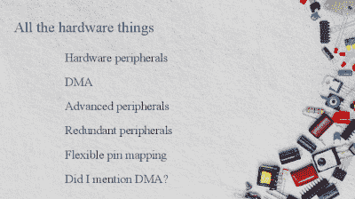

# Mike Szczys 结束 8 位 Vs 32 位圣战！

> 原文：<https://hackaday.com/2016/05/11/mike-szczys-ends-8-bit-vs-32-bit-holy-war/>

如果你通读了 Hackaday 上的评论，你无疑已经感受到了我们经典的火焰战争之一的火焰。任何用 32 位芯片完成的项目都可以在更小更便宜的芯片上完成，只要开发者不那么懒惰。任何从 8 位处理器中挤出最后一个性能周期的项目都可以用 32 位芯片来更快更合适地完成。

当然，任何给定项目的现实都介于这两个漫画极端之间。两个阵营都有一系列的能力。(当然，还有 16 位芯片……)32 位芯片往往拥有更丰富的外围设备，运行速度更快——你可以用 8 位芯片做的任何事情，都可以用它更好的表亲来完成。相反，相对而言，很少有微控制器应用能超越最便宜的 8-bitters。那么，选择哪个，什么时候？

## 八位是伟大的位

[迈克]为 8 位微控制器做的例子是，它是可控制的，因为它是一个有限的游戏场。因为缩短了很多，所以通过整个工具链要容易得多。就调试而言,(通常)出错的地方要少得多，让您先学习简单的调试课程，然后再学习真正的魔鬼课程。你可以理解硬件外设*，因为*它们是有限的。

然后是数据手册。像 Atmel ATMega168 这样的芯片的数据表大约有 660 页，不是你想打印出来的东西。但它是完整的。[Mike]与 STM32F405 形成对比，STM 32 f 405 的数据手册只有 200 页长，但这只是原则上的功能介绍。要真正了解寄存器，您需要查看长达 1731 页的编程手册。(这还不包括您可能想要使用的各种支持库，这会增加更多的文档负担。)重点是，越简单越简单。如果你正在开始，越简单越好。

 [https://www.youtube.com/embed/kz0yCrikZBE?version=3&rel=1&showsearch=0&showinfo=1&iv_load_policy=1&fs=1&hl=en-US&autohide=2&wmode=transparent](https://www.youtube.com/embed/kz0yCrikZBE?version=3&rel=1&showsearch=0&showinfo=1&iv_load_policy=1&fs=1&hl=en-US&autohide=2&wmode=transparent)

## 32 位规则！

不要误解他的讲话— [Mike]完全欣赏 32 位芯片的许多先进特性。他提到了 ARM 架构上的 set/reset 寄存器如何避免在 8 位上必须经历的读取-修改-写入循环。他提到了一个问题，他的旧手机屏幕需要 9 位 SPI 信号，这就排除了在他的 8 位微处理器上使用硬件 SPI 的可能性。该 STM32 芯片具有可配置的硬件 SPI，包括一个 9 位选项。

使用更简单、更小的芯片会遇到很多问题。对于其中的许多问题，在一个更好的芯片上有一个更简单的解决方案。但是知道你什么时候会遇到这些陷阱是最好的经验教训。在用完 UARTss 之前，你不会真正意识到拥有比你需要的更多的 UART 有多好。在你花足够的时间解决复杂的布局问题之前，灵活的引脚映射似乎是不必要的。简而言之，[迈克]学会了欣赏更大的芯片，因为当他需要时它们可以做什么。

一旦你知道如何使用，可用于编程 ARM 芯片的(相对)统一和复杂的工具链无疑是一个优势。将 JTAG 和真正的调试功能添加到项目中会让您的生活轻松很多。ARM 内核本身提供了一个单一的 CPU 基准，所有芯片生产商都可以根据自己的外设选择进行详细说明，减少了供应商锁定和重新学习的时间。试着在 PIC 和 AVR 之间来回移动，你就知道他的意思了。

## 圣战的终结？

[Mike]在结束 8 位与 32 位之争时，他说您需要学习这两种技术，因为只有这样，您才会明白哪种工具最适合这项工作。有时你需要一把圆锯，有时你需要一把手锯。从表面上看，它们都是可行的，但是在你熟悉这两种工具之前，你不能真正地理解不同的应用程序。

他以一个警世故事结尾，一个令人痛苦的熟悉故事。他为课堂演示设计了一个 POV 显示板，并为其配备了一个恰到好处的 8 位微控制器。PCB 制作完成并组装完成后，他开始编程，他意识到在所需的显示分辨率下，他将耗尽 RAM。可能有各种各样的修复、组装和变通办法，但如果他一开始就用一个更大的芯片，至少对于原型来说，他会有更多的余地进行实验。取而代之的是，他有一系列形状奇特、包铜的杯垫。

最后，[Mike]提出了一个简单的规则来决定是使用 8 位还是 32 位。如果你正在学习微控制器应用，并希望了解宇宙，你应该抓住一个 8 位芯片，因为它更容易充分探索其有限的可能性。但是如果你正在为一个(复杂的)项目制作原型，你不想被芯片的选择所限制。您希望解放您的思想，将注意力集中在系统作为一个整体的最大能力上。多花一点钱买一个功能太多的 32 位微控制器是值得的。一旦一切正常，你随时可以考虑削减开支。