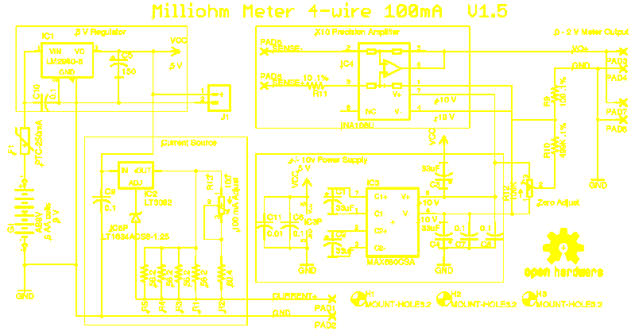

# 毫欧表版本 1.5

> 原文：<https://hackaday.com/2017/01/24/milliohm-meter-version-1-5/>

毫欧表是一种非常方便的测试设备。大多数手持万用表不能测量低电阻，而台式万用表通常非常昂贵。[barbouri]在他的博客上分享了他的毫欧计的细节，它看起来很不错。

当使用一对导线来测量非常低的欧姆时，测量导线的电阻和各个接头上的电压降会变得很大，足以使测量无效。解决方案是使用“[开尔文方法](https://en.wikipedia.org/wiki/Four-terminal_sensing)或 4 线测量。这包括将来自温度补偿恒流源的高度稳定的电流通过未知电阻，然后使用另一对导线测量电阻上的压降，然后在电压表上显示为电阻。

完成的项目不仅看起来不错，而且能够以 0.0001ω(即 0.1mΩ)的分辨率测量高达 2ω的电阻。该项目最初是由[Scullcom Hobby Electronics]的[Louis]设计的，[barbouri]的第二次迭代为原始项目添加了改进的电路板布局。

原理图本质上是四个定义明确的模块。一个 5 V 线性 LDO 调节器为整个电路供电。它从一组六节 AA 电池供电，串联一个保险丝用于过流保护。开关调节器或来自公用电源的功率可能会影响电流源的稳定性。恒流源围绕一个 [LT3092](http://cds.linear.com/docs/en/datasheet/3092fb.pdf) [pdf]构建，这是一个 200 mA 双端可编程电流源，经过调整可提供 100 mA 输出。通过使用 [LT1634](http://cds.linear.com/docs/en/datasheet/1634ff.pdf) [pdf]微功耗精密分流基准电压源，其精度得到进一步提高。该部分还需要精密、低漂移电阻来设置输出电流。[barbouri]花时间测量一批电阻，检查它们在两个不同温度下的值，然后选择漂移最低的一个。所有这些努力都意味着尽可能保持电流源的稳定。

当 100 mA 电流通过 0.1ω电阻时，电阻上的电压将为 0.01 V，显然，这需要放大 10 倍，才能在电压表上提供正确的电阻读数。这是通过 [INA106](http://www.ti.com/lit/ds/symlink/ina106.pdf) [pdf]实现的，它是一款精密差分放大器，配有激光调整电阻。INA106 的双电源利用 [MAX680](http://datasheets.maximintegrated.com/en/ds/MAX680-MAX681.pdf) [pdf]获得，这是一款双电荷泵电压转换器，从+5 V 输入提供 10 V 输出。

在他的博客上，[barbouri]分享了所有的设计文件，包括一个符合标准哈蒙德外壳的面板布局。最初的设计者[Louis]出色地解释了电路的工作原理，随后又制作了另一个视频，介绍了围绕[barbouri]电路板构建的更新版本。

 [https://www.youtube.com/embed/anE0jDeBuxo?version=3&rel=1&showsearch=0&showinfo=1&iv_load_policy=1&fs=1&hl=en-US&autohide=2&wmode=transparent](https://www.youtube.com/embed/anE0jDeBuxo?version=3&rel=1&showsearch=0&showinfo=1&iv_load_policy=1&fs=1&hl=en-US&autohide=2&wmode=transparent)

 [https://www.youtube.com/embed/y9gWZH9k_BQ?version=3&rel=1&showsearch=0&showinfo=1&iv_load_policy=1&fs=1&hl=en-US&autohide=2&wmode=transparent](https://www.youtube.com/embed/y9gWZH9k_BQ?version=3&rel=1&showsearch=0&showinfo=1&iv_load_policy=1&fs=1&hl=en-US&autohide=2&wmode=transparent)

