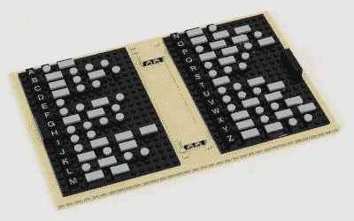

# 思维风暴莫尔斯键写给绘图机器人

> 原文：<https://hackaday.com/2017/07/13/mindstorms-morse-key-writes-to-drawbot/>

杰森·阿莱曼(Jason Allemann)制造了一台头脑风暴电报机(Mindstorms Telegraph Machine),它包含了如此之多的酷炫细节，简直让人爱不释手。

首先，它是一个能够写信的 drawbot，鉴于缺乏本地步进电机和 Mindstorms 的有限齿轮选择，这是一个困难的壮举。试图用伺服系统绘制字母通常会导致一些难看的字母。而 drawbot 是怎么知道写什么的呢？你用莫尔斯电码把它们编码进去。休息之后的第二个视频展示了[Jason]的设置。他有一个 Mindstorms 触摸传感器，上面附有一把乐高莫尔斯钥匙。他只需按一下键，EV3 智能砖就会解释他的点和破折号，并把它们翻译成字母。

接下来，[杰森]的打印机是用*一套* EV3 组装的。用你零件箱里的任何东西建造一个酷的 Mindstorms 机器人是一回事，但黄金标准是只用一套 EV3 就能建造一个项目。这样，任何人都可以建立这个项目。珍贵的几个*真正*酷的项目可以只用一套就能建成——【大卫·吉尔戴】的 [MindCub3r](http://mindcuber.com/) 魔方解算器想到了。伙计，这又是一个。

最后，[Jason]分解了如何构建它，在他的网站上提供了完整的 LDraw 构建步骤和 EV3 代码。更好的是，他展示了如何通过添加第二个 EV3 砖块来扩大项目规模，这可以通过蓝牙连接到 drawbot 的 EV3 砖块，并作为独立的 CW 密钥。他在第二个视频中展示了这一部分。

锦上添花的是，[杰森]甚至用 100%的乐高做了一本莫尔斯参考书。

Hackaday 喜欢创新的乐高项目，比如这个[游戏机器人](http://hackaday.com/2014/04/17/lego-robot-plays-games-for-you-as-you-sleep/)和这个[乐高外骨骼](http://hackaday.com/2015/08/09/lego-exoskeleton-controls-pacific-rim-robot/)。

 [https://www.youtube.com/embed/dHmgaLgFRGM?version=3&rel=1&showsearch=0&showinfo=1&iv_load_policy=1&fs=1&hl=en-US&autohide=2&wmode=transparent](https://www.youtube.com/embed/dHmgaLgFRGM?version=3&rel=1&showsearch=0&showinfo=1&iv_load_policy=1&fs=1&hl=en-US&autohide=2&wmode=transparent)

 [https://www.youtube.com/embed/dIgSKPzLC9g?version=3&rel=1&showsearch=0&showinfo=1&iv_load_policy=1&fs=1&hl=en-US&autohide=2&wmode=transparent](https://www.youtube.com/embed/dIgSKPzLC9g?version=3&rel=1&showsearch=0&showinfo=1&iv_load_policy=1&fs=1&hl=en-US&autohide=2&wmode=transparent)

经许可使用的图像。