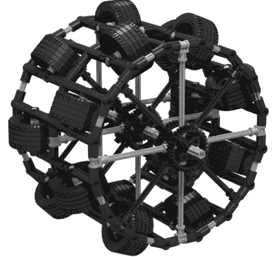

# 灵感来自真实足球机器人的思维风暴足球机器人

> 原文：<https://hackaday.com/2017/08/12/mindstorms-soccer-robot-inspired-by-real-soccer-robot/>

来自荷兰的 17 岁机器人迷[Bram]有机会观看由自主机器人进行的 RoboCup 足球比赛，并受到启发，为学校项目创作了自己的 Mindstorms 版本的机器人。

他创造的机器人直径约为 80 厘米，由四个菊花链 EV 砖控制。有九个大型电机用于控制轮子，两个大型电机用于抓球，两个中型电机用于投篮机构。它使用 Pixycam 进行球检测，只要球在 2.5 米以内，它就可以识别并向球移动。陀螺仪传感器确定机器人的旋转方向。

 我们最喜欢的机器人细节是它巨大的全向轮，由乐高元素构建而成。每一个都由 16 个 mind storms-标准轮组成，排列成一个圆圈，带有偏移的双排滚轮，以产生与 Mechanum 轮滚轮相同的角度效果。

这个故事有着更古怪的根源。[布拉姆]的机器人是基于乌龟，一个用来教大学生编程的足球机器人。像[布拉姆]的创造一样，他们也有全向轮，并通过 Kinect 和顶部的 360 度摄像头来观察周围的环境。海龟使用指南针传感器来区分自己的目标和对方的目标。

我们在过去报道过足球机器人，看一个机器人在人类守门员身上得分。

 [https://www.youtube.com/embed/kr34doWCjzU?version=3&rel=1&showsearch=0&showinfo=1&iv_load_policy=1&fs=1&hl=en-US&autohide=2&wmode=transparent](https://www.youtube.com/embed/kr34doWCjzU?version=3&rel=1&showsearch=0&showinfo=1&iv_load_policy=1&fs=1&hl=en-US&autohide=2&wmode=transparent)

[谢谢，汉斯！]