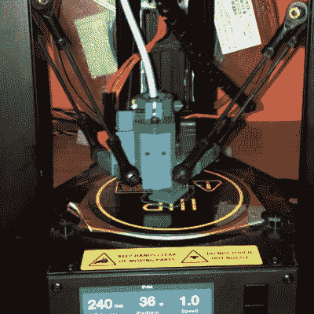

# 迷你德尔塔获得热端升级

> 原文：<https://hackaday.com/2017/08/23/mini-delta-gets-a-hot-end-upgrade/>

3D 打印机现在比以往任何时候都更便宜，而垄断是这一趋势的绝对前沿。然而，他们的一些打印机与柔性细丝斗争，如果你发现你对 Ninjaflex 及其类似物的材料属性有兴趣，这就没什么意思了。然而，不要担心——社区再次有了一个解决方案，形式是[一个用于 Monoprice Mini Delta](https://www.thingiverse.com/thing:2488711) 的热端适配器。

[Mini Delta 是 3D 打印领域的一款低成本产品](http://hackaday.com/2017/08/21/monoprice-mini-delta-review/)，但它的热端在挤出机和喷嘴之间有一个断点。这会导致柔性细丝不能被正确地引导通过热端，从而导致印刷失败。这种适配器允许安装流行的 E3D V6 热端，并类似于修改有其他单价打印机。

总的来说，3D 打印长期以来一直受益于社区的努力，为该技术带来了增量改进和重大飞跃。我们期待看到更多关于垄断范围的黑客攻击！