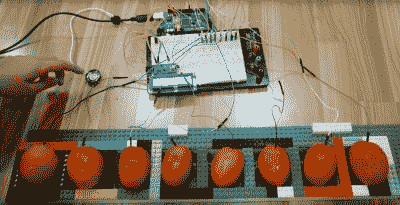
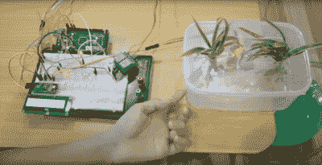
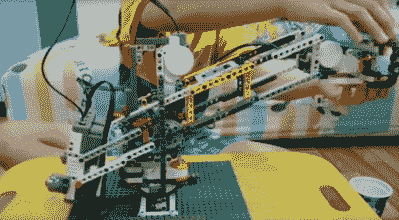

# 迷你黑客分解如何建立它

> 原文：<https://hackaday.com/2017/08/03/mini-hacker-breaks-down-how-to-build-it/>

前几天我读到，如今孩子们最热门的职业选择是:优步。这意味着每个孩子——是的，包括我的孩子——都会在他们的账户上尝试两三次 YouTube 节目，然后他们就会进入下一个大事件，然后忘记它。另一方面，有时你会发现有人有很多想法可以分享，并且乐于分享。

 【周世杰】，一个来自印尼的 11 岁男孩，在过去的几年里已经拍摄了大约 70 个视频，有[各种各样的古怪项目](https://www.youtube.com/user/KevinWilliamgZhou/videos)，从 Mindstorms 到 Arduino 到 wood shop 项目，甚至还有搅拌机教程。他的项目展示了许多复杂的、严肃的、真实世界的概念，他分享了关于项目中各种组件的技术细节，他还带你浏览了代码。

他制作了一台 [Mindstorms 雕刻机](https://www.youtube.com/watch?v=mA3Ag1vNquM&t=22s)，如上图所示，当用户用乐高积木块雕刻一块花卉泡沫时，它带有一个保持电机稳定的龙门架系统。他使用 Arduino 和继电器板以及一些抽水机器人做了很多家庭自动化项目。他不拘泥于一种媒介或技术。他有一把拼图，在一段视频中，他展示了如何用木头制作一把[雷神之锤](https://www.youtube.com/watch?v=sX24RZaAZIk)。他在办公用纸上打印出每一层的设计，然后把纸粘在一块木头上，在他的拼图上切出横截面。整个堆叠被粘在一起并被夹紧。[Kevin]的设计特点是内部有一个中空的空间以减轻重量，他用钻床在中心钻了一个 1 英寸的孔，然后用线锯刀片穿过这个孔来切割内部。作为一名业余木工，我喜欢看到他扩展到小型木材项目。

 【凯文】的[全自动饮水机](https://www.youtube.com/watch?v=k7YVYQjmYWU&t=169s)是包括几个植物浇水机器人在内的一系列抽水项目之一。[Kevin]使用继电器触发的泵和水位传感器，所有这些都在插入 1360 点试验板的 Arduino Mega 上运行。

他有很多共同的模块。他使用一个直接插入试验板的 LED 显示屏，它的背包也插入同一行，这样它就可以平放了。他摆弄着一个红外遥控器，以及一个由继电器驱动的 12 V / 5 A 珀尔帖热电冷却器。他有几个不同的继电器板，用于许多家庭自动化项目，包括一个相当复杂的安全系统[，具有 RFID 和键盘输入](https://www.youtube.com/watch?v=mfukwjpnjUY&t=86s)。

 还有许多乐高和 Mindstorms 项目，包括一个由智能手机应用程序控制的复杂的[机器人手臂](https://www.youtube.com/watch?v=jZW1cFveUf8)，以及一个技术光束分类器，它沿着传送带滚动光束，使较短的元件穿过较小的孔，而较长的元件继续落入较大的孔中。令我感兴趣的是，他做了几个项目，涉及混合 Arduinos 和 LEGO/Mindstorms，并经常使用建筑集来建造围栏和支撑结构。

我想你可能会说单个项目并没有那么有挑战性——例如，将中继板连接到 Arduino。所有这些部分单独运行都相当简单，但合在一起显示他已经为此工作了很长时间:70 个视频。DIY 安全系统与打开 LED 相差甚远。

此外，我喜欢[凯文]完成项目，然后即兴发挥的方式。他连续尝试了几个变体，进行了改变和改进。我只希望他继续建造——我无法想象 15 年后他会赚多少钱。

看看他的一些视频:

 [https://www.youtube.com/embed/mA3Ag1vNquM?version=3&rel=1&showsearch=0&showinfo=1&iv_load_policy=1&fs=1&hl=en-US&autohide=2&wmode=transparent](https://www.youtube.com/embed/mA3Ag1vNquM?version=3&rel=1&showsearch=0&showinfo=1&iv_load_policy=1&fs=1&hl=en-US&autohide=2&wmode=transparent)

 [https://www.youtube.com/embed/sX24RZaAZIk?version=3&rel=1&showsearch=0&showinfo=1&iv_load_policy=1&fs=1&hl=en-US&autohide=2&start=245&wmode=transparent](https://www.youtube.com/embed/sX24RZaAZIk?version=3&rel=1&showsearch=0&showinfo=1&iv_load_policy=1&fs=1&hl=en-US&autohide=2&start=245&wmode=transparent)

 [https://www.youtube.com/embed/bI9_hpsGCEI?version=3&rel=1&showsearch=0&showinfo=1&iv_load_policy=1&fs=1&hl=en-US&autohide=2&wmode=transparent](https://www.youtube.com/embed/bI9_hpsGCEI?version=3&rel=1&showsearch=0&showinfo=1&iv_load_policy=1&fs=1&hl=en-US&autohide=2&wmode=transparent)

