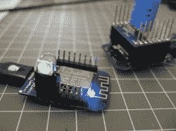
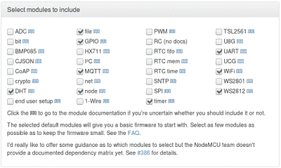
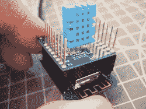
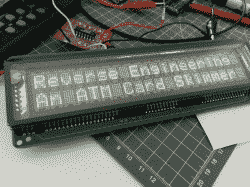

# 最小 MQTT:网络节点

> 原文：<https://hackaday.com/2016/05/17/minimal-mqtt-networked-nodes/>

[上一次在 Minimal MQTT](http://hackaday.com/2016/05/09/minimal-mqtt-building-a-broker/) 上，我们使用 Raspberry Pi 建立了一个 MQTT 代理——家庭数据网络的中心枢纽。现在是时候添加一些传感器和显示节点，让这个东西运行起来。所以，拿出你选择的 ESP-8266 模块，让我们开始吧。

[](https://hackaday.com/wp-content/uploads/2016/05/dscf8443.jpg) 对于硬件，我们使用的是 [WeMos D1 迷你](http://www.wemos.cc/Products/d1_mini.html)，因为它们真的很可爱，而且绝对便宜，但基本上任何 ESP 模块都可以。例如，你可以在最简单的 ESP-01 模块上做同样的事情，如果你有自己的 USB 串行适配器，并且[愿意跳线一些引脚以进入引导模式](http://www.benlo.com/esp8266/esp8266QuickStart.html)。如果你坚持要一个[有开心果](http://store.hackaday.com/products/huzzah)的豪华开发板，我们认识一些人。

## 节点 MCU:获取固件

我们使用 NodeMCU 固件，因为它运行起来既快又容易。但是如果您想单干的话，您不会被 NodeMCU 所束缚:MQTT 拥有广泛的支持。[TuanPM]通过 MQTT 库移植到[本机 ESP8266 SDK](https://github.com/tuanpmt/esp_mqtt)上，当然还有[espduino](https://github.com/tuanpmt/espduino)，这是 Arduino-plus-ESP 组合的一个端口。他还将 MQTT 模块移植到了我们今天将使用的 NodeMCU。谢谢，[TuanPM]！

[](https://hackaday.com/wp-content/uploads/2016/05/mqtt_options.png) 反正回到我们的故事。如果您还没有在至少一个 ESP8266 模块上尝试过 NodeMCU，那么您应该尝试一下。这是无痛的方法。前往 [NodeMCU 定制构建](http://nodemcu-build.com/index.php)，用你需要的模块为自己构建一个定制固件。在这里，我包括了 dht、file、gpio、mqtt、node、tmr、uart、wifi 和 ws2812。(我还在本系列的 [GitHub repo 中下载了这张图片](https://github.com/hexagon5un/hackaday_mqtt)。)

为了将 NodeMCU 固件上传到 ESP8266，我使用了 [esptool.py](https://github.com/themadinventor/esptool) ，它应该可以在 Python 运行的任何平台上工作。遵循`esptool` GitHub 上的说明，或者如果你以前做过这类事情，只需遵循`esptool.py --port /dev/ttyUSB0 --baud 57600 write_flash 0x00000 firmware.bin`即可。(Windows，使用`COMx`作为你的串口。Mac 的人用`/dev/cu.usbserial-whatever`。)如果你有一个没有 USB 闪存支持硬件的 ESP 模块，你可能必须在重启时将`GPIO0`拉至地——你可能有一个“闪存”按钮来做这件事。再一次，GitHub 上的说明应该能让你做好准备。

## NodeMCU:绕过

如果您以前从未使用过 NodeMCU，请不要担心。一开始有点混乱，因为许多函数是异步运行的。我们会在看代码的时候处理这个问题。除此之外，Lua 并不是一门难学的语言，你可以做得比在另一个浏览器标签中打开 Lua 中的[编程更糟。](http://www.lua.org/pil/contents.html)

NodeMCU 的酷功能是它通过一个交互式串行终端运行，所以如果你的 ESP 模块还没有板载 USB 串行转换器，插上一个 USB 串行转换器，以 9600 波特连接，你会收到一个友好的`>`提示。要在本地 WiFi 网络上注册该模块，请尝试:

```
wifi.setmode(wifi.STATION)
wifi.sta.config("ESSID","password")

```

等待大约十秒钟，你应该准备好了。键入`print(wifi.sta.getip())`确认一切正常。在我们完成之前，我们将上传一个脚本来自动完成这项工作，但从一开始就能看到事情是多么简单和交互，这很好。

## 节点 MCU 中的 MQTT

所以让我们在 NodeMCU 平台上获得一点 MQTT 的体验。[在线文档](http://nodemcu.readthedocs.io/en/dev/en/modules/mqtt/)非常好，所以请打开它继续学习。 [MQTT 库](http://nodemcu.readthedocs.io/en/dev/en/modules/mqtt/)以`mqtt.Client()`对象及其方法`connect()`、`publish()`、`subscribe()`和`close()`为中心。当您创建客户端时，您还可以注册一些回调函数，您希望在客户端连接、离线或接收消息时由某些事件触发，即`connect`、`offline`和`message`。

如果您已经从上一次开始设置了您的代理，让我们向它发送一些消息，并在代理上监视它们。在 Pi 上打开一个窗口，输入`mosquitto_sub -h localhost -v -t home/#`。

节点的 MQTT 客户机需要一个 ID、以秒为单位的保持活动时间、用户名和密码以及一个干净会话标志。连接到服务器可以像指定它的 IP 地址一样简单，发布需要通常的主题、消息、QoS 和保留标志。下面是一个简单的演示:

```
m = mqtt.Client("myNodeName", 120, "", "") -- blank user and password
m:connect("192.168.1.49") -- my local broker's IP
m:publish("home/test", "hi from node", 0, 0) -- no QoS, not retained

```

嘭！您第一个 MQTT 从 ESP8266 发布，只需要三行代码。通过添加一些回调函数，我们可以使它对用户友好，并开始接收 MQTT 数据。

```
m = mqtt.Client("myNode", 120, "", "") -- blank user and password
m:on("connect", function() print("connected") end )
m:on("message", function(client, topic, data) print(topic .. ": " .. data) end )
m:connect("192.168.1.49") -- my local broker's IP
m:subscribe("home/#", 0) -- no QoS

```

客户端代码持续监听消息或状态变化，并向`client:on()`函数发送适当的字符串，然后在指定事件发生时运行您的代码。这很像 Javascript 使用回调的方式，如果你曾经做过的话。

现在，如果您向代理发送一条消息，`mosquitto_pub -h localhost -m "heya" -t home/test`，您将看到它在节点的串行终端上打印出来。还有一点要说，但这是要点。您可以在 ESP8266 上获得发布和订阅功能。如果你想在更大的互联网上订阅或发布数据，没有什么可以阻止你。(尽管注意你发送给`test.mosquitto.org`的所有东西默认都是公开的。)

```
m:close() 
m:connect("test.mosquitto.org") 
m:subscribe("hackaday/#", 0)
m:publish("hackaday/mychannel", "your message here!", 0, 0)

```

让我们把这个基础变成一个现实的双节点家庭自动化例子。

## 传感器节点

我使用的 WeMos 模块有 DHT-11 和 DHT-22 屏蔽可用。传感器连接到 NodeMCU 引脚`D4`，该引脚在 ESP8266 数据手册中为`GPIO2`。使用 DHT 单元的 [NodeMCU DHT 库文档](http://nodemcu.readthedocs.io/en/dev/en/modules/dht/)短小精悍，只有一个你会关心的功能`dht.read()`。

无论如何，如果你有一个 DHT-11 或类似的连接到 NodeMCU 引脚`D4` (ESP `GPIO2`)上，它应该就能工作。`print(dht.read(4))`返回五个值:`status, temp, humidity, temp_decimal, humidity_decimal`。验证这一点，你就设置好了。您可以将它包装在一个函数中，如下所示:

```
temp = 20
function updateTemp()
    status, temp, humid, temp_dec, humid_dec = dht.read(4) 
end

```

如果你没有温度传感器，但你想玩，你可以在短时间内编写一个随机漫步温度模拟器。

```
temp = 20
function updateTemp()
    temp = temp + math.random(3) - 2
end

```

输入几次`print(updateTemp())`来验证它是否工作。

所以，不管是真的还是假的，我们已经把温度数据存储在一个变量里了。我们已经知道如何设置 MQTT 客户机并向给定主题发布数据。还剩下什么？确保每隔几秒钟发生一次，并将所有内容打包到一个文件中上传到节点。

### 倍

如上所述，NodeMCU 异步运行许多命令。这意味着我们不能像在 C 或 C++中经常做的那样，只写“这样做，等待返回值，然后那样做”的代码，因为第一个函数不会阻塞。一切几乎同时发生。这样做的好处是我们调用`m:subscribe()`，它只是在后台运行。缺点是，当我们不希望所有事情都同时发生时，我们需要一个[计时器。](http://nodemcu.readthedocs.io/en/dev/en/modules/tmr/)

假设我们希望每十秒发布一次传感器的温度。我们设置一个十秒钟的重复计时器，调用我们的发布函数，我们就完成了。定时器命令一调用就运行，但是定时器*包含*的函数只是周期性调用。让我们来测试一下。

```
-- assumes MQTT client setup and connection
function post_temp()
    updateTemp()
    m:publish("home/outdoors/temperature", temp, 0, 1)
end
tmr.alarm(0, 10*1000, tmr.ALARM_AUTO, post_temp)

```

现在，您应该看到当前温度(真实的或想象的)每十秒钟显示在您的代理上。我还为温度报告设置了“retain”位，因为您可能只想每隔几分钟报告一次室温，但是当您与客户端连接时，您会希望不用等待就能看到最后一个值。(请注意，计时器是以毫秒为单位设置的，因此要乘以一千。)

## 不显示

[](https://hackaday.com/wp-content/uploads/2016/05/dscf8448.jpg) 在下一篇文章中，我们将讨论数据记录和绘图以及各种各样奇特的服务器端东西。现在，让我们制作一个快速的装置，让我们在人体尺度上测量外部温度，用颜色编码:蓝色是冷的，绿色是活泼的，黄色是温暖的，红色是热的。为此，我们将一个 WS2812B LED 连接到另一个 ESP8266 节点，从代理读取温度并显示出来。

显示节点实际上没有太多需要添加的内容。我们已经知道了如何订阅主题并在数据到来时接收数据。剩下的只是一个显示函数，并将其与接收消息操作挂钩。在`mqtt_display_node.lua`中有一个充实的版本，但是这里有一些重要的部分:

```
function display_temp(data)
    data = tonumber(data)
    r = math.min(2*math.max(data-20, 0), 40)
    b = math.max(40-2*data, 0)
    g = 20 - math.min(math.abs(20 - data), 20)
    ws2812.writergb(ws2812b_pin, string.char(r, g, b))
end

m:on("message", 
    function(client, topic, data) 
        display_temp(data) 
    end
)

```

[](https://hackaday.com/wp-content/uploads/2016/05/ws2812_dongle.png)

WS2812 soldered to a female header

[写出一个 WS2812 像素](http://nodemcu.readthedocs.io/en/dev/en/modules/ws2812/)(或链)就像用一个字符串调用`ws2812.writergb()`一样简单，这个字符串对应于你想要为链中的每个像素设置的 RGB 数据。这里，我们只是设置一个。否则，该参数将类似于`string.char(r1, g1, b1, r2, g2, b2, ... )`。

这就是显示节点。

## 上传代码

直接在节点中键入代码显然不行。我们需要在设备上存储我们的代码。NodeMCU 有一个模拟的文件系统，我们可以用它来上传我们的代码。您可以使用`dofile("filename")`命令手动调用这些文件，但是您也可以利用系统在重启时自动运行一个名为`init.lua`的文件来启动所有程序。我的初始化文件通常会设置我的 WiFi 配置，等到它连接上，然后开始运行让设备做它所做的事情的代码。(GitHub 中的例子。)

把你的 Lua 源文件放到 ESP8266 上最好是通过使用[上传工具](http://nodemcu.readthedocs.io/en/dev/en/upload/)来完成，它本质上只是通过串行线把它们打出来。我自己使用 [nodemcu-uploader.py](https://github.com/kmpm/nodemcu-uploader) ，因为它可以很好地与任何编辑器和命令行构建环境一起工作。您将在串行控制台中的节点上尝试一些东西，并在文件中写下哪些东西有效。偶尔，你会把这个文件上传到设备上，也许重启它，调试，然后重复。这可能有点笨拙，所以我们可以看到像[探索者](http://esp8266.ru/esplorer/)这样更集成的东西的吸引力。尝试一下，看看什么适合你。

## 包裹

[](https://hackaday.com/wp-content/uploads/2016/05/img_20160503_131026.jpg) 目前就这么多，但也不少。您有一个正在运行的中央家庭服务器，一个温度(和湿度)记录节点连接到它，另一个节点提取温度并在 RGB LED 上显示。有一百万种方法来解释这个简单的系统。运动传感器、光传感器和继电器(或 SSR)驱动器可以推出完整的家庭自动化解决方案。如果你的桌面上还没有新的黑客文章通知程序，你可能需要一个。

下一次，我们将研究运行在我们上次设置的 Raspberry Pi 代理上的服务器端扩展:它为我们提供数据记录、网页和天气预报。接下来，作为最后一部分，我们将处理一些(酷的)细节，比如将你的手机和其他人类控制连接到整个系统中，并考虑一点安全问题。