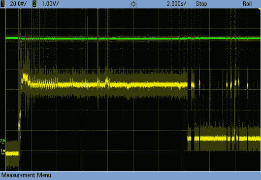
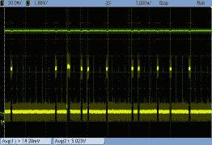
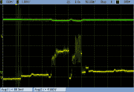
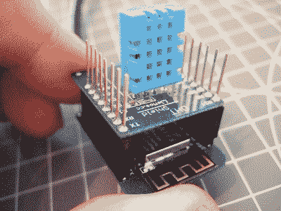
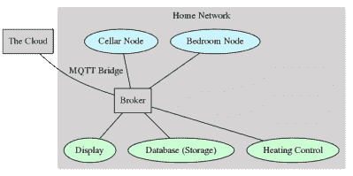

# 最小 MQTT:权力和隐私

> 原文：<https://hackaday.com/2016/06/02/minimal-mqtt-power-and-privacy/>

在这一期的 Minimal MQTT 中，我将讨论两个细节:一个在传感器节点端，另一个在 MQTT 服务器端。具体来说，我将处理 NodeMCU 的睡眠模式以降低功耗，并引导您通过桥接 MQTT 服务器将您的数据安全地从您的家庭服务器转移到“云”中，这实际上只是其他人的服务器。

如果你现在刚刚进入这个系列，你真的应该看看其他三篇文章，我[建立了一个服务器](http://hackaday.com/2016/05/09/minimal-mqtt-building-a-broker/)，然后[建立了一些传感器节点](http://hackaday.com/2016/05/17/minimal-mqtt-networked-nodes/)，然后[用一些方法从你的手机或网络控制一切](http://hackaday.com/2016/05/27/minimal-mqtt-control-and-clients/)。不管怎样，这是最酷的材料。这最后一部分只是完善了我们已经建立的东西。我们走吧！

## 使用更少的功率

ESP8266 的单位是真棒。他们在一个带 WiFi 的小盒子里装了相当多的计算能力。这让一切变得简单。一切，除了电池供电的使用，也就是说。如果不花些力气去驯服它，ESP8266 就是一个耗电大户。

让我们快速量化一下。我已经通过一个大约 1 欧姆的电阻将 ESP8266 连接到我的电源，并正在测量它两端的电压；示波器上的每毫伏都是通过静电除尘器的毫安电流。第一个示波器截图显示了启动期间的高电流消耗，第二个放大了待机模式，第三个显示了再次启动，电压刻度缩小，以便您可以看到近 350 mA 的峰值。

 [](https://hackaday.com/2016/06/02/minimal-mqtt-power-and-privacy/scope_29/) ESP Draws a Lot on Startup [](https://hackaday.com/2016/06/02/minimal-mqtt-power-and-privacy/scope_31/) And Less During Operation [](https://hackaday.com/2016/06/02/minimal-mqtt-power-and-privacy/scope_33/) The Peak Current Can Be High

当使用 WiFi 时，我桌上的 ESP8266 从 5 V 电源中消耗大约恒定的 70 mA 电流。(正如许多人已经注意到的那样，它偶尔会在几毫秒内达到 350 mA 的峰值，这就是电源不良时导致停电的原因。)当它连接到基站时，会消耗相当多的电能。一旦连接上，它会稳定在大约 15-20 毫安的巡航高度，但仍然会出现颠簸和尖峰。我们称之为平均 20 毫安。

对于 WiFi 待机和传输电流的要求，我们无能为力——物理学要求产生电磁波的能量。然而，对于像长期运行的温度和湿度监控器这样的应用，我们*可以*降低占空比——大约每十分钟测量一次，而不是每十秒测量一次，并在大部分时间进入休眠模式。ESP 醒着的时间越少，我们的电池就能用得越久。

为了客观地看待这一切，我将把一切都放在 1000 mAh 电池的框架内，因为它使数学变得简单，并且大约适合小型锂离子电池组。如果只是空转，那就是 50 个小时——我们称之为两天。发送数据只会缩短生命周期。那可不行。

但是，如果我们可以不经常报告，并在报告期间将其关闭，我们将节省大部分恒定的 20 mA。想象一下，一个连接和温度报告大约需要十秒钟，每十分钟进行一次测量。因为这包括高电流连接阶段，我们假设 10 秒内的平均值约为 50 ma。如果它一直开着，那么运行时间只有 20 个小时，但由于它只开了 60 分之一的时间，所以它可以持续 1200 个小时，或 50 天。那有所进展。

### 睡眠

但是我们不能完全关闭 ESP8266:什么能让它再次开启？相反，它可以进入深度睡眠模式，关闭除了将唤醒它的闹钟之外的一切。当我的 ESP8266 处于深度睡眠状态时，它仅使用大约 145 微安。(我见过低至 78 微安的[报告，我假设差异是矿上内置稳压器的待机功耗。或者测量错误。)](http://tim.jagenberg.info/2015/01/18/low-power-esp8266/)

将带有 NodeMCU 固件的 ESP8266 置于深度睡眠模式非常简单——只需使用`node.dsleep()`函数，并告诉它您希望它睡眠多少*微秒*。很简单。

有一个条件，有两个结果。要从深度睡眠中唤醒，ESP8266 需要自行复位，为此，引脚`D0 / GPIO16`必须连接到复位线。(就是引脚排列图中标有`wake`的那个。)这是必要的，因为在深度睡眠模式下唯一剩下运行的是实时时钟(RTC)。就在进入睡眠模式之前，RTC 被配置为在经过一段时间后触发`D0 / GPIO16`。
将您的节点连接到您的计算机，并立即进行测试。不要忘记在`D0`和复位线之间接上电线。输入`node.dsleep(10*1000000)`,你会看到芯片在 10 秒钟内完全没有反应，然后又恢复生机。

如果你跟着做，你刚刚经历了第二个后果:芯片在深度睡眠后完全重置。这意味着每次醒来，它都会忘记所有的事情，重新开始。对于像简单的传感器节点这样每次醒来都做相同事情的节点来说，这没有问题。但是有时我们的进程需要存储一些状态。

### 纪念品

[](https://hackaday.com/wp-content/uploads/2016/05/fry-lightbulb-on-forehead1.jpg)

[By Tinkeringbell](https://commons.wikimedia.org/w/index.php?curid=6277669) – Own work, Public Domain

ESP8266 的生活就像电影《Memento》。如果你看过那部电影，你会记得解决方法是给自己留下好的笔记。除了在设置中添加非易失性内存之外，您还可以滥用 MQTT 的持久性特性来存储数据以备重启。指定一个主题(或者两个，或者更多！)来存储深度睡眠后应该保持的数据。在进入睡眠状态之前，使用“retain”标志将数据写入主题，并等待几百毫秒以等待消息被传递。在醒来并连接到 MQTT 网络时，订阅`home/powertest/memento`。从该主题读取的第一个值将是上一个会话留下的数据。

顺便说一句，有一个函数`node.bootreason()`，原则上你可以测试芯片是否来自上电或深度睡眠复位，但有一个[硬件错误和解决方法](https://github.com/nodemcu/nodemcu-firmware/issues/1059)阻止它正确运行。结果是你总是得到相同的返回码，2，这基本上是没有用的。真扫兴。

可以在我的 MQTT GitHub 存储库中的[和`powertest`示例](https://github.com/hexagon5un/hackaday_mqtt/tree/master/power_test)中找到`bootreason()`错误的解决方法。该代码还演示了如何设置`status`和`command`通道来与节点对话。要体验一下它是如何工作的，可以打开一个窗口来监听 MQTT 流量:`mosquitto_sub -t home/powertest/# -v -h 192.168.1.49`，然后向节点:`mosquitto_pub -h 192.168.1.49 -t home/powertest/command -m "sleep"`发送一个命令。

总结:在运行 NodeMCU 时，在 ESP8266 上使用深度睡眠的技巧是编写代码，以便它在复位时做正确的事情，并将任何长期运行的数据存储在某个地方。不要忘记将`wake`引脚连接到`reset`引脚——芯片将保持休眠状态，直到你给`reset`线施加脉冲。

### 外围设备

[](https://hackaday.com/wp-content/uploads/2016/05/dscf8450.jpg) 对于温度传感器节点，值得一提的是，在标准配置中，它们会耗尽电池。我加电的 DHT-11 模块持续消耗 486 微安——姑且称之为半毫安。既然我们已经通过睡眠降低了工作周期，这就大大减少了我们的能源预算。我们的平均能耗从大约 20 毫安下降到不到 1 毫安。如果让一个不必要的外围设备烧掉一半，那就太可惜了。

其他外设、传感器和 led 也是如此。如果你不需要它们，就把它们扔掉，把那些必要的工作时间减少到最低限度。一种有用的方法是通过 PNP 晶体管或 P-MOSFET 为外设供电，并使用节点上的 GPIO 引脚开启该晶体管。

最后，如果你小心谨慎，不经常测量，你应该可以从电池中获得几个月的寿命。如果您需要节点始终在线，或者需要更长的寿命，2.4 GHz 无线电模块和 MQTT 网关可能就是您想要的。

## 思考安全性

最后，我在这个系列开始的评论中受到了猛烈的抨击，因为一些读者错误地认为，仅仅因为某个东西*可以*放到互联网上，它就必须。这意味着我们的传感器节点需要加密。但在我看来，这是错误的方法。

到目前为止，我们建立的系统——一个树莓 Pi 通过家庭 WiFi 路由器与一群基于 ESP 的节点进行对话——已经达到了您所要求的安全性。所有通信都由您的 WiFi 路由器加密和验证，并限制在本地范围内。事实上，在家里运行自己的 MQTT 代理的一半原因是，除非您需要，否则您的数据永远不会离开您自己的四面墙。*不*将不需要连接到互联网的设备连接到互联网是第一条安全规则。但是不要相信我的话，看看[肖丹](https://www.shodan.io/)——巨魔和[娱乐节目主持人](https://www.youtube.com/watch?v=Y8l7Qb0MfAM)丹·坦特勒怎么说。

就目前情况来看，所有东西(希望)都在你路由器的防火墙后面，并且在传输过程中被 WPA2 用一个很强的随机密码加密，对吗？而你[关掉了 UPnP](https://www.fbi.gov/news/news_blog/cyber-tip-be-vigilant-with-your-internet-of-things-iot-devices) ？太好了。除了最偏执的人，这对任何人来说都足够了。或者，如果你愿意，你可以在 ESP8266 上敲打你的头反对加密，但由于 Espressif 已经宣布他们[不会在 2017 年](https://github.com/nodemcu/nodemcu-firmware/issues/996#issuecomment-178053308)之前推出 TLS 1.2 支持，你可能是在浪费时间。

### 将 MQTT 配置为桥接

[](https://hackaday.com/wp-content/uploads/2016/05/mqtt-dot1.png) 然而，你可能想把你的数据带到外面广阔的世界，或者你可能想在外出时控制你的家庭系统。有大量简洁的服务使用 MQTT。如果数据哪怕是一点点敏感，您都会希望在传输过程中对其进行加密。

MQTT 代理桥接正是我们在这种情况下需要的:它在代理之间复制主题。通过桥接，我们可以将已经通过 WiFi 的 WPA2 加密和访问控制得到保护的家庭网络，安全地将数据转发到“云中”的另一个 MQTT 代理。在这种情况下，我们将使用在第一部分中使用的[test.mosquitto.org 服务器](http://test.mosquitto.org/)。

为了连接一个主题，我们需要在基于 Pi 的家庭 MQTT 服务器上添加一个新的配置文件。在这个例子中，我调用文件`/etc/mosquitto/conf.d/bridge.conf`:

```
connection TestBridge
address test.mosquitto.org:8883
topic home/outdoors/temperature both 0
bridge_cafile /etc/mosquitto/ca_certificates/mosquitto.org.crt

```

“连接”为桥命名，并为远程代理提供一个客户机 id，所以选择一些独特的和描述性的东西。“地址”是远程代理的地址，在本例中，端口 8883 是`test.mosquitto.org`用于 SSL/TLS 连接的端口。

对于您希望在两个经纪人之间转发的每个主题，您都需要一个“主题”行。在这种情况下，我在“两个”方向上转发我的温度主题(“输入”和“输出”是其他选择)，并使用 QoS 0。有关所有桥接选项，请参见`mosquitto.conf` 的[手册。因为桥实际上是作为远程代理上的客户机运行的，所以您会发现几乎所有的东西都可以直观地工作。](http://mosquitto.org/man/mosquitto-conf-5.html)

最后，因为我们使用 TLS 来保护连接，所以我们需要远程代理的证书授权文件。您将不得不从您使用的任何远程服务中获取此信息。在这种情况下，我在这里下载了它[，并将其保存在 Mosquitto 安装附带的证书颁发机构目录中。](http://test.mosquitto.org/ssl/mosquitto.org.crt)

经过一段时间后，一切都会好的。尝试在任一服务器上发布到温度主题，您会发现它出现在两个地方。瞧，您的本地网络已经安全地转发到云上，而不会暴露位于 Pi 防火墙后面的单个设备。这是实现物联网安全的简单方法。如果你买了一个内置 WiFi 的新树莓 Pi 3s，你甚至可以通过内置 WiFi 运行物联网网络。

## 总结

我真的很喜欢 MQTT，如果你还没猜到的话。这是一种与数据无关的传输机制，只需要一点内存，就可以用很少的内存做很多事情。你可以很快地拼凑出一个系统，让一个设备控制另一个设备，整合来自多个传感器的数据，并用一个网络界面很好地包装起来(例如)。这是一个开放的标准，可以实现你能想到的任何编程语言或平台。

有很多方法可以将这个系统向外扩展。我们还没有触及存储、分析或汇总数据——这是服务器上的应用程序的工作，它们可以作为客户端监听特定主题。MQTT-to-REST 桥是几行 Python 代码，同样，您可以按照自己喜欢的方式对外加密它。一旦您开始编写服务器端客户端脚本，您会发现创建依赖于其他输入的触发器非常容易，很快您就有了自己的非常灵活的版本 [IFTTT](https://ifttt.com/) 。