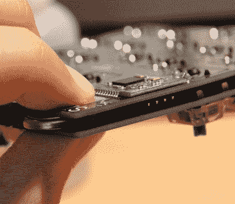

# 有丝分裂:定制键盘的剖析

> 原文：<https://hackaday.com/2017/06/05/mitosis-anatomy-of-a-custom-keyboard/>

符合人体工程学。无线的。低延迟。极简主义。高效。自己设计开源键盘走多远？勾选这些框，并为其他人提供这样做的手段，Redditor [reverse_bias]呈现了[有丝分裂键盘](https://www.reddit.com/r/MechanicalKeyboards/comments/66588f/wireless_split_qmk_mitosis/)，这个东西很酷。

定制的分离式机械键盘——顾名思义——在 10 厘米 x 10 厘米的两半上有 23 个键，当然，还有一个定制的键映射，用于最佳的个人使用。

上部和下部 PCB 分别容纳按键和电子电路，形成光滑的外观。键帽和机械开关是从牺牲板上撕下来的:两个 Waveshare core51822 蓝牙模块用于通信，第三个模块与 Pro Micro 配对组成接收器。 [reverse_bias]花了相当多的时间试图将键盘的功耗降至最低，这样它就可以由一对硬币电池供电，估计每天使用六个月。这些被夹在上下电路板之间，靠的是少量的焊料和电路板本身的轻微弹力。然而，更换电池需要一点脱焊。 

激光切割粘合氯丁橡胶装饰底座，提供舒适的弹性、抓握力和对针脚的保护，以及对桌子上任何碎片的缓冲。最终产品几乎没有弯曲，具有足够低的轮廓，不需要腕托。如果你对构建自己的感兴趣，[reverse_bias]已经链接了所有相关文件[这里](https://www.reddit.com/r/MechanicalKeyboards/comments/66588f/wireless_split_qmk_mitosis/dgg1jth/)。

当然，你可以反其道而行之，选择更重量级的选项。

【感谢提示，泰贝留斯 Prime！]