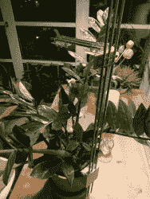

# MoAgriS:模块化农业系统

> 原文：<https://hackaday.com/2018/05/14/moagris-a-modular-agriculture-system/>

Hackaday.io 用户[Prof. Fartsparkle]的目标是再次用 [MoAgriS 给我们留下深刻印象，这是一种用于将作物带到室内并为它们提供所需的一切的精简钻机](https://hackaday.io/project/91757-moagris-modular-agriculture-system)。

这个项目是他们去年提交的 Hackaday 奖的演变， [MoRaLiS](https://hackaday.com/2017/05/10/modular-rail-lighting/) —一个轨道上的模块化照明系统——集成了光、水、气流、肥料及其适当传感器的模块。以低成本为重点，三个金属条作为结构，电力和数据传输媒介，SAM D11 芯片管理着每个工厂。

 加固的倾斜 PCB 水平延伸导轨，允许模块安装在不同的高度。光模块？在上面。水传感器？在花盆边缘上方的低轨上。你明白了。3D 打印的夹子将轨道连接到花盆上，并涂上一点油漆，以防止它像拇指一样突出在树叶中。

气流模块复制风流——缺少风流会导致茎干变细变脆——而照明模块包括一个柔和的白色 LED，以伴随和减轻全光谱 LED 的粉红色霓虹灯般的辉光。为了管理植物的浇水，Fartsparkle 教授]最初想用一个泵将水分配给每一株植物，但发现一些价格足够低的小型泵使每株植物都可以使用一个泵，并且更容易集成为一个模块！

如果你喜欢在户外种花，考虑一个机器人助手来帮你除草。

The [HackadayPrize2018](https://hackaday.io/prize) is Sponsored by:     