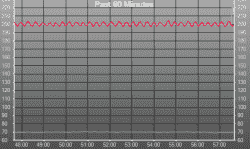
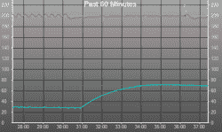
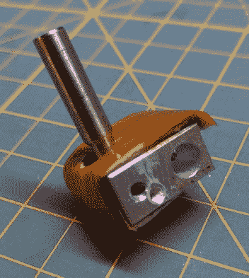
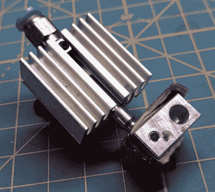
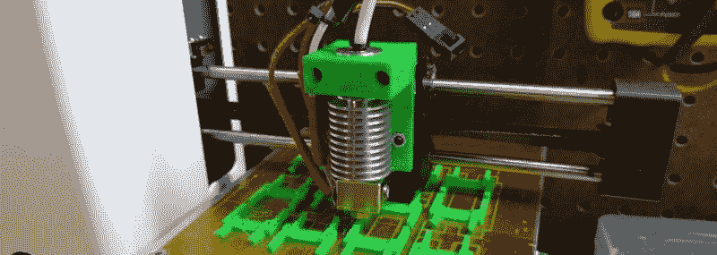
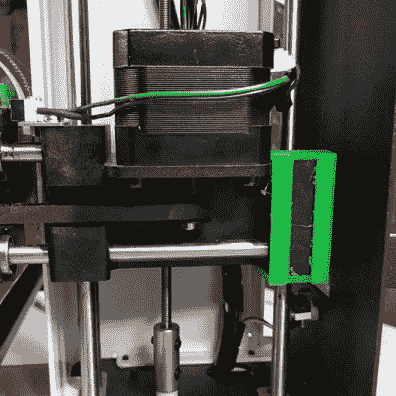
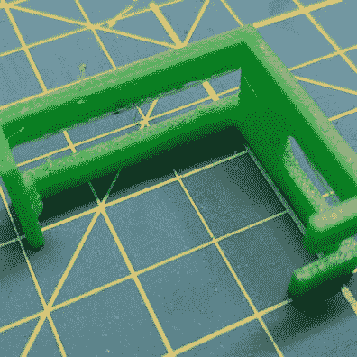

# 改装 Monoprice MP 小型打印机

> 原文：<https://hackaday.com/2016/07/07/modding-the-monoprice-mp-mini-printer/>

[在我对 MP Select 迷你 3D 打印机](http://hackaday.com/2016/06/13/review-monoprice-mp-select-mini-3d-printer/)进行评测的两周之后，Monoprice 自己的网站已经多次表示这款打印机已经断货、有货、再断货。这种几乎难以想象的廉价 3D 打印机被证明非常受欢迎，在我看来，它是整个 3D 打印世界的游戏改变机器。

随着这种还算过得去的廉价打印机的流行，肯定会有改进。我们这些对 3D 打印机有任何经验的人不会对一台有任何缺点的机器感到满意，特别是如果这意味着我们可以为我们的打印机打印增强功能和模块。

以下是目前可用于这款出色打印机的最佳 mod。打印机的明显问题得到了纠正，它变得更加健壮了。有 mods 加了玻璃构建板，少数人甚至在摆弄这台机器上的固件。考虑这一卷的 MP 迷你黑客之一；有了一台实际上很好的廉价打印机，肯定会有更多的改进。

### 自动 PID 调节

MP Mini 最大也是最容易解决的问题是温度控制不好。3D 打印机使用 PID 控制器将床的温度保持在一个恒定的、精确的温度。PID 控制的理论远远超出了一篇关于黑掉一台廉价 3D 打印机的帖子的范围。不过，PID 回路不良的后果确实会极大地影响这台打印机的质量。

[](https://hackaday.com/wp-content/uploads/2016/06/poorpid.png)

A poor PID control loop. Notice the oscillations around the set temperature.

[](https://hackaday.com/wp-content/uploads/2016/06/betterpid.png)

Poor PID control fixed with one simple command. The KsubI value is probably too low, but that really doesn’t matter.

原料 PID 回路使热端的温度从设定值振荡 5 度。这不好；如果这台机器没有合适的风扇，桥接就已经很困难了，糟糕的温度控制只会使情况变得更糟。好消息是，您可以用一个简单的 Gcode 命令来解决这个问题。

要解决温度控制不佳的问题，只需在 Repetier、Octoprint 或其他任何通过 USB 控制打印机的设备中输入以下内容:

```
M301 P20 I0.02 D250
M501
M500
```

该 Gcode 改变 PID 控制器的 K [d] 分量，以更均匀地调节温度。M501 将值保存到 EEPROM、闪存或固件中的任何东西，M500 显示新的 PID 值，以便您可以检查您的工作。

这是可行的——通过更新 K [d] 值，hotend 稳定到 0.5 度。然而，它并不完美:K [I] 可能太低，K [D] 项也不完美。虽然没有 PID 自动整定好，但是已经足够好了。

现在是时候提一下热敏电阻和 hotend 的*精度*了。我用福禄克仪表和热电偶测试过这个，温度精确到半度左右。如果不能修改固件和热敏电阻表，这已经是最好的了。

### 一个新的热点

MP Mini 上的库存热端有点乱。不受约束的长丝路径意味着柔性长丝是不可能的，甚至将新长丝装入机器也有点棘手。让我们看看这里有什么，好吗？

 [](https://i0.wp.com/hackaday.com/wp-content/uploads/2016/06/cz6xt8s.jpg?ssl=1)  [](https://i0.wp.com/hackaday.com/wp-content/uploads/2016/06/kjpuyzk.jpg?ssl=1) 

从热分解来看，热端实际上是全金属的。加热器块接受标准加热器筒和螺丝安装的热敏电阻。加热器筒用平头螺钉固定，热敏电阻用一小片金属包裹在加热器周围。除此之外，真的没有什么值得大书特书的。喷嘴*看起来*和六边形的喷嘴一样，但是我没有办法测试。

由于 hotend 使用标准加热器筒和用螺钉固定在加热器上的热敏电阻，这意味着 e3d hotend 是一种替代产品。我设计了一个支架，可以在 MP Mini 上安装 e3d (或者任何其他使用凹槽支架的 hotend)。我已经测试了 e3d V6 的股票加热器和热敏电阻-它的工作。它工作得相当好。

[](https://hackaday.com/wp-content/uploads/2016/06/65599714671898921021.jpg)

一个新的旅馆能给你带来什么？首先，一旦喷嘴堵塞，你就可以更换它。这也可能是股票 hotend 的情况，但我不能得到股票喷嘴关闭，即使有一对大的渠道锁。其次，你可以用更奇怪、更奇特的材料打印。股票 hotend 已经是全金属的，但正如我所说，不受限制的灯丝路径意味着柔性灯丝是不可能的。用我的装置，你可以用柔性细丝打印。即使使用 bowden 设置，也可以在 Ninjaflex 和 Semiflex 中打印。

### 一张新床

MP Mini 上的原料床是铝包 PCB。就价格而言，这是一个了不起的成就；实际上，在这台机器上打印不需要玻璃床，只需要一点胶带。也就是说，直接粘合到 PCB 上的铝不会随着时间的推移而竖立起来，放下一块玻璃是个好主意。

这是 MP Mini 的一个问题。床身水平调节只有这么多的间隙，Z 轴限位开关安装在框架内。需要进行一些修改来提高打印头，为此，您只需要简单的打印即可。

[【Sumpy】的玻璃床垫片](http://www.thingiverse.com/thing:1621650)正是你想要在床上放一块玻璃所需要的。它有效地使 Z 轴托架更高，使其比平时更高地碰到限位开关。

 [](https://i0.wp.com/hackaday.com/wp-content/uploads/2016/06/mpminispace.jpg?ssl=1)  [](https://i0.wp.com/hackaday.com/wp-content/uploads/2016/06/bedheightadjuest.jpg?ssl=1) 

把这个垫片夹在托架上，你就可以把床抬高 3/32 英寸。虽然这是一个伟大的打印，一个更好的 MP 迷你玻璃床垫片将利用 Thingiverse 的定制。能够输入一片玻璃、一片玻璃和 PEI 片或任何其他构建平台的厚度，并获得大小完美的适配器，这将非常好，但不幸的是，Thingiverse 社区并不重视发布零件的原始设计文件。这只是开源减少工作量和工作重复的另一种方式，孩子们。

### 固件

或许 MP Mini 最有趣的特性是 Monoprice 没有列入规格表的。这台打印机有 WiFi，它有一个基于 ARM 的控制器板，它比任何人都要强大得多。[Matthew Upp]设法找到了这台打印机的原始制造商，并获得了一些固件，为他的机器添加了 WiFi 打印功能:

 [https://www.youtube.com/embed/UQkVYsSrpVw?version=3&rel=1&showsearch=0&showinfo=1&iv_load_policy=1&fs=1&hl=en-US&autohide=2&wmode=transparent](https://www.youtube.com/embed/UQkVYsSrpVw?version=3&rel=1&showsearch=0&showinfo=1&iv_load_policy=1&fs=1&hl=en-US&autohide=2&wmode=transparent)


这不是真正的无线、无头 3D 打印解决方案，就像你在 Raspberry Pi + Octoprint 设置中看到的那样。WiFi 连接实际上只是一个无线 USB 连接，尽管您可以非常轻松地使用 WiFi 将文件传输到 SD 卡并从那里打印，但您仍然需要运行 Repetier-Host 来进行无线打印。

### 这是 T 型打印机。这意味着它没那么好。

这是 3D 打印机的 T 型。像今天所有的消费 3D 打印机一样，技术核心非常简单——开环步进电机，打印机没有办法知道细丝是否在机器里*和从喷嘴出来的*，也没有办法确保打印出来是正确的。将此与 T 型车进行比较；油门在转向柱上，变速器里面有木头。这种打印机和 T 型打印机非常便宜，非常受欢迎，买方垄断将在这种打印机上大赚一笔。

在我们得到 3D 打印机的 A 型之前，还有一段路要走，它具有先进的功能，如地板上的加速器。在那之前，将会卖出大量的打印机，而且这款神奇的打印机将会有很多 DIY 改进。