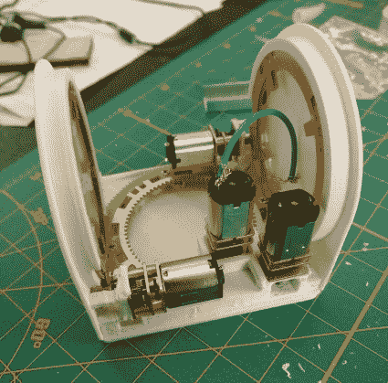

# 模块化机器人:当你希望你的机器人中有更多的机器人时

> 原文：<https://hackaday.com/2018/05/10/modular-robotics-when-you-want-more-robots-in-your-robot/>

虽然半个多世纪以来，机器人让我们的生活变得更加轻松，让我们的装配线更加高效，但我们还没有完全攻克一个像杰特森一样的通用机器人。当然，波士顿动力公司和麻省理工学院有一些人形机器人，踢翻它们很有趣，但它们远没有建造一个终结世界的机器人。

但不是每个机器人都需要人形才能通用。正在研究的一些更有趣的设计是模块化机器人。这是一种机器人技术，使用较小的单元组合成组件来完成给定的任务。

我们一直沉浸在这样的主题中，因为现在[机器人模块挑战](https://hackaday.io/prize/details#two)是黑客日奖的焦点。我们正在寻找任何模块化设计，使制造机器人更容易——电机驱动器、传感器阵列、肢体设计——你的想象力是有限的。但是独立的机器人模块组成了更大的机器人，这是一个迷人的领域，绝对适合这个挑战。和我一起看看模块化机器人现在在哪里，以及我们希望看到它们走向哪里。

## 许多机器人联合起来完成更大的任务

[ChainFORM](http://tangible.media.mit.edu/project/chainform/) is an interesting modular robotics proof of concept from the MIT Media Lab. Modules are servo motors surrounded with PCB for brain, sensing, and actuation. Here they’ve been tasked as legs.

表面上看，这似乎是一个非常有用的想法，尽管经常被忽视。一小群机器人可以执行许多不同的任务，例如移动、操纵工具和解决各种各样的其他问题。机器人可以自己决定完成这些任务的最佳方式，并根据需要执行的任何功能形成正确的形状。像这样的机器人的另一个关键特征是它可以同时做许多这样的任务。例如，机器人的一半可以分离和保持一个物体，而另一半操纵一个工具在该物体上使用。

模块化正是这种机器人如此有用的原因。例如，虽然像 Baxter 这样的单个[通用机器人可以负责操纵装配线上的一件东西，但它可能仍然有一整只手臂没有被使用。如果那只胳膊能被卸下来做些有用的事情就好了。此类事情的另一个好处是，基于这些原则构建的机器人不会受到单点故障的限制。如果它碰巧被损坏，故障模块可以被替换，或者在替换模块不在附近的情况下，机器人的其余部分可以继续工作，同时等待增援的到来。根据设计，模块化机器人可以与自身的所有其他部分进行通信，而不管哪些部分是连接的，它们在哪里，或者它们正在做什么。](https://www.rethinkrobotics.com/baxter/)

## 模块化适应性的未来优势

当机器人开始在地形无法预测的工厂受控条件之外得到更广泛的应用时，适应是唯一能让它们的使用变得可行的事情。轮式机器人是岩石地形中的噩梦。腿式机器人可以在那里取得成功，但回到路面时会比轮式机器人慢。一种机器人，它可以装载可能需要的特殊用途模块，并在必要时自己切换它们。

[Cellular automata ideation](https://groups.csail.mit.edu/drl/modular_robots/ca/ca.html) from Rus Robotics Lab

研究人员设想机器人可以去人们不能去的地方，比如在地震等自然灾害后在瓦砾中进行搜索和救援行动。模块化机器人可以通过重新定位来适应比传统机器人小得多的空间，从而在这种情况下取得成功。这里展示了一种有趣的可视化方式，这是在俄罗斯机器人实验室进行的细胞自动机研究[的一部分。](https://groups.csail.mit.edu/drl/modular_robots/ca/ca.html)

模块化机器人的其他应用是在重量是一个主要问题的情况下，以及多用途功能将大有作为的情况下，例如在太空中。模块化机器人还有许多其他应用，因为优势不仅仅在于灾难救援和太空探索等利基应用，而是在几乎任何情况下都有帮助。了解这些未来用途的一个好方法是看看科幻小说作者是如何“使用”它们的。尼尔·斯蒂芬森在他的小说 [*中不厌其烦地以*](https://en.wikipedia.org/wiki/Seveneves) 的方式详细解释了使用模块化机器人作为太空行动的主力。

## 就像机器人民主:谁负责由许多个体组成的整体？

目前，模块化机器人技术还没有发展到足以生产出像巴克斯特这样有用的机器人。但是在学术界和其他地方的实验室里，有许多严肃的工作正在进行，以推动这项技术的发展。早在 2013 年，我们看到麻省理工学院的一个实验室创造了一组[积木，它们可以独立移动，并排列成不同的晶格结构](https://www.youtube.com/watch?v=mOqjFa4RskA)。这是上面测试的细胞自动机。被称为 [M-Blocks](https://www.csail.mit.edu/research/m-blocks-modular-robotics) 的模块最初受到限制，因为它们是远程控制的，只能在一个相对方向上移动。这是一个概念验证，令人印象深刻，工作仍在继续。

 [https://www.youtube.com/embed/Yp4VMNaH5Ww?version=3&rel=1&showsearch=0&showinfo=1&iv_load_policy=1&fs=1&hl=en-US&autohide=2&wmode=transparent](https://www.youtube.com/embed/Yp4VMNaH5Ww?version=3&rel=1&showsearch=0&showinfo=1&iv_load_policy=1&fs=1&hl=en-US&autohide=2&wmode=transparent)

另一个在这个领域产生一些有趣结果的实验室是宾夕法尼亚大学的 ModLab。他们目前正在从事许多项目，包括可变拓扑桁架、单驱动器飞行机器人，当然还有 [SMORES 变形模块化机器人](http://www.modlabupenn.org/2016/06/18/smores-ep/)。这些机器人有四个自由度，以及一个可驱动的磁体，允许它们与其他模块或金属表面进行交互。这是我们迄今为止见过的功能更丰富的模块之一，但它们仍然存在与其他模块化机器人相同的问题，即与大量对象进行通信，并以分散的方式决定如何最好地执行任务。

随着模块或单元数量的增加，控制一大群没有中央指挥结构的物体也变得更加困难。然而，为了获得如何有效解决这一障碍的灵感，我们可以看看大型无人机群，它们可以由一个人进行编程控制，但也可以根据一套预定的规则作为一个群体协调行动。麻省理工学院的一个实验室能够为这些无人机“群体”开发一种分散控制算法，这使它们能够以更有效的方式行动，同时仍然能够遵循整体控制命令。我们已经看到[也有类似的为地面蜂群定向的项目](https://hackaday.com/2017/02/17/zooids-swarm-user-interface/)，它们可以以规定的方式行动，但仍然以模块化为核心原则。

## 没有手，没有脚，只有模块

M-Block 设计的另一个主要缺点(请记住，它从未打算用作功能模块化机器人)是，模块本身不能操纵任何东西，只能相对于其他模块移动。这就是像 Dtto 这样的模块化机器人能够推动该领域向前发展的地方。

  Single Dtto module  Dtto locomotion with 4 modules  Internals of new face and clamp design

Dtto 建立在使用由铰链连接的两部分的设计方案上。每一半的外部可以连接到另一个 Dtto 模块，该模块本身在中间有一个铰链。每个模块都可以控制其铰链，使机器人能够在自己的动力下轻松移动，并从每个模块的 10 个不同位置随意连接和断开自己的部分。这是一种可靠的多功能，因为它将每个模块的单个自由度增加到几乎任何任务所需的运动和角度。

Dtto 被评为 2016 年 Hackaday 奖的大奖得主，理由很充分。这个项目让我们了解了像这样的机器人在实践中是如何工作的。该项目没有设想对模块进行中央指挥，而是让它们作为一个集体来决定如何集合起来完成一个目标。Alberto Molina 继续致力于设计，下面是一个改进的夹紧系统的演示，它在原始设计中增加了面旋转。

组成 Dtto 机器人的模块可以相互无线通信，价格低廉(模块化机器人的关键)，可以很容易地 3D 打印，并且从硬件到软件都是完全开源的。已经有几个小组在致力于他们自己的 Dtto 构建，像这样的扩散将带来更多的人来加入到软件设计中，并在已经存在的伟大工作的基础上进行构建。

 [https://www.youtube.com/embed/uYlxW-vOC68?version=3&rel=1&showsearch=0&showinfo=1&iv_load_policy=1&fs=1&hl=en-US&autohide=2&wmode=transparent](https://www.youtube.com/embed/uYlxW-vOC68?version=3&rel=1&showsearch=0&showinfo=1&iv_load_policy=1&fs=1&hl=en-US&autohide=2&wmode=transparent)

## 我们需要克服的限制因素

当模块化机器人世界继续成长和扩展时，我们可以期待看到这个领域的许多发展。为了实现这一概念，模块需要变得更小、更紧凑，同时变得更强，以便它们能够移动更大组件的大部分。他们还需要提高相互通信的能力，并支持越来越多的模块。这些群体的软件至少和硬件设计一样难啃——模块化机器人需要在甚至不知道它们将会是什么形状的情况下解决问题。

但是这些问题确实值得我们花费时间和精力。无需干预就能克服故障部件的自动定向机器人的实用性将改变游戏规则。

## 招聘机器人制造商

正如我之前提到的，2018 年[黑客日奖](https://hackaday.io/prize)的当前挑战要求你展示自己的机器人设计。20 人将带着 1，000 美元的现金大奖离开，并进入决赛，50，000 美元的大奖和其他四个最高奖项正在等待着他们。

当然，如果你愿意的话，你**可以建造一个像 Dtto 一样的基于模块的机器人，我们很想看看！但是[机器人模块挑战赛](https://hackaday.io/prize/details#two)向更多的概念开放。它是关于开放的硬件设计，其他人可以在他们的项目中使用，学习，并用于不同的目的——从简单的电子板到复杂的组件，以及介于两者之间的一切。我们希望看到让我们充满机器人的未来离现在更近一点的巧妙技巧和好主意。**

 **需要快速入门吗？如果你在湾区，[周六加入我们的机器人研讨会](https://www.eventbrite.com/e/hackaday-bay-area-beginner-robotics-workshop-tickets-45535365504?aff=hadcom0510)。

The [HackadayPrize2018](https://hackaday.io/prize) is Sponsored by:     **