# 垄断价格迷你三角洲评论

> 原文：<https://hackaday.com/2017/08/21/monoprice-mini-delta-review/>

在过去的一年左右的时间里，买方垄断者一直在取笑他们的 200 美元的梦幻迷你精选的后续产品。这是 150 美元的迷你三角打印机。我们在去年一月的 CES 上看到了它，它在去年五月的[湾区制造商博览会上展出](http://hackaday.com/2017/06/08/mini-delta-3d-printer-in-action-at-the-monoprice-booth/)。现在有一个在 Hackaday 评论桌上。

在过去的几年里，3D 打印已经成为我们大多数人在 2010 年所期望的。不，并不是每个人都想要，或者说需要一台 3D 打印机放在他们的桌子上。这与几年前的炒作相去甚远，留给我们今天的。3D 打印机只是工具，很像钻床或激光切割机。

尽管如此，3D 打印仍然有一些惊人的进步。Prusa 将很快推出 i3 Mk 2 的 4 色多挤出机附件，而且不知何故，我们有无限量打印机。尽管如此，3D 打印仍有民主化的空间，也有机会推出非常便宜、非常好的打印机。

在 MP Mini Delta 正式登陆他们的网站之前，Monoprice 好心地给了我一个评论单元。这是首批下线的产品之一，与今年早些时候在 Indiegogo 活动中预购的几百台产品一起。这台打印机符合预期吗？的确如此，这不仅仅是因为这是一台 150 美元的打印机。

这将是一台价格为三倍的优秀打印机，足以证明 3D 打印正在从一个古怪的业余爱好者的东西转变为一个合适的工具。

### 规格和拆卸

MP Mini Delta 是一款全金属 3D 打印机，直径为 110 毫米，高度为 120 毫米。它包括一个加热的构建平台，具有 BuildTak 样的表面，自动调平床，全彩色显示器和 WiFi 连接。这台打印机接受解放军，和 ABS，我已经运行 PETG 通过这台打印机的一些随机对象。电源是 12v 直流电，所以如果你正在一辆货车上建造一个车间，这就对了。简而言之，这是一个最小可行的产品，它的构建量足够大，可以作为原型开发的有用工具。

这款打印机在很大程度上依赖于去年畅销产品 Monoprice MP Select Mini 的创新功能。[我们去年很喜欢这台打印机](http://hackaday.com/2016/06/13/review-monoprice-mp-select-mini-3d-printer/)，并不是因为它只花了 200 美元就送到了我们家门口。Select Mini 是廉价 3D 打印机的一个巨大变化。它有一个 32 位 ARM 控制器板。这台打印机技术上支持无线上网。它有一个相当大的体积，一个全彩色显示器和一个加热床。Mini Delta 保留了 32 位 ARM 控制器，有更好的 WiFi 支持，全彩色显示器看起来更好。

也就是说，拆机怎么样？

 [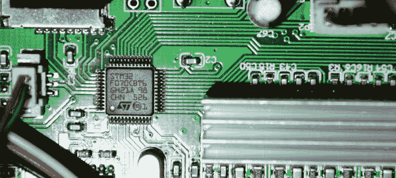](https://i0.wp.com/hackaday.com/wp-content/uploads/2017/08/stm32.jpg?ssl=1) The STM32-based controller board [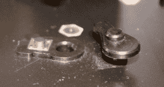](https://i0.wp.com/hackaday.com/wp-content/uploads/2017/08/bedleveling.jpg?ssl=1) Bed leveling via three tact switches [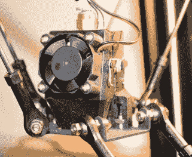](https://i0.wp.com/hackaday.com/wp-content/uploads/2017/08/hotend.jpg?ssl=1)   The guts of the machine. Not much, just a controller board and a few motors  The front of the front panel. [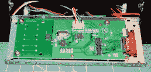](https://i0.wp.com/hackaday.com/wp-content/uploads/2017/08/panelback.jpg?ssl=1) The back of the front panel. This board contains the WiFi functionality via an ESP8266    The hotend. This has remained mostly unchanged from the hotend in the MP Mini Select

对于任何拆开过 Monoprice 的 *other* 廉价打印机的人来说，这应该非常熟悉。电子设备被分成两半。第一个是控制板，负责移动电机、读取热敏电阻和感应限位开关。这是一款基于 STM32F0 的 32 位 ARM 板。当这种主板出现在 MP Select Mini 中时，它只是稍微有点革命性。电子设备的另一半由前面板组成，大部分由 ESP8266 控制。该芯片处理 WiFi 并驱动显示器。除了电路的轻微改造和显示器用户界面的巨大改进，它似乎没有太大的变化。

当然，打印机的机械结构是一个 delta 平台，这一点不需要多说。加热床有点意思；它实际上位于三个轻触开关上。床调平 g 代码简单地将喷嘴向下敲击到床上，直到轻触开关关闭。简单而有效。

挤出机和热端也与 MP Select Mini 极其相似。这是一种鲍登装置，不直接将长丝从挤出机喂入喷嘴。相反，热端的散热片上的波顿有一处断裂。与 MP Select Mini 一样，这也是整个系统的薄弱环节。挤出机和热端之间鲍登管的这种断裂意味着很难使用柔性细丝。虽然这个问题可以通过用 3D 打印部件重新设计热端来缓解，但这不是一个很大的问题。然而，如果你购买一台打印机是为了在 Ninjaflex 中打印，我会去别处看看。

 [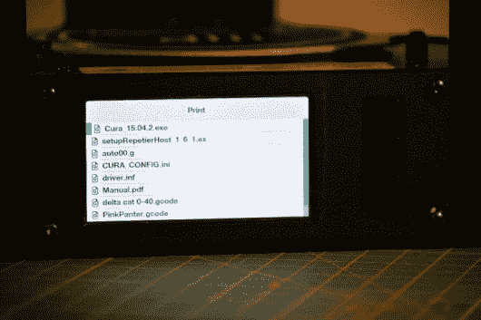](https://i0.wp.com/hackaday.com/wp-content/uploads/2017/08/4.jpg?ssl=1)    [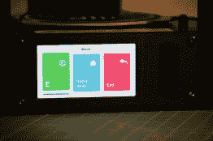](https://i0.wp.com/hackaday.com/wp-content/uploads/2017/08/3.jpg?ssl=1)     

与 MP Select Mini 相比，一个值得注意的升级是在前面板。Mini Delta 没有旋转编码器，只有一个明亮、清晰的显示屏和三个按钮。一个旋钮显然比三个按钮更贵。用户界面得到了极大的改进，看起来更加专业。看似取自 Windows 3.1 时代应用程序的花哨 UI 已被一个时尚、现代的皮肤所取代。这不是触摸屏，但三按钮控制是有意义的。

### 无线局域网（wireless fidelity 的缩写）

[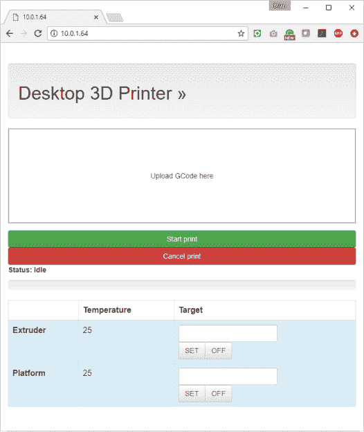](https://hackaday.com/wp-content/uploads/2017/08/wifi.png)

The printer as a web server. This is a simple server that allows you to set temperatures, upload g-code, and print items from across your network

虽然 Monoprice Select Mini 拥有 WiFi 连接硬件，但在线打印最初并未正式实施。Mini Delta 自带 WiFi 连接，实际上很容易设置。

这台打印机的网络界面很简单——它只是一个放置 g 代码(然后保存在 SD 卡上)的地方，一个设置旅馆和床的温度的地方，以及两个开始和取消打印的按钮。这不是 Octoprint，这是一个非常非常有限的网络界面，但所有这些都是在 ESP8266 上运行的。未来很棒。

配置网络界面需要一个移动应用程序，可以在 [Play Store](https://play.google.com/store/apps/details?id=com.mpselectmini.matthewupp.mp3dprinterwificonnect&hl=en) 或 [iTunes](https://itunes.apple.com/us/app/mp-3d-printer-wifi-connect/id1205476135?mt=8) 中找到，这取决于你的设备偏好。要使用此应用程序，只需输入 WiFi 网络的密码。按住打印机上的一个按钮几秒钟，WiFi 奇迹就发生了。不到一分钟，打印机将连接到网络，IP 地址显示在打印机上。在那里，只需将 IP 地址输入任何网络浏览器，你就可以通过局域网访问你的打印机。

同样，这不是一个全功能的网络界面。为此，你将需要一个树莓皮和八字纹。不过，这是一个*可用的*网络界面，也是消费者 3D 打印机标准功能集的一个受欢迎的补充。

### 黑客和修改

与任何 3D 打印机一样，我希望看到一些黑客和 mods 来提高这个小打印机的性能。我们已经看到了一些为 Monoprice Select Mini 做的事情，包括我做的[调整 E3D 热端](https://hackaday.io/project/12184-monoprice-mp-select-mini-e3d-hotend-adapter)，一些为[增加打印机分辨率](https://hackaday.io/project/12371-monoprice-select-mini-upgrades)，和一些[其他机械恶作剧](https://hackaday.io/project/14823-monoprice-select-mini-maximum-3d-printer-mods)。

[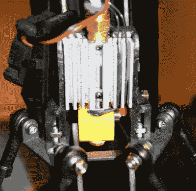](https://hackaday.com/wp-content/uploads/2017/08/endeff.jpg)

The end effector of the Mini Delta

迷你三角洲肯定不会有什么不同，这里我预见了两个主要的黑客和修改。第一是改进或更换热端，第二是增加打印机的生产量。

我已经提到了迷你三角洲最大的弱点是在热端；细丝路径在喷嘴的热障处不受限制，因此在柔性细丝中打印非常困难。这可以通过[完全替换热端](http://hackaday.com/2016/07/07/modding-the-monoprice-mp-mini-printer/)来解决，通过鲍登管保持灯丝包含在其行程中。

虽然我不打算解决这一点工程，迷你三角洲的设计是非常服从热端黑客。平台，或末端执行器，或我们叫它什么，只是一块边缘朝上的钢板，用于支撑手臂，中间有一个孔，周围有几个孔用于固定紧固件。为 E3D 热端设计一个适配器很简单，就像 MP Select Mini 一样，我们可以重复使用加热筒和热敏电阻。

我为这台打印机想到的第二种模式稍微没那么有用，甚至更荒谬，近乎滑稽。delta 平台的一个很大的特点是扩展 Z 轴比笛卡尔平台更容易。我希望有人会在下一届中西部 RepRap 节之前将迷你 Delta 的建造体积增加到直径 110 毫米，高 2 米。这种黑客将需要一个金属制动器来制造底盘的三个角落，但除了购买六块两米长的光滑杆外，这将是一个相对容易的构建。

### 很好，那指纹呢？

人们第一次看到 MP Mini Delta 生产的印刷品是在海湾地区制造商博览会的 Hackaday 报道中。Maker Faire 上的默认测试打印，包括在打印机的 SD 卡上，是一个小的中国猫打印。Maker Faire 演示中使用的非常大的图层高度可能会让一些人对 Mini Delta 失去兴趣——许多 3D 打印爱好者会将可见的图层线与不准确的打印机相混淆。这个演示模型在生产版本中被微妙地改变了；现在，默认的测试打印使用 0.10 毫米的层高度。打印质量*惊人*，虽然打印时间近三个小时，但没有人会对这台打印机生产的塑料零件失望。

和往常一样，基于细丝的 3D 打印机[的一个伟大基准是 3DBenchy](http://www.3dbenchy.com/) ，每个人都喜欢的 3D 打印拖船。我被一台未经调试的打印机生产的 Benchy 的质量震惊了:

 [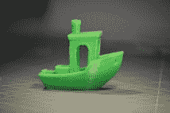](https://hackaday.com/2017/08/21/monoprice-mini-delta-review/dsc_0281-2/)    [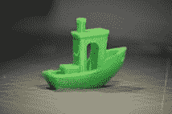](https://hackaday.com/2017/08/21/monoprice-mini-delta-review/dsc_0280/)    [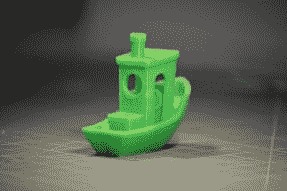](https://hackaday.com/2017/08/21/monoprice-mini-delta-review/dsc_0279/)  [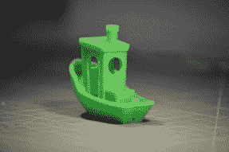](https://hackaday.com/2017/08/21/monoprice-mini-delta-review/dsc_0277/)    [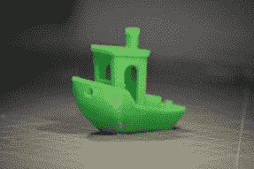](https://hackaday.com/2017/08/21/monoprice-mini-delta-review/dsc_0275/)     

这 Benchy 是打印在 0.2 毫米层的高度，与一些随机解放军我坐在周围。此打印没有使用额外的调整。这是 MP Mini Delta 的开箱即用能力，结果是惊人的。这个图案唯一的问题是飞行员的窗户顶部有点下垂。这是一个桥接问题，也是最难解决的问题之一。

无论用什么标准来衡量，这都是一幅非凡的作品。从 Lulzbot、Ultimaker 或 Prusa i3 上下来，这是一个可以接受的基准。这是现成的设置，使用 Cura 的标准配置。我真的对这台打印机能够生产的零件质量大吃一惊。这不仅仅是一台性价比很高的打印机，这是一台非常好的打印机。

### 市场细分是关键

在过去的几年里，3D 打印机的市场已经有了巨大的发展。10 年前，3D 打印机只在工程公司使用，只用于原型，机器本身成本很高。现在，各个层次的 3D 打印机都有一个实际的市场。如果你有预算，有一款 3D 打印机适合你。

3D 打印机市场的最佳比喻是汽车。如果你有几百块或者几十万，你就有机会买车。在这个比喻中，制造火箭发动机的金属烧结打印机是玛莎拉蒂，兰博基尼和其他汽车，它们的门像 ***这个*** **，**而不是像*这个。这些当然远远超出了普通消费者的价格范围。金属烧结、巨大的制造量和其他奇异的技术正在降价，但 3D 打印的顶级产品和十年前很像。*

但是高端的消费类打印机呢？在汽车的比喻中，这些打印机将是一辆雷克萨斯，一辆赢得了名牌的吉普车，或者一辆漂亮的照相机。在这里，有很多选择。 [Lulzbot](https://www.lulzbot.com/) 制造了一台神奇的打印机，[Ultimaker](https://ultimaker.com/)也是如此。 [Prusa Mk 2](http://www.prusaprinters.org/) 配备多挤压机附件非常出色，它可以打印多种颜色，就像 3D 打印机世界中的布加迪一样。在高端消费领域，我们甚至可以获得无限的构建量；Printrbot Printrbelt 的售价定为 1500 美元。

选择一家汽车制造商，查看各产品线的销售情况。雪佛兰的 Sonics 销量超过了 Corvettes，特斯拉的 Model 3 销量将超过其他任何车型。你总能卖出比肌肉车更多的 econoboxes，3D 打印机也是如此。

所以我们有了单价迷你三角 3D 打印机。这是一台价值 150 美元的打印机，送货上门。我甚至不知道任何制造商是否有可能制造出更便宜的 3D 打印机。无论如何，这可能是有史以来最受欢迎的 3D 打印机。这里存在的问题是，如何评价一台被设计成最便宜的打印机:你不能因为福特嘉年华不是 F350 就批评它。同样，我不能批评 Monoprice Mini Delta 的小体积和无法打印多种颜色。如果那是你喜欢的，一辆 Prusa i3 就可以了，但它的价格也是一辆迷你德尔塔的五倍。

也就是说，MP Mini Delta 是一款出色的打印机。这台打印机本应在四月发货，但现在我们知道了延期的原因。这是一种高质量的打印机，将在许多许多的台式机上找到一个家。如果你正在寻找 3D 打印，如果你正在寻找一个新的爱好，或者那个渴望发明的 12 岁表弟正在表现出对建筑材料的亲和力，这就是完美的打印机。它很便宜，完全在冲动购买的范围之内。这也是一台设计精良、功能强大的机器。我会向任何人推荐这台机器，无论是以前从未接触过 3D 打印零件的人，还是建立机器人农场以更快生产更多零件的人。

这将是一款非常受欢迎的打印机，我们期待着黑客将这台打印机变成非凡的东西。如果你有一个有用的破解这个小打印机的方法——或者你把它变成了一个六英尺高的庞然大物，一定要在[黑客日提示热线](http://hackaday.com/submit-a-tip/)上写一篇文章。