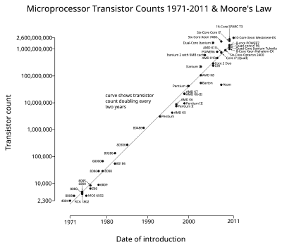

# 摩尔定律(再次)结束了

> 原文：<https://hackaday.com/2016/03/01/moores-law-is-over-again/>

根据《自然》杂志的这篇文章，[摩尔定律正式完成](http://www.nature.com/news/the-chips-are-down-for-moore-s-law-1.19338)。还有熊[在树林里便便](http://hackaday.com/2015/09/09/exponential-growth-in-linear-time-the-end-of-moores-law/)。

Note when the time axis ends…

几年前，集成电路中晶体管数量的持续指数增长被认为是理所当然的:每两年，密度翻一番。毕竟，[这是英特尔创始人戈登·摩尔(Gordon E. Moore)提出的一条“定律”](http://www.intel.com/content/www/us/en/silicon-innovations/moores-law-technology.html)。对于硅制造商来说，这与其说是一项法律，不如说是一个生产目标，事实证明这是一个非常有用的营销手段。

摩尔定律死亡的谣言通常每隔几年就会出现一次，然后英特尔就会想出一种更密集的方式。但是最近，甚至英特尔也承认小型化的步伐必须放慢。现在我们在《自然》杂志上得到证实:英特尔继续其小型化速度的成本小于收益。

我们已经习惯了以节能的名义降低 CPU 速度，所以这并不是一个全新的领域。我们会在乎摩尔定律的速度是否减慢了 50%吗？我们的 IC 需要有多小？

图由[Wgsimon]通过维基百科提供。