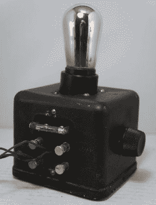

# 更多的力量:鲍威尔·克罗斯利和辛辛那提喷火器

> 原文：<https://hackaday.com/2017/02/06/more-power-powel-crosley-and-the-cincinnati-flamethrower/>

我们倾向于认为，在美国，发明曾经是一项单人游戏。孤独的企业家奋力创造下一件大事的画面是一个永恒的主题，尽管有点不准确和浪漫。当然，许多伟大的发明都来自独立的发明家，但事实是，从 19 世纪晚期开始，R&D 的企业对大多数创新都负有责任。但有时这些机构并不是没有灵魂的企业巨头。有些是由一个有创造力的人创立的，他通过想象力和营销的力量将企业推向伟大。托马斯·爱迪生的门洛帕克“发明工厂”就是一个例子，但还有另一位多产的发明家和不懈的推动者，他们为美国早期的消费电子行业做出了巨大贡献:小鲍威尔·克罗斯利。

### 天生的齿轮头

Powel Crosley, Jr. and Bonzo with his “Crosley Pup” radio. Source: [Ohio History Central](http://www.ohiohistorycentral.org/w/Powel_Crosley_Jr.)

虽然鲍威尔·克罗斯利的财富是通过无线电获得的，但他的初恋是汽车。在 20 世纪初，13 岁的克罗斯利开始制造他的第一辆汽车。他的父亲是辛辛那提的一名著名律师，显然是个有钱人，他用 10 美元的巨款打赌他的儿子不能完成这辆车。鲍威尔得到了他哥哥刘易斯的帮助，他们一起完成了这辆汽车，并配有一个手工制造的电动马达。他们赌赢了，并开始了后来成为长期商业伙伴的关系。

大学最终吸引了他，但鲍威尔对汽车的兴趣分散了他的注意力，几年后他辍学了。他尝试了各种汽车企业，结果喜忧参半；虽然创办一家汽车公司是他的梦想，但他似乎更擅长为美国蓬勃发展的汽车文化发明各种小玩意。到 1919 年，鲍威尔和刘易斯积累了 200 万美元的财富，并开始在不断增长的消费市场的其他部分寻找机会。

### 克罗斯利的小狗

20 世纪 20 年代增长最快的行业是广播，对克罗斯利兄弟来说，这一新领域显然是可以发财的。但是收音机还是新事物，即使像鲍威尔这样的富人也会对商店里买来的 100 美元的价格望而却步。所以当他的儿子想要一台收音机时，Powel 选择了黑客的方式——他买了一本关于收音机的书，这样他们就可以一起制作一台了。

Crosley Pup. Source: [Stone Vintage Radio](http://www.stonevintageradio.com/description.php?II=758&UID=20170130040734)

克罗斯利被收音机的潜力所吸引，并利用制造厂的资源，很快就开始销售全套收音机。到 1924 年，克罗斯利已经是世界上最大的收音机制造商。1925 年，他们标志性的“克罗斯利小狗”收音机上市了。一个简单的单管再生接收器把无线电带到了大众面前。它 9.75 美元的价格是可能的，因为它的零件数量很少——电子管既充当放大器又充当检波器，一个简单的 LC 储能电路调谐无线电，一个“辅助线圈”可以手动调节，以将部分放大的 RF 信号反馈到调谐电路，并创建一个正反馈环路来进一步放大信号。

多亏了用 Powel 的狗 Bonzo 作为吉祥物的精彩营销活动，这只小狗受到了消费者的欢迎。但是克罗斯利并不满足，他看到麻烦正在酝酿。他的小收音机受到了一个简单事实的威胁——当时没有那么多电台在广播。那些播出的通常是低功率广播，这也给 Pup 带来了一个问题——考虑到为保持价格可承受性所做的牺牲，它不是一个特别“热门”的接收器。

鲍威尔对这个问题的回答是 20 世纪早期资本主义的经典和垂直整合的模型:他将建立自己的广播电台。

### 更多动力

在当时简单得多的监管环境下，鲍威尔从 1921 年开始试验无线电广播，1922 年 WLW 电台开始在辛辛那提以 700 千赫的频率运营。起初辐射只有区区 50 瓦，克罗斯利开始逐年增加功率，他的理论是用的功率越多，制造收音机就越便宜。最初是 500 瓦，到 1924 年是 1000 瓦，第二年是 5000 瓦。1928 年，克罗斯利把 WLW 的输出功率提高到了 50，000 瓦，成为世界上功率最大的广播电台。在一个晴朗的夜晚，从纽约到佛罗里达都能听到它的声音，但克罗斯利的目标更高。高得多。

1933 年，开始为 WLW 建造一个 50 万瓦的放大器。目前还不清楚让 WLW 获得如此荒唐的电力是否有正当的商业理由，因为大约 90%的美国人口已经在 50 千瓦的 WLW 范围内。但是，克罗斯里走在了前列——1934 年也是他购买辛辛那提红人棒球队的一年。因此，傲慢无疑在 WLW 的权力提升中扮演了一个角色。

但是这种傲慢付出了巨大的代价。必须建造一个专门用于 WLW 的新变电站，以及冷却用于处理放大器热量的水的池塘。巨大的天线从俄亥俄州梅森市的 WLW 大学校园拔地而起，1934 年 1 月，WLW 开始以 50 万瓦的功率进行广播。

 [https://www.youtube.com/embed/CbHjcwIoTiY?version=3&rel=1&showsearch=0&showinfo=1&iv_load_policy=1&fs=1&hl=en-US&autohide=2&wmode=transparent](https://www.youtube.com/embed/CbHjcwIoTiY?version=3&rel=1&showsearch=0&showinfo=1&iv_load_policy=1&fs=1&hl=en-US&autohide=2&wmode=transparent)

投诉几乎立即开始涌入。WLW 关闭了其他电台，多伦多电台尤其容易受到攻击。到 1934 年 12 月，WLW 被要求在解决干扰问题的同时，将其夜间排放量降低到 50，000 瓦。建造了新的天线，并馈入异相信号，以形成足以解决多伦多问题的辐射模式，WLW 在 1935 年恢复全功率全天候运行。

但是 WLW 作为世界上最强大的广播电台的日子屈指可数了。正如新技术经常出现的情况一样，政治家们终于看到了可以监管的东西，并于 1938 年通过立法禁止超过 50，000 瓦的广播电台。WLW 的 500 千瓦许可证到期，辛辛那提火焰喷射器回到了新的 50 千瓦的法律限制，在那里它仍然运行到今天。即使在这个水平，WLW 仍然可以在 38 个州的晚上听到。

由于克罗斯利计划在国会介入之前让 WLW 达到 75 万瓦，可以肯定地说，他对自己孩子的遭遇感到失望。但克罗斯利从来不是一个固步自封的人，虽然广播仍然是他业务的一大重点——他将拥有 WLW 直到二战结束——但他还有许多其他商业兴趣。他是家用冰箱的先驱，发明了一种煤油驱动的冰箱，用于没有电的农村家庭，并在冰箱门上安装了第一个架子。他发明了夜间棒球的概念和详细的无线电广播，这两者都增加了他的辛辛那提红人队的收入，以至于所有的职业棒球联盟都很快模仿了他的模式。

汽车、收音机、体育、电器、飞机，甚至早期的电视广播——克罗斯利几乎涉足了 20 世纪消费文化的每一个主要领域。