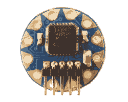

# 莫尔斯电码:薄荷盒里的巴黎

> 原文：<https://hackaday.com/2016/06/03/morse-code-paris-in-the-mint-box/>

[罗伯·拜利]喜欢做东西，也喜欢业余无线电。我们猜测他也喜欢薄荷糖，因为众所周知他会把东西塞进糖果罐里。他一直在考虑在 Altoids Smalls tin 中构建一个代码练习振荡器，但不确定他是否也可以在那里挤一个 Arduino Pro Mini。然后他找到了 TinyLily Mini。剩下的就是历史了，就像他们说的，[和 1CPO 诞生了](https://hackaday.io/project/11212-1cpo)。

TinyLily Mini 是一个圆形的 Arduino(见右图)，大小约为一枚美国一角硬币。大多数焊盘排列在圆圈周围，有一个小标题，需要 USB 编程器。一个小的可充电电池可以运行设备很长一段时间。

如果你曾经编写过莫尔斯电码软件，一个挑战就是计算实际发送速度(每分钟字数)。例如，如果你正在做一个串行端口，速度是容易的，因为发送的元素是相同的长度。然而，用莫尔斯电码，有些东西很短(比如 E)，有些东西很长(比如零)。事实上，代码试图反映某些字母出现的频率。e 是最短的字符，在英语文本中最常见。

你可能认为[塞缪尔·莫尔斯]应该对此负责，但他的原始代码只是数字。这个想法是你会得到数字，并在代码簿中查找它们。据推测，一些代码可能是形成早期编码的单个字母，如 ASCII、Baudot 或 EBCDIC。[Alfred Vail]扩展了该系统，以包括字母和其他字符，并根据当地报纸的铅字检查来指定长度。这种代码也使用点，破折号和长破折号，但它几乎是公认的莫尔斯电码在今天使用。

因此[Rob]寻找一种确定速度的方法，并发现[ARRL 使用单词 PARIS](http://www.arrl.org/files/file/Technology/x9004008.pdf) 的时间作为一个平均单词。[Rob]不太相信这是正确的方法，所以他编制了一个列表，列出了 1000 个最常见的英语单词，世界上 100 个最大的城市，以及其他几组单词，并计算了这些单词的平均元素长度。巴黎总共有 50 种元素。罗布的平均得分是 49.489。相当接近。

如果你认为莫尔斯电码已经死了，仍然有一些享受它的火腿。另外，[美国空军每年培训 10 名莫尔斯电码操作员](http://www.goodfellow.af.mil/News/ArticleDisplay/tabid/322/Article/590391/morse-code-training-moving-to-goodfellow.aspx)。莫尔斯已经被用于[通过手机](http://hackaday.com/2016/01/06/free-cell-data-transfer-with-slowest-morse-code-ever/)传输数据，而且我们已经看到了很多[更大的练习设备](http://hackaday.com/2015/09/24/arduino-teaches-morse-code/)。