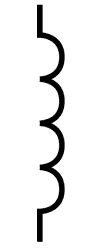
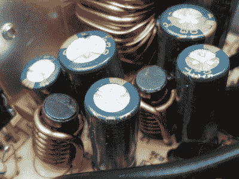
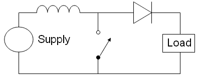
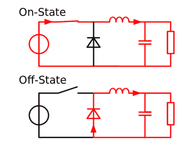
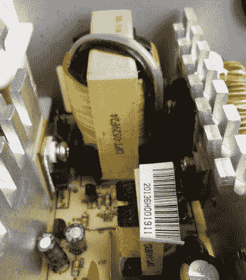

# 关于线圈，你希望知道但又不敢问的大部分事情

> 原文：<https://hackaday.com/2016/04/14/most-of-what-you-wish-you-knew-about-coils-of-wire-but-were-afraid-to-ask/>

如果你是一个新手电子建造师，你会熟悉常见的电子元件。电阻器、电容器、晶体管、二极管、发光二极管、集成电路。这些是无数学习项目的素材，并将点亮许多树莓 Pi 或 Arduino 所有者的试验板。

列表中有一个明显的遗漏，那就是电感。的确，它不是一个在简单的模拟或逻辑电路中有很多应用的元件，而且它也比其他无源元件贵一点。但这种忽略造成了对电感的知识空白，使电感的使用被认为是一种黑色艺术，并对其在套件和项目中的使用感到不安。

我们认为这是一种耻辱，所以下面是对电感器新手的介绍，试图揭开它们的神秘面纱，并鼓励你重新审视它们，如果你一直避开它们的话。

### 电感基础知识

Inductor symbol. Public domain, via [Wikimedia Commons](https://commons.wikimedia.org/wiki/File:Inductor.svg).

如果你考虑一个有电流流过的电导体，奥斯特定律告诉我们电流会在导体周围产生磁场。如果流经导体的电流发生变化，[楞次定律](https://en.wikipedia.org/wiki/Lenz%27s_law)告诉我们，当它导致磁场发生变化时，导体中就会感应出电流，该电流与流入导体的电流方向相反。这种特性被称为电感。

电感是以[亨利](https://en.wikipedia.org/wiki/Henry_(unit))来衡量的，最好用百科全书中的直接剪切和粘贴来描述，你不需要记住:“*当电流以每秒 1 安培的速度变化，在电感器两端产生 1 伏特的电动势*时，电路的电感是 1 亨利。实际上，亨利是一个相当大的单位，所以你更有可能遇到毫亨利、微亨利甚至纳亨利。

当然，单个导体或一根导线没有多少能力产生磁场，因此没有多少电感。您可以通过增加导体的长度来增加电感，但由于很长的导线很快就会耗尽空间，所以除了最小的电感器之外，所有电感器都将很长的导线缠绕在线圈中，并围绕由比空气具有更高磁导率的材料制成的磁芯。因此，电感器的示意符号是一个线圈的表示。

我们已经讨论了什么是电感*和*。那*做什么*呢？你将在哪里使用它，如何使用它？

如果你是一名电子实验者或构建者，你最有可能在 DC 滤波器、降压/升压逆变器、变压器中遇到电感，或者如果你喜欢无线电，在调谐电路或 RF 滤波器中遇到电感。它们并不局限于这种选择，但考虑这些情况应该有助于揭开电感器的神秘面纱，并鼓励您对它们另眼相看。

### 电感器作为 DC 滤波器

Filter inductors in an ATX PSU

你曾经打开过开关电源吗，也许是一个来自 PC 的 ATX 模型？当然，你是一个普通读者！如果你检查了这些元件，你会注意到一堆电感器，它们带有厚厚的漆包线线圈，紧挨着 DC 电缆出来给你的电脑供电的地方。这些滤波器与平滑电容一起用作滤波器，去除高频，仅留下 PSU 输出中的 DC。

如果您还记得前面提到的一段话，即快速变化的电流会引起磁场变化，进而感应出反向电流，那么您可能会开始理解这些滤波器的工作原理:感应出的反向高频电流会抵消产生这些电流的输入电流，同时稳定的 DC 分量不会引起磁场变化，因此不会产生反向电流，并且不会产生反向电流。

### 降压和升压逆变器

Boost converter basic circuit. Public domain, via [Wikimedia Commons](https://commons.wikimedia.org/wiki/File:Boost_circuit_2.png)

相比之下，降压和升压逆变器利用电感将能量存储为磁场的能力，有效地将 DC 功率从一种电压转换为另一种电压。如果你让电流通过一个感应器，你就在它周围创造的磁场中储存能量，当你停止电流时，磁场崩溃，并通过在感应器中感应反向电流来释放能量。这个过程发生得非常快，因此大量的能量可以在非常短的时间内释放为非常高的电压尖峰。有时，这种尖峰是一种麻烦，例如继电器驱动器集成了一个二极管，以安全地将它从晶体管传导出去，但在升压转换器中，电感反复受到能量脉冲，产生的尖峰通过一个二极管转移到储能电容中，由此可以获得更高的输出电压。

Buck converter basic circuit. Cyril Buttay, GFDL, via [Wikimedia Commons](https://commons.wikimedia.org/wiki/File:Buck_operating.svg)

相比之下，降压转换器使用电感器中存储的能量在较低电压下释放较高电流的脉冲，而不是升压转换器的高电压低电流尖峰。基本电路如左图所示，电流脉冲在电感中产生变化的磁场，从而感应出反向电压，进而降低负载上的电压。

出于说明目的，此处所示的降压和升压转换器的示例电路都进行了简化。实际上，开关将被由振荡器驱动的晶体管代替，振荡器的脉冲宽度由连接到负载的反馈电路改变。这可能是一个非常简单的分立元件电路，但在这两种情况下，都有大量现成的集成电路专为这一工作而设计，其数据手册将提供有关合适电感值的宝贵信息。

### 变形金刚(电影名)

如果你把导体放在变化的磁场中，就会感应出电流。又是楞次定律。这就是发电机和发电机的工作原理，以及在电感中产生反向电流的效应，我们在前面几段已经讨论过了。因此，如果将一个电感置于另一个电感产生的不断变化的磁场中，第一个电感会因该磁场而感应出电流。您已经创建了一个变压器，如果我们将第一个电感称为初级，将第二个电感称为次级，则初级与次级交流电压之比与初级和次级线圈匝数之比相同。我们可以一下子将交流电压从一个电平改变到另一个电平，同时保持初级和次级之间的完全物理隔离。

Ferrite-cored high frequency transformers in an ATX PC PSU. Much smaller than their mains-frequency equivalents.

制造实际变压器时，要使两个电感的磁场尽可能紧密耦合。两个线圈将占据相同的线圈架，并缠绕在相同的磁芯材料上，目的是将它们产生的所有磁通量都包含在磁芯内，而不是浪费在周围环境中。变压器的设计者将不得不应对磁芯中感应电流引起的损耗以及导线电阻引起的损耗，这两种损耗都会产生热量，并且磁芯可能会被磁场饱和，器件在工作频率下会变得非线性。

在较低的频率下，如市电使用的频率，铁芯通常采用与相邻铁芯绝缘的铁叠片形式，以减少感应电流。随着工作频率的上升，避免磁饱和所需的铁芯尺寸减小，因此变压器尺寸也相应减小。这种效应被在更高频率下工作的更高性能磁芯材料的要求所抵消，因此，在开关模式电源或 RF 应用中的高频变压器中，您会看到由铁磁性陶瓷(称为铁氧体)制成的磁芯。

你可能会遇到另一种类型的变压器，自耦变压器。如果你想在美国的 110 伏电压上使用欧洲的 230 伏电压，你可以在柜台上买到便宜的电源升压或降压变压器，反之亦然。自耦变压器没有单独的绕组，而是有一个绕组，中间有第三个连接。在绕组底部和第三个连接之间施加交流电压，它将在绕组顶部感应出一个电压，该电压与第三个连接的匝数和总匝数之比成正比。其工作原理与传统变压器非常相似，但它不提供初级和次级之间的物理隔离，因此不提供与市电电源的隔离。

### 射频电路中的电感

电感最神秘的地方可能就在于它在射频电路中的应用。试图建造一个无线电项目的人会对给自己的电感上发条的想法犹豫不决，他们设计的主题可能是我们前面提到的大部分黑色艺术的原因。

A high power air cored inductor in a radio transmitter. Public domain, via [Wikimedia Commons](https://commons.wikimedia.org/wiki/File:Transmitter_tank_inductor.jpg).

在射频电路中，设计者最感兴趣的是包含电感和电容的[电路的谐振频率。简而言之，如果将一个电容和一个电感并联，并向电路施加一个电流脉冲，能量将在电感的磁场之间“反弹”,通过连接线中的电流到达电容中存储的电荷，然后再返回，直到电阻损耗导致能量耗散，其频率取决于所涉及的电感和电容。有一个](https://en.wikipedia.org/wiki/LC_circuit)[简单的公式](https://en.wikipedia.org/wiki/LC_circuit#Resonance)来计算共振，每个无线电爱好者都会鹦鹉学舌般地背诵:“F 等于二分之一π根 L C”，但幸运的是，如果你愿意节省一点努力，还有许多[在线共振计算器](http://www.google.co.uk/search?q=online+lc+resonance+calculator)。

对于 RF 电感设计，尤其是自己缠绕电感的想法，现在可能不像以前那样需要提心吊胆。预置值的实用 RF 电感可从多家制造商处获得，此外还有带螺纹铁氧体磁芯的可调电感，可在电感体内移动。这些元件不如电阻和电容元件便宜，但它们确实让 RF 设计人员的工作变得更加轻松。

### 去焊接吧

我们希望，如果你是电感新手，这篇文章将为你提供这方面的基础知识，并为你揭开这些元件的神秘面纱。和往常一样，没有什么可以替代实践经验，所以如果你对这个问题产生了好奇心，我们建议你通过构建几个电感电路来了解这个问题。先从一个基于现成 IC 的简单降压或升压转换器开始，然后研究一下示波器所涉及的电压和波形。有一个充满磁性的美好世界等待着我们去发现！