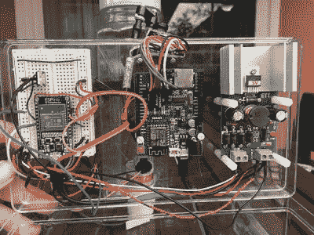

# 运动激活的超级喷射器站岗

> 原文：<https://hackaday.com/2017/10/18/motion-activated-super-squirter-stands-guard/>

小偷当心。如果你在[马修·盖伯]的住处附近徘徊，你会被他的[动作激活的超级喷射器](http://www.instructables.com/id/Super-Squirter/)弄得浑身湿透。即使他不在家，他也可以使用 iPhone 应用程序远程瞄准和射击。另外，相机会把你尿湿的照片存到 SD 卡里。

ESPino, ArduCAM UNO and voltage converter boards

整个安全系统由三个子系统处理，即目标获取、照片记录和通信。第一个子系统以 ESPino 为中心，利用 PIR 传感器检测运动。然后，它打开挡风玻璃清洗泵，使用云台伺服系统向受害者喷水。

目标采集硬件还向第二个子系统(ArduCAM ESP8266 UNO 板)发送消息。它使用安装在喷水口旁边的 ArduCAM 迷你相机拍摄大量照片。UNO 还可以提供一个收集了这些照片的网页。

最后一个子系统是一个 iPhone 应用程序，它可以与 ESPino 和 UNO 板对话。它可以远程控制喷水器，并提供摄像机所见的视频。

我们真正喜欢的一个细节是他自己制作的真空安全阀。它可以防止水泵不工作时虹吸现象。休息之后，不要错过喷水器的演示。

 [https://www.youtube.com/embed/94JgzTSS4HA?version=3&rel=1&showsearch=0&showinfo=1&iv_load_policy=1&fs=1&hl=en-US&autohide=2&wmode=transparent](https://www.youtube.com/embed/94JgzTSS4HA?version=3&rel=1&showsearch=0&showinfo=1&iv_load_policy=1&fs=1&hl=en-US&autohide=2&wmode=transparent)

在 Hackaday 上自动浸泡似乎是一件事情。[Ashish]的动作感应水枪不仅浸湿了他的同事，还在推特上发布了其行为的照片。[Austin Shaf]把他的浸泡器藏起来，[通过无线遥控触发它。](https://hackaday.com/2010/06/17/student-soaker-wireless-water-gun/)