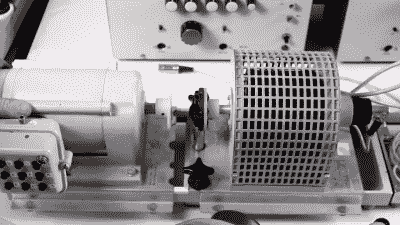

# 电机试验台谈扭矩

> 原文：<https://hackaday.com/2018/04/25/motor-test-bench-talks-the-torque/>

对于黑客来说，拯救一台结实的电机是人生中最大的乐趣之一，但是，当涉及到在一个新项目中使用它时，缺乏规格和文档可能会令人沮丧。[后启示录发明家]有看似无穷无尽的废弃发动机库存，并决定对这个问题做点什么。

[TPAI]再次将他的才能用于旧货复兴，他花了一年的时间收集、逆向工程和修复建于 20 世纪 70 年代的设备，以生产一个完整的电动马达测试装置。通过使用修复的测试设备，可以很容易地找到失速扭矩、空载速度、峰值功率等参数。通常只能在数据手册中找到的关键操作图也可以制作出来。

测试装置包括许多磁粉制动器、组合电源和控制单元、三个巨大的三相假负载和一个华丽的老式功率因数表。

马达通过一块橡胶与磁粉制动器相连。橡胶包含六个沿其边缘间隔分布的磁铁，与霍尔传感器结合使用，用于计算电机的转速。当制动器内部的线圈通电时，磁化的内部粉末会在转子和定子之间产生摩擦力，摩擦力与通过线圈的电流成正比。除此之外，制动器还可以测量施加到电机轴上的扭矩，这使得控制单元可以通过速度或扭矩来调节制动器。Arduino 从这些控制单元中吸取数据，使特性很容易用图表表示出来。

如果你正在寻找更多的测力计动作，去年我们特别推出了[这个设计简洁的单元](https://hackaday.com/2017/12/18/a-dynamometer-for-measuring-motor-power/)——由一些康奈尔大学的学生制作，具有令人印象深刻的文档水平。

 [https://www.youtube.com/embed/8uV3vDV0PYM?version=3&rel=1&showsearch=0&showinfo=1&iv_load_policy=1&fs=1&hl=en-US&autohide=2&wmode=transparent](https://www.youtube.com/embed/8uV3vDV0PYM?version=3&rel=1&showsearch=0&showinfo=1&iv_load_policy=1&fs=1&hl=en-US&autohide=2&wmode=transparent)

