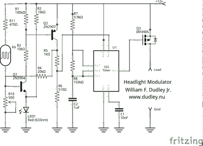

# 摩托车前灯调制器是一个好主意

> 原文：<https://hackaday.com/2015/11/26/motorcycle-headlight-modulator-is-a-bright-idea/>

骑摩托车的人很害怕被车撞，这是有原因的。当你被装在一个金属壳里，有安全气囊和安全带时，你会安全得多。汽车和摩托车的质量差异对摩托车手来说也不是很好。不幸的是，对于骑自行车的人来说，摩托车也更苗条，通常比汽车更不显眼。

几十年前，摩托车制造商转向日间行车灯，使自行车更容易被看到。然而，与此同时，汽车也做了同样的事情，导致许多骑自行车的人担心他们的能见度优势正在失去它的影响。解决办法？白天轻轻闪烁大灯，晚上正常运行。

[威廉·达德利]对商业版本不满意，所以他[为他的摩托车制造了一个定制的前灯调制器](http://www.dudley.nu/headlight_modulator/)。

 信不信由你，他用一个 555 定时器 IC 和一个光敏电阻(加上一些晶体管和一大堆杂七杂八的零件)做到了这一点。但[威廉]的设计是一个好的设计，他向你展示了他在构建使 555 失效的光感电路时所做的所有选择。

无论你是需要一个摩托车前灯调制器，还是有兴趣了解在 Arduino 出现之前这个问题是如何解决的，去看看[William]的帖子吧。当你在怀旧电子产品之旅中，看看这个数码管速度表。