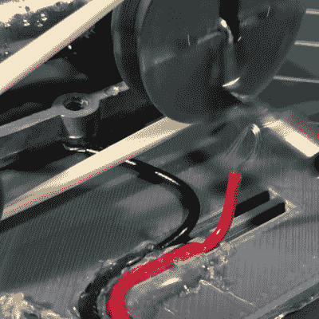

# 电动音乐盒制造出通往天堂的阶梯

> 原文：<https://hackaday.com/2016/05/31/motorized-music-box-cranks-out-stairway-to-heaven/>

[Bokononestly]找到了一个播放《通往天堂的阶梯》的 lil '音乐盒，并决定这些正是他每天早上想醒来时听到的美妙音调。各有所好；我曾经每天醒来都是盲瓜的《无雨》，大概有半年的时间。[Bokononestly]现在仍在这个闹钟项目中。很快有一天，它将使用 a *duino 来跟踪音乐盒的转数，并将闹钟声音限制在旋律的一个周期内。

【Bokononestly】决定[用电动螺丝刀](http://www.reddit.com/r/engineering/comments/4l54ko/motorizing_a_hand_crank_music_box_with_my_3d/)的齿轮传动 DC 电机驱动音乐盒的曲柄。在制作了两者尺寸的一些漂亮的工程图并用 CAD 模拟后，他设计并打印了一个基板来安装它们。安装在电机轴和曲柄臂上的一对定制滑轮使用正确的橡胶带传递运动。你不能忽视对一大包橡皮筋的需求。为了计算转数，他在金属音乐盒曲柄的路径上放了一根电线，并用盒子的主体作为开关。休息后查看构建视频，观看他用万用表的连续性功能证明这一点。一个聪明的功能，应该在某个时候取代叶交换机。

这些年来，我们已经报道了很多很酷的时钟版本，包括一两个运行 Linux 的版本。说你想说的楼梯；这总比[醒来后不断被扇耳光好。](http://hackaday.com/2015/12/29/simone-does-strange-things-with-motors-and-servos/)

 [https://www.youtube.com/embed/UAB1ufzUI74?version=3&rel=1&showsearch=0&showinfo=1&iv_load_policy=1&fs=1&hl=en-US&autohide=2&wmode=transparent](https://www.youtube.com/embed/UAB1ufzUI74?version=3&rel=1&showsearch=0&showinfo=1&iv_load_policy=1&fs=1&hl=en-US&autohide=2&wmode=transparent)

[通过[研发/工程](https://www.reddit.com/r/engineering/comments/4l54ko/motorizing_a_hand_crank_music_box_with_my_3d/)