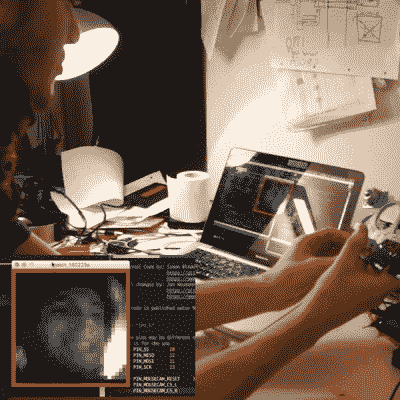

# 老鼠大脑加上线激光等于测距仪

> 原文：<https://hackaday.com/2016/06/17/mouse-brains-plus-line-laser-equals-rangefinder/>

[Neumi]写了一个可爱的机器人黑客。这是一个 2D [激光距离传感器(YouTube)](https://www.youtube.com/watch?v=uZoETsntwv8) ，由一个廉价的线激光器和一个光学鼠标的流量传感器芯片制成，用作低分辨率相机。在某种意义上，这是一个标准的激光距离传感器项目。但是它很聪明，原因有很多。

首先，使用鼠标传感器作为低分辨率相机是很棒的。它被设计成从标准的红色 LED 读取，所以灵敏度正好适合线激光器使用。它返回 30×30 像素的灰度图像，对于低端微控制器来说，这正好是处理和保持帧速率所需的数据量，而无需求助于编码技巧。

在易贝，这些内置镜头的传感器相对便宜，这也不是巧合。显然，四轴飞行器的专家们把它们当作老鼠来使用，来直观地跟踪四轴飞行器的运动。黑客溢出！

当激光线从[Neumi]地板上的任何物体反射时，检测激光线也可能被证明是困难的，并且可能在有背景照明的情况下产生错误的读数。所以[Neumi]用相机读取两个读数——一个是激光打开的，一个是关闭的——并把它们区别开来。如果做得足够快，这应该会将任何非激光源降低到传感器的本底噪声。最后，有一些阈值和平均正在幕后进行，这有助于一切工作的权利。GitHub 上有[代码。](https://github.com/Neumi/OpticalFlowA3080ArduinoProcessing)

对于预算有限的 2D 激光测距系统来说，这是一个不错的构建。如果你想支付更多的钱，并进入一个严重的建设，这可能是我们在很长一段时间内看到的最圆滑的。如果你认为你以前听说过[Neumi],你是对的:几个月前，我们展示了这款[405 毫米激光 PCB 曝光机/刻录机数控机床](http://hackaday.com/2016/03/14/laser-pcb-exposer-built-from-cd-rom-drives/)。

 [https://www.youtube.com/embed/uZoETsntwv8?version=3&rel=1&showsearch=0&showinfo=1&iv_load_policy=1&fs=1&hl=en-US&autohide=2&wmode=transparent](https://www.youtube.com/embed/uZoETsntwv8?version=3&rel=1&showsearch=0&showinfo=1&iv_load_policy=1&fs=1&hl=en-US&autohide=2&wmode=transparent)

