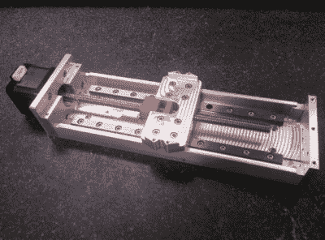

# 用高精度线性工作台移动微米

> 原文：<https://hackaday.com/2017/02/22/moving-microns-with-a-high-precision-linear-stage/>

正如任何试验过自制数控机床的人会告诉你的那样，精度并不便宜。您可以使用现成的螺纹和厨房抽屉滑轨组装龙门磨。但是一个安全的假设是，如果你把工具放在一个特定的位置，下次你回来的时候，它就不会在同一个位置了。但是如果你把你的预算从非常便宜调整到合理的价格，你可以做得更好。[Adam Bender]以设计高精度自动化系统为生，因此当[为个人项目需要精密线性平台时](http://www.adambender.info/precision-linear-stage)，他以不到 500 美元的价格实现了微米级精度。

Red parts are the two spring-loaded nuts

他用一个便宜的丝杠解释了反冲问题——螺纹部件之间的摆动导致位置混乱。他的解决方案是用一个弹簧将两个螺母相互压紧。仍然存在粘滑问题；由于材料之间的静摩擦系数和动摩擦系数之间的差异，倾向于突然移动。仔细选择螺母的加工原料，挑选这些系数几乎相同的材料，尽可能地减少粘滑。

他详细介绍了舞台所有部件的设计、制造和测试，包括主体、密封系统和控制。如果你是一个精密数控专家，也许你会发现它是一个设计巧妙的组件，但如果你只是一个业余爱好者，你会发现阅读该领域专业人士的全面而易懂的文章非常有趣。

这个版本可能比我们过去的大部分版本更进了一步，但这并不是说我们没有看到[一些非常好的成果](http://hackaday.com/2016/02/07/a-home-cnc-built-by-someone-who-knows-their-stuff/)。