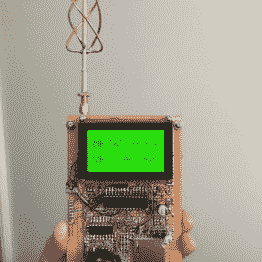
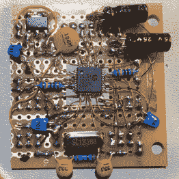
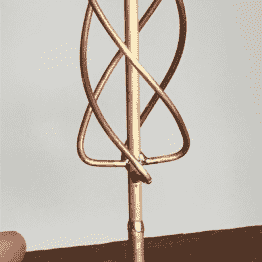

# MP3 播放器和手持 GPS 是一个奇怪的组合艺术品

> 原文：<https://hackaday.com/2016/11/08/mp3-player-and-handheld-gps-is-an-odd-combo-work-of-art/>

我们认为[布雷克·马丁]开始着手制造一个手持全球定位系统，最后在上面加了一个 mp3 播放器。不管怎样，它建造得很漂亮。手工制作的电路板，甚至一个定制的天线装饰这个令人印象深刻的建设。

构建的核心是来自 Microchip 的 16 位微控制器 a [dsPIC33FJ128GP802](http://www.microchip.com/wwwproducts/en/dsPIC33FJ128GP802) 。做这么多是一个不起眼的筹码。它使用 UBlox NEO-6M 定位模块进行定位，并在使用在线计算器对 GPS 部分进行计算后，定制 QFH 天线。音频部分基于 VLSI VS1003b 解码器芯片。

整个构建是用 protoboard 完成的。在内置走线不够的地方，漆包线和绕线被小心地布线并焊接到位。有一种 48 引脚 LQFP 封装芯片焊接死虫风格，令人印象深刻。你可以在下面的这个小画廊里看到一些不错的图片。

  The whole unit.  Impressive.  A custom antenna.

界面是标准的 gLCD 和带点击的模拟操纵杆。mp3 和地图数据可以用 SD 卡加载。还有一些工作要做，例如，他还没有想出如何处理电池。如果你对更多感兴趣，他的 YouTube 频道上有几个专门的视频，可能还会有更多。

我想这可以归结为:是[布雷克]在 mp3 播放器上加了一个 GPS，因为他在听音乐的时候迷路了，还是他在 GPS 上加了一个 mp3 播放器，因为他喜欢在被找到的时候听音乐？撇开哲学不谈，这是一个美丽的建筑。