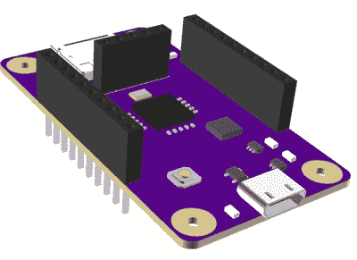

# Open-V，第一个开源 RISC-V 微控制器

> 原文：<https://hackaday.com/2016/11/22/mrisc-v-the-first-open-source-risc-v-microcontroller/>

开源软件已经存在了几十年。在这几十年里，开源软件一直是大多数互联网和所有 500 强超级计算机背后的驱动力。开源软件运动的产物也许比古腾堡出版社更重要。但硬件尚未完全接受这种开放的超级充电效应。能够简单地购买一个没有所有专有位和 NDA 的开源 CPU 是不可能的。

现在，这种情况终于改变了。哥伦比亚桑坦德工业大学(Universidad Industrial de Santander)的一群博士生创办的 OnChip 一直在研究 mRISC-V，这是一种基于 RISC-V 指令集的开放式 32 位微控制器。现在这是一个众筹活动，是的，你可以简单地*购买*一个开源芯片。

[在](http://hackaday.com/2016/10/10/the-journey-toward-a-completely-open-microcontroller/)之前，我们已经看过 onchip 的开放式微控制器项目。该团队已经取得了重大进展，从可以在 FPGA 上运行的东西转移到真正的物理芯片流片。 [onchip twitter 时间轴](https://twitter.com/onchipUIS)是一系列的活动，有真实的芯片，并预测在十年内 50%的低端微控制器将运行 RISC-V。

A render of the Open-V dev board

如果你想得到这些开放式微控制器中的一个，考虑到这是定制硅，群众供应活动实际上是相当合理的。49 美元可以让你得到一个 QFN 32 封装的首次运行的 mRISC-V。99 美元可以买到带有 SD 卡插槽、USB、调节器的 mRISC-V 开发板，当然还有微处理器本身。

这种芯片的功能几乎与低功耗 ARM Cortex M0 不相上下。芯片本身的工作频率为 160MHz，内置 SPI、I2C、SDIO 和 JTAG，以及一个 10 位 10MS/s ADC 和一个 12 位 DAC。mRISC-V 上有 16 个 GPIO 引脚，你不能用这种芯片建造智能手机或笔记本电脑，但你可以建造一个物联网小发明。

虽然 OnChip 的努力不会导致完全开源的智能手机，但其他项目正在进行中，将为更强大的设备带来开源核心。lowRISC 是一个将支持 Linux 的片上系统投入生产的项目，比我们更聪明的人已经将 GCC、LLVM 和 QEMU 引入了这个架构。

大多数引入 RISC-V 架构的努力，实际上是大多数开源处理器，都集中在大芯片上——全 CPU 和 SOC。Onchip 的 mRISC-V 则反其道而行之，创造了一个小型的开放式微控制器。如果你想创建一个开放处理器的生态系统，这是非常有意义的；上路的本田 Civics 比兰博基尼还多，微芯片和 TI 每年出货的微控制器远远超过英特尔出货的 CPU。