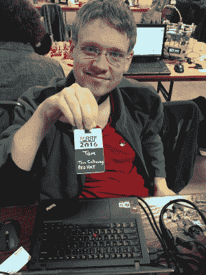

# MRRF，红帽如何帮助开源 3D 打印

> 原文：<https://hackaday.com/2016/03/23/mrrf-how-red-hat-helps-open-source-3d-printing/>

红帽是世界上最大的开源公司。作为一家盈利性公司，它设法将每一行代码都公开，但每年仍能轻松获得 15 至 20 亿美元的收入。因此，可以证明，红帽知道如何经营开源业务。尽管是一家软件公司，但作为一家公司，Red Hat 对开放硬件的未来抱有希望，他们将资金投入到他们的精神所在的地方。

[汤姆·卡拉威]是红帽公司的全职 3d 打印机设计师。他在北卡罗来纳州罗利的红帽总部工作。我们有机会在 [MRRF](http://hackaday.com/2016/03/19/mrrf-3d-printing-spectacular/) 和他交谈，弄清楚红帽到底为 3D 打印做了什么。

Red Hat 的第一个兴趣是，任何使用他们的软件运行 3D 打印机或与相关文件进行交互的人在 Linux 中都很容易。为此，Tom 定期测试我们常用软件的最新版本。他确保软件为 Red Hat 包装得很好。除此之外，他还对项目本身做出了贡献。他已经提交了 Cura 和 Slic3r 的补丁。

为了运行软件，并作为红帽员工的额外津贴，[汤姆]负责红帽的 3D 打印实验室。员工可以在里面打印他们喜欢的任何东西，但这也给了 Red Hat 一个机会来测试软件的故障点。如果你是一个 3D 打印机制造商(开放或关闭)，你可以给他们一台打印机，他们会确保它有一个配置文件，并在每次版本更新时运行正常，不错！

The face of 3D printing at Red Hat.

【汤姆】还参加了~~红帽~~ Fedora 3D 打印[特殊兴趣小组](https://fedoraproject.org/wiki/SIGs/3DPrinting)。这让~~红帽~~ Fedora 的用户走到一起，解决他们在野外发现的问题。这也是他领先于随着 3d 打印的发展而出现的新软件包的最佳方式之一。

最酷的事情是红帽对制造商的支持。Red Hat 将确保任何支持打印机的软件都能免费运行。所以如果你为你的打印机写了一个只能在 windows 上运行的自定义驱动程序。只要你让 Red Hat 访问源代码，他们会确保它也能在 Linux 上运行。不过，显然没有一家闭源打印机制造商接受他们的提议。红帽确实与 Lulz Bot 等开放制造商有合作关系。

作为一家主要的软件公司，Red Hat 个人对此时进入开放的硬件市场没有兴趣。他们确实希望看到它成功，为此，他们最后也是最有趣的服务是他们愿意谈论在运行一个开源业务中什么有效，什么无效。从事开放硬件业务的人可以接触像[Tom]这样的人，就开放源代码业务的日常方面寻求建议。这些年来，红帽无疑学到了很多经验，就像他们的软件一样，他们愿意分享每一句台词。

编辑:*最后，感谢评论中的【米罗】，他也为红帽工作，为 3d 打印做出了贡献。酷！我只是想弄清楚，这些东西中的大部分都转化成了 Fedora 项目，它监管着 Fedora Linux，一个非常流行的发行版(显然是 Linus Torvald 的首选。)如果你想参与其中，Fedora Linux 3d 打印机 SIG(我错误地将其称为 Red Hat SIG，这意味着它只面向 Red Hat Enterprise Linux 的付费客户，这不是真的)是一个好去处。它让 Fedora 变得更好，并帮助整个 3d 打印社区*:)