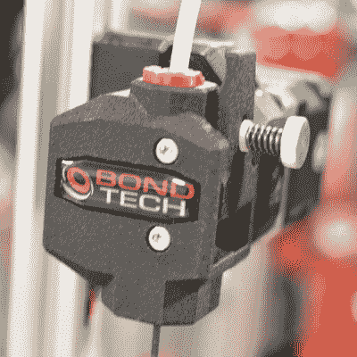
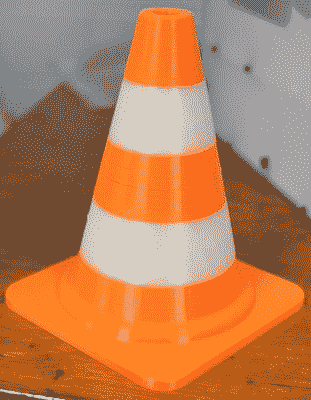

# MRRF:创新挤出机和可溶性长丝

> 原文：<https://hackaday.com/2016/03/30/mrrf-innovating-extruders-and-dissolvable-filament/>

认为在 3D 打印机上放置熔融塑料就像从热管中挤出塑料丝一样简单吗？事实并非如此，任何在 2009 年拥有 3D 打印机的人都会这么告诉你。有将塑料剥离成糊状的螺栓，有使一切都不稳定的超大 x 型车厢，没有一样东西像今天这样好用。

技术在进步，今年的中西部 RepRap 节上，人们展示了推动塑料的最新进展，以及一些还没有太多用途的东西——可溶解的细丝。

### 邦德科技公司的 V2 挤压机

 [当我们在上一届 MRRF](http://hackaday.com/2015/03/25/mrrf-hot-ends-extruders-extremely-posh-brits-and-stoic-swedes/) 看到 Bondtech 挤出机的时候，那是一种可以非常用力的推很多细丝的设备；两个滚花或滚齿齿轮推动灯丝穿过热端的承诺非常有趣。[这里有一个视频](https://www.youtube.com/watch?v=tS3VbDA9zWA)，展示了 Bondtech 挤压机用 20 公斤的力拉细丝。

今年，[马丁]回到印第安纳展示了他最新版本的 Bondtech 挤出机。旧的 Bondtech 挤出机需要你向步进电机发送命令来改变细丝，新的 QR 版本(快速释放)包括一个杠杆来锁定细丝。

虽然这对于 Bondtech 挤出机来说并不是一个很大的改变，但它确实使一个伟大的挤出机变得更好。有很多 RepRaps 震撼了 MRRF 的 Bondtech，而[Martin]组装了一个非常好的产品。

### 改良的湿地

从时间开始，或者至少从 2010 年开始，Wade 的齿轮挤出机一直是 RepRaps 和其他 DIY 3D 打印机的标准低端挤出机。这很简单——只需要一个马达架、两个齿轮、一个螺栓和几个弹簧和螺栓。太受欢迎了，[韦德的挤压机](http://reprap.org/wiki/Genealogy_/_Archeology_of_the_Greg's_Wade's_Geared_Extruder)上有一个数字考古项目。

也就是说，这种挤压机很重，当你把它安装在移动的支架上时，你很快就能制造出一个摇摆机器人。E3D 的家伙们今年在 MRRF，展示了一些新的进步，包括他们在新的 BigBox 3D 打印机中使用的小型化 Wade。

这种新型挤出机正是你所期望的由注塑塑料制成的齿轮传动挤出机。一个微型马达用螺栓固定在挤压机上，一个齿轮系统驱动一个滚花、滚花或其他改进的轴。

E3D 的家伙们做得很对，他们甚至观察了这位残疾司机的牙齿轮廓。这降低了保持细丝紧密所需的压力量，并使该挤出机具有优异的效率。在 MRRF，E3D 用一台“煎饼”NEMA 17 发动机驱动这台挤压机。通常，这些薄电机不适合 3D 打印应用，因为它们缺乏推动细丝或移动轴所需的扭矩。E3D 的挤压机不需要大电机，除了有点热，这个挤压机和电机表现得像冠军一样。

### 可发现的细丝

Video LAN Client, an example of E3D’s dual extrusion capabilities

可溶解的细丝在 RepRaps 和其他 3D 打印机中用作支撑材料已经有一段时间了。Makerbot 早在 2011 年就推出了一系列可溶解的 PVA，但不知何故，在打印完成后挤出两种类型的细丝并溶解一种的想法从未真正流行起来。为什么，我们永远不会知道。

由于 E3D 有一些不同的挤出机专门设计的双重挤压，这只是有意义的，他们将纳入他们的产品线可溶解的长丝。也不是纯 PVA 塑料。E3D 发明了一种基于聚乙烯醇的新型灯丝，其中还包括其他水溶性材料，如制成药物的塑料凝胶。他们称这种材料为[脚手架](http://e3d-online.com/E3D-175-SCAFFOLD-GREY)，从他们展出的照片来看，这种材料非常有效。

可溶解细丝的一个问题是如何去除支撑材料。如果你使用高抗冲聚苯乙烯作为支撑材料，你可以用柠檬烯将其溶解，但这意味着你需要去除溶解塑料和有毒化学物质产生的粘性物质。聚乙烯醇是水溶性的，支架材料中的所有其他成分也是水溶性的，所以溶解印刷品上的材料的最好方法就是将其放入洗碗机中。

虽然还不建议将支架材料放入洗碗机中——E3D 仍在努力证明这种塑料足够安全，可以冲进下水道——但这是我们在过去两三年中看到的最多的可溶解细丝。最终的印刷品看起来棒极了，从我们所看到的，两台挤压机*标准*可能是几年后的必需品。