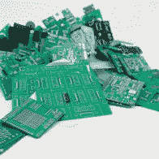
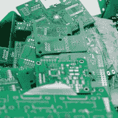
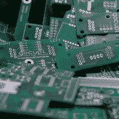

# 佩妮夫人的驾驶学校——达拉斯的硬件车间

> 原文：<https://hackaday.com/2016/04/15/mrs-pennys-driving-school-hardware-workshop-in-dallas/>

如果你没有注意到，Hackaday 社区正在努力成为一个社区 AFK。本周末我们在东 VCF，Hackaday World Create Day 即将到来，几天前的 Hackaday | Belgrade，以及下周的 Hackaday Toronto，这里仅举几个离本文很近的例子。

无论是承诺还是威胁，取决于你的立场，我将在每个月的第三个周六在达拉斯的创客空间教[一堂电子课。这些课程的目标是帮助你克服硬件想法和拥有硬件之间的障碍。我不是 PCB 设计或布局方面的专家，但我发现了比我可能承认的更多的错误方法，这是我分享我通过反复试验痛苦地学到的东西的方式。在写这篇文章的时候，第一节课还有几个名额，请点击上面的链接买票。](https://www.eventbrite.com/e/mrs-pennys-driving-school-electronics-class-01-tickets-22426034874)

        

感谢[【克里斯·海什曼】](http://www.ninjabunny9000.com/)精彩地捕捉到了我失败的希望和梦想的图像

# 1 类

在第一个 6 小时的课程中，我们将从一个基本的、高层次的想法开始，一步步深入下去。例如:我们的第一个项目将是一个 AVR 开发板。这是一个足够普通的东西，每个人都知道它是什么(Arduino 是一个 AVR 开发板，以防我妈妈正在读这篇文章)。我们不会一部分一部分地复制 Arduino，而是将 Arduino 的想法变成我们自己的定制板。也许我们可以添加一些端子板来代替杜邦接头，或者我们希望电路板上有一个实时时钟和一个滑动电位计。我们想做就能做，你不能阻止我们。

因此，1 号课程是 Eagle 原理图捕获和 PCB 布局的速成课程。因为这只是 6 个小时的课堂时间，我们需要在离开时订购电路板和零件，所以我们的设计不会太复杂。

# 第二类

到我们第二次见面时，我们应该已经收到了闪亮的新 PCB，我们的零件订单早就应该从分销商那里交付了(Mouser 距离达拉斯制造商空间大约一个小时的车程，不是说我们会在这个项目中随意挑选零件，但有这个选择很好)。我们将花第二个 6 小时的会议组装和测试我们的板。如果我们需要改变我们的主板，我们可以在设计过程中讨论。根据集合需要多长时间，我们可以为下一轮【Penny 夫人驾驶学校的课程集思广益，该课程将在下个月的第三个星期六继续进行。