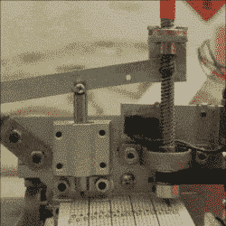

# 由于自动打孔机，音乐盒播放“仍然活着”

> 原文：<https://hackaday.com/2017/09/19/music-box-plays-still-alive-thanks-to-automated-hole-puncher/>

Custom hole punch and feed system

大多数项目都有一两个展示定制工作或巧妙执行的重要方面，但这个由[Josh Sheldon]和他的室友[Matt]制作的[音乐盒打孔机](http://www.jshel.co/things/music-box-hole-punching-machine)在许多层面上都是一种享受。不仅定制的硬件可以自动在长卷轴纸上打孔，以通过音乐盒，而且处理 MIDI 文件的软件前端也意味着在某种程度上，这个项目实际上是一个 MIDI 到手摇音乐盒的转换器。活着是多么美好的时光。

打孔机是一个完全定制的组件，正如[Josh]所观察到的，制造一个可靠的打孔机是非常具有挑战性的。大量的试验和错误涉及，该项目的文件以及概述视频进入大量的细节。也不要错过音乐盒版的《依然活着》。两者都嵌在下面。

 [https://www.youtube.com/embed/W41uh2bS2Yc?version=3&rel=1&showsearch=0&showinfo=1&iv_load_policy=1&fs=1&hl=en-US&autohide=2&wmode=transparent](https://www.youtube.com/embed/W41uh2bS2Yc?version=3&rel=1&showsearch=0&showinfo=1&iv_load_policy=1&fs=1&hl=en-US&autohide=2&wmode=transparent)

> [在 Instagram 上查看此贴](https://www.instagram.com/p/BUGUoQkg71E/?utm_source=ig_embed&utm_campaign=loading)[这是一次胜利. . .
> 
> [乔希·谢尔登](https://www.instagram.com/heyjshel/?utm_source=ig_embed&utm_campaign=loading) (@heyjshel)于 <time style=" font-family:Arial,sans-serif; font-size:14px; line-height:17px;" datetime="2017-05-15T03:59:50+00:00">2017 年 5 月 14 日晚 8:59 PDT</time> 分享的一篇帖子](https://www.instagram.com/p/BUGUoQkg71E/?utm_source=ig_embed&utm_campaign=loading)