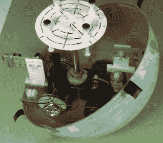
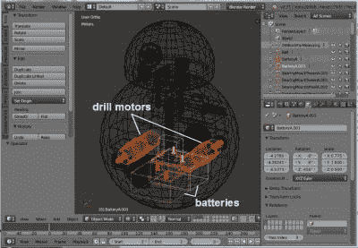
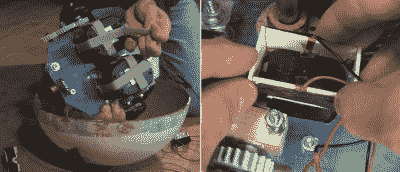
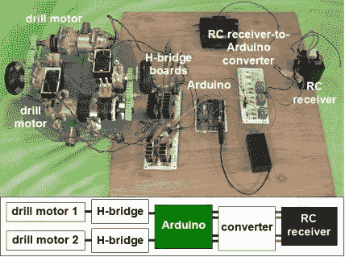
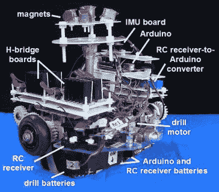
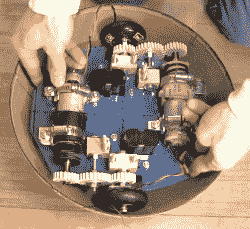
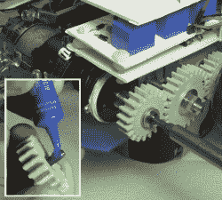
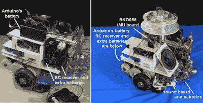

# 我的 DIY BB-8:问题、解决方案、经验教训

> 原文：<https://hackaday.com/2016/11/30/my-diy-bb-8-problems-solutions-lessons-learned/>

想象一下，试图制造一个球形机器人，它可以向任何方向滚动，但头部保持不动。当我在第一部*星球大战:原力觉醒*预告片中看到 BB-8 机器人这样做时，这是一个有趣的工程挑战，我无法抗拒。我是如何做到的所有细节都可以写满一本书，所以这里是重点:我遇到的问题，我如何解决它们以及我学到了什么。

## 设计标准:便携且便宜

Carrying BB-8

我心中有两个设计标准。首先是保持低成本。有些人花 1000 到 1500 美元买他们的 b b-8。我想尽可能少花钱，所以尽可能多的零件必须来自我现有的库存、在线分类广告和旧货店。不算沿途丢弃的零件，费用不到 300 美元。

第二个设计标准是使它便于携带。它必须是我可以带上公交车或步行一段合理距离时携带的东西(我曾经带着它走了 25 分钟到附近的一所学校)。

这两个标准意味着它必须小于全尺寸。一个全尺寸的球直径为 20 英寸。我的有一个 12 英寸的球，这使得它的比例为 3/5。此外，它越大，电机、电池、电机控制器、磁铁等的功率越大，成本也越高。

## 版本一:快速简单

  BB-8 version 1 in action  BB-8 version 1 truck in the globe

首先，我尝试了一种极简主义的方法。对于球，我在 kijiji.ca 上找到了我的 12”纸板地球仪。我在庭院甩卖中买了一辆遥控玩具卡车，并在它上面连接了一根柱子，用于在地球仪顶部附近固定磁铁。然后我做了一个头，下面有相应的磁铁。头部磁铁吸引磁极磁铁，保持头部。同时，在球内滚动的卡车使球移动。

让球滚来滚去很容易。让它在保持头部不动的情况下转动是非常困难的。磁极顶部的磁铁吸引头部下方的磁铁，将它们用力拉向地球表面。本质上是把卡车粘在地球的顶部。

为了克服这一点，卡车需要足够的牵引力。这也意味着卡车需要很重。最后，卡车的发动机需要足够强大，以克服自身重量和磁铁对球的吸引力。另一种方法是减弱磁引力，但如果太弱，头就会掉下来。从这个词的两种意义上来说，这都是一种微妙的平衡行为。

但我能呆在上面的最像圆顶的头只是一个纸板骨架。任何被填满的东西都会更重，需要更强的磁引力。玩具卡车的发动机无法胜任。

## 版本二:电钻马达和电钻电池

Batteries and motors in Blender

为了更强大的电机和更大的质量，我想我可以通过在仓鼠驱动配置中使用钻头电机和钻头电池[来一举两得。使用钻头零件降低了成本，因为电池和一个钻头来自庭院销售，而另一个钻头在 freecycle.org 是免费的。同时，两者都很重。](http://hackaday.com/2016/06/24/driving-bb-8-more-than-one-way-to-move-this-bot/)

为了确保一切都合适，我在我经常使用的免费 3D 建模和动画软件 [Blender](https://www.blender.org/) 中绘制了一个 3D 模型。事实上，找到如何使电池和马达匹配是第一步。它们必须尽可能低。它们巨大的重量使机器人保持垂直，而较轻的头部位于最高点。

Batteries Velcroed and a connector

电钻电池必须易于拆卸充电。为了把它们放在驱动盘下面，我简单地用了 Velcro。与此同时，钻孔电池杆穿过驱动板上的一个孔。我做了一个连接器来电连接电池端子。它是一个塑料矩形，带有薄铜片作为触点。一旦电池安装到位，这个塑料和金属片就被降低到杆上，铜金属与电池端子接触。

## 电子产品

  BB-8 version 2 electronics  Assembled internals

对于大脑，我使用了 Arduino UNO。为了驱动电机，我准备了制作两个 H 桥驱动板的所有零件，除了 4 个 MOSFETs 和一些保险丝。Arduino 对驱动板进行脉宽调制(PWM)以控制速度，并在电机开启的特定时间播放声音。

对于远程控制，我从玩具卡车上破解了 RC 接收器，并添加了一组额外的 AA 电池，以获得更多的运行时间。不过，我马上遇到的一个问题是，RC 接收器根据电机的旋转方向输出两种极性的电压，而 Arduino 的引脚只接受正电压。为了解决这个问题，我想出了一个转换器板来连接它们。

让所有这些可靠地工作需要一段时间。在添加保险丝之前，我烧了几个 MOSFETs。在某一点上，我会将 N 型 MOSFET 放在 P 型 MOSFET 应该放的地方，反之亦然。光是由此产生的问题就花了几天的空闲时间来解决。

轮子是旧的直排轮——我店里有一小桶这样的轮子。我决定让球以大约每秒 1 英尺的速度滚动，并做了数学计算，这意味着轮子必须以大约每秒 2 转或 120 转的速度旋转。我找到了一个 PWM 值，可以给出接近这个值的值，然后开始烧保险丝。我从 1 安培保险丝开始，然后是 2、5 安培，最后选定了 10 安培保险丝。

我的最后一个障碍是，当马达被告知向相反方向转动时，它们会表现得很奇怪，但当它们被告知向相同方向转动时，它们却表现得很好。这被证明是我对 RC 接收器内部接线方式的一个糟糕假设——内部没有公共的输出线。在对电路做了一些改动后，我现在有了稳定的电子设备。

我基本上一直将 RC 接收器视为一个黑盒，但当[我在 Hackaday](http://hackaday.com/2016/11/14/ask-hackaday-converting-negative-voltages-to-positive/) 上寻求关于我的转换器板的帮助时，有人指出接收器可能包含 H 桥。打开它，那正是我发现的。转换器板目前工作正常，但在不久的将来，我将使用 Hackaday 帖子中的一个建议来完全消除该板。我甚至会尝试所有的建议，只是为了好玩。

## 该驱动系统

The drive system

马达太长，无法安装在车轮之间，所以必须安装在侧面。为了将旋转传递给轮子，我在搅拌机里画了一些齿轮，并在我们当地的渥太华大学创客空间 3D 打印出来。在打印设置中，我使用了 2 个壳，只填充了 50%。齿轮被牢牢地固定在轴上，仅使用螺母和垫圈。即使在开发过程中出现滑动和摩擦，它们也能保持得非常好。

对于中心齿轮和轮子的轴承，我使用了一个用硬木制作轴承座的老技巧。

Putting Loctite and screwing gear to motor shaft

我想在驱动板上保留尽可能多的空间，以便以后添加东西，所以最初我只在三个点安装了电机。但是这使得马达移动了一点，导致齿轮打滑。为了解决这个问题，我后来增加了第四个安装点，从那以后就再也没有滑动过。

在钻机马达轴的末端有一个孔，一个螺钉可以穿进去。这是[卡盘如何保持在钻机马达](http://hackaday.com/2016/09/08/safely-remove-drill-chuck-receive-motor-gearbox-and-clutch/)上的一部分，也是如何保持一个齿轮的一部分。然而，这个螺钉有松动的趋势。在螺纹上涂一点乐泰胶水就可以解决这个问题。

## 稳定性

Rearranging BB-8’s internals

考虑到我试图在一个小机器人里装很多东西，我不得不把一些东西装得比我想要的更高。当机器人停止时，高质量会导致机器人摇晃。在用于促销活动的 BB-8 droid 中，他们在很大程度上尽可能降低大部分重量。最初我有 Arduino 电池和 RC 接收器，其额外的电池相当高。后来我把它们放得更低了。当我把内部拿在手里的时候，我可以分辨出不同，但是它并没有对抖动产生明显的影响。

相反，为此我增加了 [Adafruit 的 BNO055](https://www.adafruit.com/products/2472) 惯性测量单元(IMU)板。有了它，我可以知道机器人停止时的角度，并试验 PID 循环和我自己的其他算法，以最小化抖动。这很有帮助。

## 球

如我所说，我用了一个 12 英寸厚的纸板地球仪。为了增加地球仪内部车轮的牵引力，我在地球仪内部喷洒了一种来自五金店的防滑喷雾。这造成了巨大的差异。然而，随着时间的推移，防滑涂层消失了，所以我在寻找另一种更持久的涂层，也许是聚氨酯或其他东西。如果有人有什么建议，请在评论里告诉我。它最终也必须停止排气。防滑喷雾长时间有异味。

Sealing globes – cardboard and fiberglass

但是纸板地球仪的主要问题是它太薄了。由于内部巨大的重量压在轮子所在的地方，它严重扭曲，需要很大的努力和大量的胶带来保持两个半球在一起。这种大量的磁带也使磁头滑过不均匀的脊，使其被卡住。在这一点上，要么驱动系统继续移动，而头部脱落，要么驱动系统根本不能移动。

解决办法是小心翼翼地用三层玻璃纤维包裹一个新的地球仪。我花了一个半月的时间来做这件事，一次涂一块，然后在涂下一块之前打磨。结果是一个了不起的进步。它不再变形，现在只需用八条窄窄的透明胶带就能把两个半球连接起来。

## 永无止境的传奇

My DIY BB-8 in action

我的 BB-8 现在到了我可以称之为完工的时候了。至少就所有工程而言，它已经完成了，这通常是我放弃的地方。

虽然油漆工作进行得很好，但近距离你可以看到细节是画上去的。如果至少头上的线条是真正的凹槽就好了。此外，这些钻机电机是有刷电机，我后来了解到，随着时间的推移，对有刷电机进行高频 PWM 会损坏它们。我想把它们换成无刷电机。经常使用无绳电钻人都知道，电钻的电池不会持续很长时间，所以换成 LiPos 会很好。

但是现在，我从孩子和成人那里得到的反应超出了我最大的期望。孩子们像朋友一样威胁它，而成年人则像婴儿或狗摇尾巴一样抚摸它，呼唤它。我称之为成功。