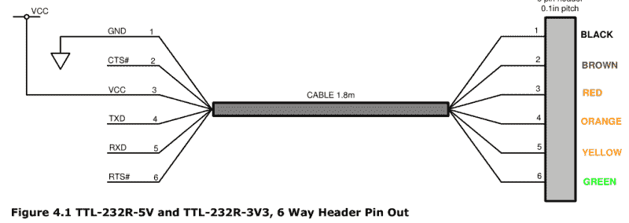
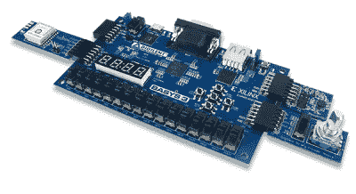
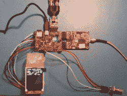
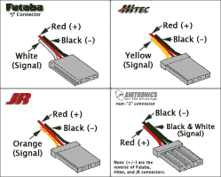
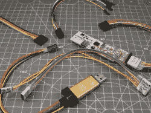

# 我在连接器动物园的生活

> 原文：<https://hackaday.com/2016/11/09/my-life-in-the-connector-zoo/>

"标准的伟大之处在于有如此多的标准可供选择."更真实的话从来没有说过，这对于硬件黑客的爱好者来说更是如此。似乎每一个模块、每一家公司和每一个黑客都有一种最喜欢的方式将相同的引脚排成一行。

我们有一整个抽屉的适配器，可以从一个引脚连接到另一个引脚，或者一个程序员连接到许多不同的目标板。我们将第一个承认这通常是我们自己的该死的错误——我们决定交换复位线和接地线，因为这对于一个设计来说很方便，现在我们有两个适配器。但是想象一下，在一个只有几个不同引脚的世界里，那个抽屉只有一半是满的，许多项目会简单地合在一起。“你可能会说我是个梦想家…”

这篇文章是关于连接器和标准的。我们会尽量不发牢骚和抱怨，尽管我们会发表社论。我们将研究一些设计权衡和要求，也许你会发现已经有一种标准引脚排列“足够接近”你的下一个项目。如果您有我们遗漏的常用引脚排列或用例，我们鼓励您在评论中分享连接器引脚排列及其优缺点。让我们看看我们是否能搞清楚这一团乱麻。

## FTDI TTL 串行

黑客 TTL 串行引脚排列的事实标准肯定是 FTDI 用于其 USB/TTL 串行电缆的布局。所说的电缆是如此方便手头上，你会傻用任何其他引脚的工作。好消息是，世界其他地方基本上都加入了进来。从中国的“Pro Mini”cloned uins 到[hack aday Edition Huzzah ESP8266 板](http://store.hackaday.com/products/huzzah)，从 Adafruit 的 [FTDI Friend](https://www.adafruit.com/products/284) 到 Modern Device 的 [USB-BUB](https://moderndevice.com/product/usb-bub-ii/) ，几乎所有人都使用这种引脚排列。普通人的胜利！

然而，有一个小小的争议点，那就是引脚 6 是`DTR`还是`RTS#`。我们从来不使用这两个，所以我们不在乎，但是如果你指望你的程序员发送`DTR`信号进入设备上的编程模式(我们正看着你 [Arduino](http://playground.arduino.cc/Learning/AutoResetRetrofit) ！)然后你会希望`DTR`在引脚 6 上，讽刺的是，原来的 FTDI 电缆有“错误”的引脚排列。也许这就是为什么 Sparkfun 避免了整个崩溃，走自己的路，将 FTDI 芯片的每个信号分解成自己独特的配置。

如果你只是要打破 TTL 串行线，你会是一个傻瓜使用任何其他引脚排列。

## 模块和其他通信

与简单串行不同，将各种模块连接到主板是一个难题。为许多潜在协议或任意信号创建单一引脚或连接器规格是一项艰巨的任务。令人惊讶的是，它已经被做了几次。这里有一些名人。

### Pmod

[Digilent](http://store.digilentinc.com/) 制造各种 FPGA 演示板，他们需要一种内部标准引脚排列，可以用来插入他们销售的各种附加外设模块。Pmod 就这样诞生了。它已经成为一个成熟的、有商标的[开放标准](//reference.digilentinc.com/reference/pmod/specification?redirect=1)，你可以在你的设计中使用。这是规格的 [PDF 版本](https://www.digilentinc.com/Pmods/Digilent-Pmod_%20Interface_Specification.pdf)供您打印，这样您就知道他们是认真的。

Pmod 有几个方面我们认为特别巧妙。首先，所涉及的引脚数量“正好”为六个，并且很容易扩展。他们使用标准的 0.1 英寸间距引脚和接头。两条线承载电源和地，留下四个空闲引脚用于 SPI、UART 或其他任何设备。规格是所有电源和信号电压都是 3.3 V，因为它们毕竟是为 FPGAs 设计的。如果你知道你在做什么，你可以混合搭配，但他们不会让你叫它 Pmod(tm)。

Eric Brombaugh’s [iceRadio](http://ebrombaugh.studionebula.com/radio/iceRadio/index.html) FPGA SDR, plugged together with Pmods

如果您需要四个以上的信号，有一个 12 引脚版本，它只是两个 6 引脚 Pmods 堆叠成一个双排接头。额外的电源和接地是多余的，但它使 12 针输出非常灵活，因为没有什么可以阻止它被用作两个 6。该标准还规定，12 针接头的中心间距为 0.9 英寸，因此当您需要 16 个板对板信号连接时，您甚至可以将两个接头连接在一起。我们喜欢模块化和可扩展性。

Pmod 连接器支持多种协议，但每种协议只有一个引脚。因此，有一个 SPI Pmod 和一个 I2C Pmod，引脚总是在同一个位置。当然，并不存在适用于所有可能应用的 Pmod 标准，因此有一个 GPIO 引脚排列，让您可以自由控制什么东西去哪里。我们认为这将是很好的，如果一些额外的显着议定书(I2S？单线？伺服系统？模拟立体声音频？)包含在规范中，但是社区也可以处理这些底层细节。

 在我们眼中，Pmod 近乎完美。它使用廉价的硬件，易于扩展，最小的化身小到足以适合一平方英寸的电路板的所有四面。如果你愿意支付品牌溢价，Digilent 制造了一系列令人难以置信的模块。我们希望看到更多 FPGA 之外的黑客加入进来。

### 小型公共汽车

digi lent 之于美国开发板，MikroElektronika 之于欧洲。虽然 Pmod 的目标是能够做任何事情，但 Mikro-E 的 [mikroBUS](http://www.mikroe.com/mikrobus/) 连接器想要做任何事情，也就是说它在同一个引脚上有 I2C、SPI、UART、两个电压，甚至几个额外的信号。从物理上来说，它是两排 8 个引脚，左右间隔 0.9 英寸，这意味着它可以很好地放入试验板。这是 PDF 格式的规格。

相对于 Pmod，这里的权衡是，在任何给定的设计中，都有许多引脚没有被使用。(只有)一个“模拟”通道，你不会选择 mikroBUS 来发送立体声音频，然而没有什么可以阻止你将 Pmod 的 GPIO 线路称为模拟，并发送四个声音通道。但是 mikroBUS 得到的是防呆。(嗯，他们也可以把它做成非对称的……)新手不可能把 SPI 模块插在应该是 I2C 模块的地方而挠头。有了 mikroBus，应该就行了。

微芯片在他们的好奇心板上增加了一个 mikroBus 端口，MikroElektronika 制造了大量的模块。如果您的受众是初学者，并且所有协议都是一个脚印，那么这是值得考虑的。

### Seeed 的小树林

与此同时，在中国，Seeed Studios 制作开源模块，并使其价格低廉。他们的 [Grove 连接器](http://wiki.seeed.cc/Grove_System/)只用了四个引脚，其中有电源和地。具有 UART、I2C 和伺服电机的标准引脚排列。传感器和其他模拟外设被分配了一个“主要”引脚和一个“次要”引脚，并且假设您知道自己在做什么。他们的系统背后的想法是，你给你的微控制器板增加一个屏蔽，他们把相关的引脚分成这些四引脚 Grove 接头。

这对于小东西和 I2C 设备来说很棒，这是 Seeed 的目录，但例如，没有足够的信号引脚来运行 SPI 或模拟 RGB LED。但由于引脚数量少，它们使用非常便宜的极化电缆和护罩，你不能以错误的方式插入，并且占用相对较少的电路板空间。这就是格罗夫的设计权衡。

### 伺服电机控制

One of these things is not like the others…

爱好伺服电机需要三条线:电压、接地和一个告诉它们指向哪里的信号。有三种不同的方式来安排这些电线，但双叶，HiTec，塔，GWS 和 JR 伺服都选择把它们放在 SVG(或 GVS)的顺序，没有理由逆潮流而动。(Airtronics，你在想什么？！)

SVG 也是一种方便的引脚排列，用于各种空间宝贵的单信号传感器或执行器，我们已经在一些设计中看到了这一点(例如，这里的[和这里的](https://hackaday.io/project/2080-gvsduino)[和](https://hackaday.io/project/5841-ignore-this-esp8266-board))。但是我们被撕裂了。例如，相对于小树林，你只是节省了一根针。甚至 Pmod 也只需要三个管脚就可以工作。这值得让你的生活变得复杂吗？如果你需要很多动力单一信号设备，或伺服，它可能是，你很难击败 SVG 或 GVS，无论你怎么看它。

### 阿尔杜伊诺

从其他模块互连系统的角度来看，Arduino 是最糟糕的。它像 mikroBUS 一样是单片的，但它非常巨大——如果你希望它可以堆叠，你必须构建一个 55×73 mm 的电路板，并容纳 30 个引脚和通道。这些针有一个有趣的间距。)，那不符合任何正常的 protoboard。没有人会仅仅为了一个 I2C 的连接而费心去建造一个屏蔽。难怪大多数 Arduino 项目看起来像一只试验板刺猬。关于它，我们能说的唯一好的事情就是很难把它倒着插上。

还有一个非常小的因素，那就是有一百万个 Arduino 盾，围绕它们建立了一个巨大的社区，以及对它们的广泛支持。这超越了所有合理的设计考虑。(摇头。)

### 混合物

 当然，人们可能会遇到其他非常特殊的引脚排列，如旧的 [ESP-01 模块](https://hackaday.io/project/5936-esp-01-esp-03-breakout)，或 [XBee](https://www.parallax.com/product/32403) ，或 nRF24。让模块适应主板总是一件痛苦的事情，因为制造商会在那天选择任何适合他们的模块。特定微控制器的程序员引脚排列是一个类似的故事，JTAG 也是如此，这是一个美丽的标准，具有引脚排列的可能性。(我们可以做一整个专栏！)

面对这种不可避免的情况，以及对许多一次性适配器的需求，您能做些什么？我们所做的是购买大量廉价的“杜邦”女性对女性电缆，让连接工作和测试，然后用胶带将它们永久固定在一起并贴上标签。它没有专用的 PCB 适配器漂亮，但它快速简单，让你开始做你想做的事情。

## 总结和建议

连接器及其标准的目标是将零件组装在一起。如果你正在设计一个有多个组件的传感器模块，并且你想让你自己和其他人最大限度地方便地连接到他们的任何主板，这不是一件容易的事情。最终结果是翻译器、适配器板、帽子、盾牌、斗篷或其他任何东西的激增。我们有一个半满的抽屉，我们打赌你也有。

 

是的，我明白我在暗示什么了。[source:[xkcd 927](https://xkcd.com/927/)]

老实说，我们很高兴看到世界上大多数需求都依赖 Pmod，我们甚至会以标准化的名义抛弃我们心爱的 FTDI 串行引脚排列(或制作适配器)。我们还可以看到，当使用小型传感器或多个传感器时，需要 SVG /伺服连接器等例外情况。当然，也总是需要专用的板载连接器。没人说硬件容易。

对于连接器的终极难题，你的解决方案是什么？我们是否遗漏了重要的连接器系统？他们的设计权衡是什么？如果所有东西都能连在一起，你会有多兴奋？让我们知道！

缩略图由[ [Raspberry Pi 控制器]](http://rpc.gehennom.org/2014/10/attiny85-breakout-boards/) 提供。