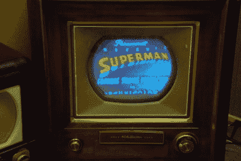
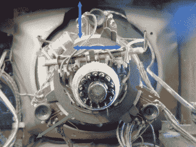

# 我最过时的技能:三角枪聚合

> 原文：<https://hackaday.com/2016/04/04/my-most-obsolete-skill-delta-gun-convergence/>

在与电子产品打交道的一生中，我们看到许多技术出现，变得强大，然后消失，就好像它们从未存在过一样。例如锗晶体管、热离子阀(“电子管”)、螺旋扫描录像带或阴极射线管显示器。在这个过程中，我们获得了大量与使用设备相关的一般知识和特殊技能，一旦世界发生变化，这些知识和技能就变得多余，只适合回忆过去的时光。

当我想到我现在多余的特殊技能时，有一项技能因其复杂性和所需的技能而脱颖而出，但它在今天完全不相关。我说的是三角电子枪荫罩彩色阴极射线管的融合，它是 20 世纪 70 年代之前电视技术的顶峰，在 20 世纪 80 年代，一个青少年仍然可以很容易地对其进行修补。

[![Delta-gun shadow mask operation. By User:Tirante (Own work) [CC BY-SA 3.0], via Wikimedia Commons](img/60a5e999b1dfb5c2519a729d5024c6ad.png)](https://hackaday.com/wp-content/uploads/2016/03/deltagun.png)

【Delta-gun】阴影遮罩操作。By 用户:Tirante(自己的作品)[CC BY-SA 3.0]，via[Wikimedia Commons](https://commons.wikimedia.org/wiki/File:DeltaGun.png)

一个荫罩式彩色 CRT 有三个电子枪，一个用于红色，一个用于绿色，一个用于蓝色。它的屏幕上有一个红色、绿色和蓝色磷光体点的网格，一个布满孔的金属板——荫罩——正好排列在它的后面，这样每种颜色的磷光体只能被相应的电子枪看到。当三束电子束在屏幕上的光栅中被追踪时，它们的相对强度可以为你的眼睛合成任何可见的颜色。

荫罩式 CRT 的设计者面临的问题是对准电子枪、荫罩和荧光点，使得对准在屏幕上的所有点都是完美的，而屏幕上的所有点与电子枪的距离并不相等。如果你用一个全白的图像提供一个排列不良的阴极射线管，它将提供一个大部分是白色但有彩色斑点的图像，当一个电视图像被显示时，它将在它的主题周围出现洋红色、青色和黄色的阴影。

从 20 世纪 60 年代中期开始发展起来的荫罩式阴极射线管通过巧妙的荫罩设计、不同的荧光点图案以及所有部件与三个电子枪在管颈上成一条线的仔细对准，机械地解决了这个问题。早期的显像管将电子枪安装在管颈的三角形区域，依靠复杂的电子设备、磁铁和电磁铁来主动校正电子束穿过屏幕时的不对准。这篇文章的主题就是做出这些调整的技巧。

The daddy of all delta-gun CRTs, the RCA CT-100\. By HumanisticRationale – CC BY 3.0 ([Wikipedia](https://en.wikipedia.org/wiki/CT-100#/media/File:RCA_CT-100_screenshot.jpg))

广播彩色电视起源于第二次世界大战后的几年，第一批商用电视机都是美国的 525 线 NTSC，1954 年初的[西屋 H840CK15](http://www.earlytelevision.org/westinghouse_color.html) 和 [RCA CT-100](https://en.wikipedia.org/wiki/CT-100) 。(在这些情况下，我应该使用诺亚·韦伯斯特的拼写*颜色*。早期的电视机是圆形的阴极射线管，但是当我们英国人在 20 世纪 60 年代末拥有 625 行 PAL 彩色电视时，世界已经发展到了你可能熟悉的曲边矩形屏幕。

为了说明这个作品，我从储藏室里拿出了我最后一台剩下的三角枪电视。这是一把 ITT CVC5，在 20 世纪 90 年代的某个时候我拿到了它，它是 1972 年制造的，我一直留着它，因为我猜想它会是最后一把德尔塔枪。它在战争中出现过——我应该保留我在 80 年代拆开的许多更好的例子中的一个——但我当时通过修复一个破裂的 PCB 和更换一个熔断的整流器让它工作了。可悲的是，它现在失去了场振荡器，所以有一个修复工作，为未来的闲置时间。

打开 CVC5，你会开始理解为什么这些电视机在推出时如此昂贵。它有一个 Mullard delta-gun CRT，一个底盘，有几平方英尺的树脂粘合纸质 PCB，上面密密麻麻地覆盖着分立元件，电子管在你面前向下铰链，一条粗壮的 PAL 延迟线和一个用于 25 千伏 EHT 电路的大型金属外壳。这是一种实时机箱设计，因此如果它是连接的，就需要非常小心。在阴极射线管的颈部是偏转组件，在它的后面是会聚线圈，通过脐带电缆连接到一个大的塑料会聚盒，盒内有一组电位计和可变电感器。这些磁体和会聚轭上的可调磁体构成了会聚调节的基础。

The CVC5 convergence yoke with coloured arrows showing what each control does.

会聚线圈采用倒 y 形(⅄)线圈和磁铁组件的形式，当正确放置时，它在每个电子束的路径上放置一个磁场。⅄的每个臂具有可旋转的磁体，该磁体沿着臂的轴线移动相应的束。上面是蓝色，右下角是红色，左下角是绿色。还有另一个可调节的磁铁夹在会聚轭后面的管颈顶部。这具有将蓝色光束从一边移动到另一边的效果。

从图中可以看出，蓝色电子束可以在两个轴上调整，而另外两个只有一个轴。要执行会聚的基本调整，您可以关闭蓝色枪，并将蓝色和绿色移动到它们对齐的点，然后重新打开蓝色枪，并根据需要向两个方向移动它，直到它与另外两个相交。理想情况下，这应该用测试模式发生器来完成，但作为一个青少年，这样的设备远远超出了我的能力范围，我使用了 [Testcard F](https://en.wikipedia.org/wiki/Test_Card_F) 。感谢 BBC 2 台的转播！

当然，完成基本的会聚后，你会发现三角枪 CRT 的会聚是多么糟糕。屏幕边缘周围的几乎所有东西上仍然会有彩色阴影，三个栅格中的每一个都可能在中心对齐，但它们仍然具有不同的形状。是时候接触电子会聚面板了，进入调整所有这些罐子和感应器的黑色艺术，将三个图像拖成一条线。

The ITT CVC5 convergence panel

汇聚面板总是设计为可从电视机前面接触到，您需要有一个良好的屏幕视野才能使用它。在一些电视机上，它可以从前面的面板后面进入，在另一些电视机上，它是一个铰接的 PCB，但在 CVC5 上，它是一个塑料盒，位于机箱内的一个插槽中，可以通过脐带电缆引出。

前面是一系列会聚控制，每个控制都用颜色和屏幕面积进行了有益的标记。还有调整光束强度以设置灰度性能，以及关闭蓝色和绿色电子枪的开关，以进行不需要它们的调整。

多年来第一次看到融合面板时，我的反应是，也许这是我曾经拥有的技能，现在却失去了。但在现实中，控制是有逻辑安排的，而不是疯狂地摆弄锅，技术是根据屏幕上的收敛问题进行小的调整。几乎可以肯定有一个推荐的进度，但是如果我一开始就有它，在过去的二十年里我已经把它弄丢了。我确实记得在 20 世纪 80 年代，通过不断的试错，我学会了如何做到这一点，一开始犯了惊人的错误，然后逐渐变得越来越好。

这就是你要做的，对一项现在完全多余的技术的非常老的版本进行复杂的调整——这是我最过时的技能。你呢？

值得花点时间深入研究一下复古领域，看看 CVC5 的其他照片。一些彩色解码器和时基电路以及高压外壳的特写镜头。PL509 线路输出管，回扫变压器和 EHT 三倍频器。不过，我个人最喜欢的是 focus pot，开路杆电阻两端为 5 KV，游标由一片细长的玻璃纤维 PCB 材料通过活动底盘上的插槽进行调节。对我来说很安全。

此幻灯片需要 JavaScript。