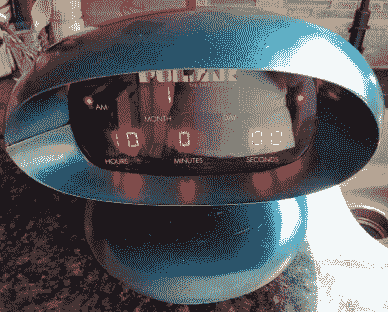
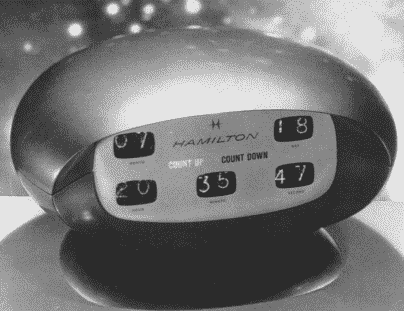

# 2001 年神秘的谢妮钟:太空漫游和脉冲星

> 原文：<https://hackaday.com/2018/03/20/mystery-nixie-clock-from-2001-a-space-odyssey-and-pulsar/>

时不时会有一些旧的东西出现，让我们惊讶的是这些东西从未被黑客攻击过。这里的情况尤其如此，因为它包括谢妮管和一个时钟，这两样东西在这里受到很多人的喜爱。话又说回来，不是黑，只是应该是(提示提示)。

  Pulsar mystery clock  2001: A Space Odyssey clock

这座钟的起源有点神秘。正如[Asto_Vidatu]的 Reddit 帖子中详细描述的那样，他是在清理他母亲的车库时发现的。时钟内部的大照片在[的 imgur 页面](https://imgur.com/a/cSOTb)上，一定会让你高兴和好奇。它看起来非常像一个被广泛认为是汉密尔顿钟表公司为斯坦利·库布里克制造的时钟。1966 年，库布里克委托汉密尔顿为他即将上映的电影《2001:太空漫游》制作一个未来外观的时钟和手表。在电影中，手表出现在宇航员的手腕上，但时钟却留在了剪辑室的地板上。电影制作完成后，库布里克将时钟交还给汉密尔顿，它最终落入[Asto_Vidatu]的祖父手中，他在制作时钟的团队中工作。

所有这些可能会让你认为这是为电影制作的时钟，而不是上面有 Hamilton 名字的时钟，但 Pulsar 这个名字被认为是在电影上映时虚构出来的。那么它是从哪里来的呢？是[Asto_Vidatu]的爷爷或者汉密尔顿的其他人黑的？这是汉密尔顿开发的产品，还是 Pulsar 手表的营销噱头？

有一件事我们知道，这是一个现代翻拍的呼声。如果你能找到一些谢妮电子管，那么这些驱动板可能会有所帮助。或者用类似数码管的东西来做，比如[这些边缘发光的丙烯酸数字](https://hackaday.com/2017/03/23/before-there-were-nixie-tubes-there-were-edge-lit-displays/)。