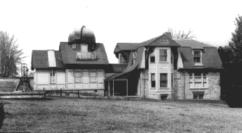
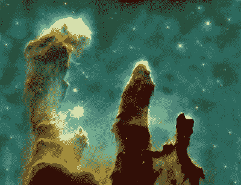

# 南希·格蕾丝·罗曼，哈勃之母

> 原文：<https://hackaday.com/2018/04/03/nancy-grace-roman-mother-of-the-hubble/>

南希·格蕾丝·罗曼四岁时，就喜欢画月亮。到她 40 岁时，她负责说服美国政府资助一架太空望远镜，为我们提供前所未见的最清晰、最锐利的月球照片。她对天文学的兴趣一直是学术性的，她自己也从未拥有过望远镜。但是没有南希，就没有哈勃。

### 晚安，月亮

A view of the Milky Way from Reno, Nevada. Via [Lonely Speck](https://www.lonelyspeck.com/how-to-find-the-milky-way/)

南希于 1925 年 5 月 16 日出生在田纳西州的纳什维尔。她的父亲是地球物理学家，一家人经常搬家。南希的父母影响了她的科学好奇心，但也满足了他们。南希的父亲处理科学难题，南希的母亲对自然世界非常感兴趣，她会给她指出鸟类、植物和星座。

两年来，这家人住在内华达州里诺的郊区。广阔的沙漠和低水平的光污染使观星变得容易，南希被迷住了。她和一些邻居女孩组成了一个天文俱乐部，他们每周在罗马人的后院聚会一次，研究星座。南希后来回忆说，她在雷诺的经历是对她未来职业生涯最大的影响。

南希准备上高中的时候，尽管几乎完全得不到老师的支持，她还是下定决心要成为一名天文学家。当她请求指导老师允许她选修第二学期的代数而不是第五学期的拉丁语时，指导老师震惊了。她瞧不起南希，冷笑道:“哪个女士会选数学而不选拉丁语？”

### 伸手摘星

南希选择了斯沃斯莫尔学院。他们有一个强大的天文学项目，由苏珊·坎宁安创立，她曾在瓦萨大学师从 T2·玛丽亚·米切尔。不幸的是，第二次世界大战正如火如荼地进行着，许多老师都离开去帮助战争了。

The Cunningham Observatory. Via [Swarthmore](https://www.sccs.swarthmore.edu/users/98/elizw/Swat.history/Cunningham.html)

学校的天文台处于一种可悲的、被忽视的状态，被一些当地人用作储存洋葱的筒仓。南希和另一名学生决心研究宇宙，他们把望远镜拆开，清洗，重新组装，并进行调整，以便更好地工作。

南希于 1946 年获得天文学学士学位，然后去芝加哥大学攻读博士学位。毕业后，她继续在威斯康辛州的耶基斯天文台工作。一天，当她试图确定一颗恒星的组成和它在星系中的位置之间的关系时，她观察到一颗具有不寻常发射光谱的恒星。这似乎有点奇怪，但她没有多想。她写了两页纸的便条，然后回去工作了。她观察到的恒星，一个后来被命名为[AG dragonis](https://phys.org/news/2017-10-astronomers-unusual-outburst-binary-star.html)的双星系统，将会成为她的幸运星。它每 10 年或 15 年才会出现约 100 天的这种活动爆发。

虽然南希非常喜欢教学和研究，但她认为女性永远不会在研究机构获得终身职位。她改变了自己的专业，以贴近研究，并在华盛顿美国海军研究实验室(NRL)的射电天文学项目中谋得了一个职位。

任职几年后，她意外地收到了参加亚美尼亚一座新天文台落成典礼的邀请。新天文台的主管读了她写的关于她在耶基斯看到的那颗不寻常的恒星的两页笔记，对她的发现很感兴趣，所以他邀请她来代替一个不得不退出的人。

冷战期间，南希只有大约四周的时间获得海军的许可，并安全进入苏联，但她成功了。她受到邀请的消息很快传遍了 NRL，他们请她谈谈她的旅行，并在她回来后给她的同事们讲课。

### 美国宇航局黄铜

Nancy with a model of an Orbiting Solar Observatory. Via [NASA](https://solarsystem.nasa.gov/people/225/nancy-roman/)

南希喜欢给已经精通工程和物理的听众讲授天文学，因为她可以更深入地探索这些话题。她通过做这些讲座获得了很多认可和名声，当美国国家航空航天局于 1958 年成立时，她有权力推荐一个可以启动太空天文学项目的人。南希认为这是一个建议，她提交自己的名字。离开研究很难，但她无法抗拒影响未来几十年天文学的机会。

南希是美国国家航空航天局聘用的第一位女性主管。她负责开发几个太空天文学项目，为它们做预算，并完成它们。她监督了天文卫星的发展，并参与发射了三个轨道太阳观测站，这些观测站使用伽马射线和 x 射线从低地球轨道研究太阳。

她的职责之一是测量天文学界的温度。她带着美国国家航空航天局的工程师走遍了美国，想知道天文学家最想从这个新成立的组织中得到什么。工程师们在那里验证他们愿望的可行性。他们中的大多数人说他们想要一个太空望远镜，但他们并不都同意。许多受人尊敬的天文学家是反太空的，他们相信只要他们继续建造更大更好的望远镜，在地面上一切都可以做得更好。在南希说服国会之前，她必须说服天文学界。

### 哈勃之母

南希经常把地球的大气层比作一扇旧的彩色玻璃窗。我们可以看穿它，但玻璃中的灰尘颗粒和不规则性扭曲了视图，模糊了许多细节。地球的大气层也是如此；它完全阻挡了一些光线，并扭曲了通过的光线。

Hubble’s image of the Eagle Nebula giving birth to stars. Via [NASA](https://spaceplace.nasa.gov/hubble-wfpc/en/eagle-lrg.jpg).

大部分被阻挡的光对我们进一步了解宇宙至关重要，因为它让我们能够测量恒星和星系的速度。将望远镜放在大气层上方似乎是科学需要的飞跃。

将望远镜放入太空的想法并不新鲜。普林斯顿大学的教授莱曼·斯必泽在 1946 年首次提出了这个想法，但是有太多的技术挑战需要首先克服。

正如南希发现的那样，也有人类的挑战。即使是设计一架太空望远镜，也需要大量的金钱、时间和研究。但是钱是第一位的。南希和美国国家航空航天局必须说服国会，向太空发射望远镜是值得的，因为它有望促进我们对宇宙的了解。

她和她的上司为那些拥有政治权力但缺乏科学背景的人举办了许多盛大的晚宴。十年来，她撰写国会证词，然后由她的男性同行提交给国会。资助哈勃望远镜是一条艰难的道路，美国国家航空航天局被拒绝了很多次。即使在国会批准后，仍有许多人大声反对。

### 妈妈，我应该相信政府吗？

南希于 1979 年从美国宇航局退休，并试图将该项目交给有能力的人，但它遭遇了重大的财务，工程和管理问题，超出了任何个人的控制。哈勃的发射原定于 1983 年，然后是 1986 年，但由于挑战者号的灾难而进一步推迟。它最终于 1990 年 4 月 24 日被送入轨道。

南希把她的成功归功于运气、决心以及她良好的口语和写作能力。那些坚持认为她在天文学或物理学中没有地位的教育者从未使她气馁。她只是知道这是她想做的，她相信自己。

对南希来说最重要的是推进太空探索。她退休后一直非常活跃，到处旅行去教书和讲课。她是科学界女性的直言不讳的倡导者，并利用一切机会鼓励对天文学感兴趣的女孩。