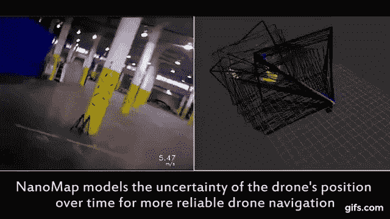

# 麻省理工学院通过不出汗障碍物打破了自主无人机的速度限制

> 原文：<https://hackaday.com/2018/02/12/nanomap-mits-uncertain-solution-to-autonomous-navigation/>

如何给无人机编程，让它在现实世界中自己飞到某个地方，而不撞上什么东西？这是一个棘手的问题，如果你把速度推得越来越高，这个问题会变得更加棘手。但是任何带有“麻省理工学院”的文章都暗示着被设计的问题并不简单。

麻省理工学院计算机科学和人工智能实验室的人们已经将他们相当多的技能用于解决这个问题。他们想出了(毫不奇怪)非常聪明的办法:他们拥抱不确定性。

## 为什么自主导航这么难？

假设我们给自己制造一个机器人，它可以将钥匙插入汽车的点火开关并启动发动机，并且可以在大约与人类相同的时间内完成这项工作——比如说 10 秒钟。这可能不是一个容易制造的机器人，但我们都同意这是非常可行的。有了车辆点火开关相对于我们的机械臂的坐标信息的预知，我们可以 100%准确地将钥匙放在开关中。但是，如果我们希望我们的机器人在任何带有标准点火开关的汽车上取得成功呢？

现在，点火开关的位置会因汽车型号的不同而稍有不同。这意味着我们必须实时处理这个问题，并在运行中开发我们的坐标系。如果我们能慢一点，这不会是太大的问题。但是将这个过程限制在 10 秒内是极其困难的，也许是不可能的。在某种程度上，环境信息和计算的数量变得如此之大，以至于任务变得难以数字化。

这个问题类似于自主导航。环境总是在变化，所以我们需要传感器来不断监控无人机及其周围环境的状态。如果障碍变得太大，就会产生另一个存在于计算能力中的问题…有太多的信息需要处理。唯一的解决办法就是让无人机减速。NanoMap 是一种新的建模方法，它打破了通常由动态环境映射强加的人工速度限制。

## 纳米地图

所有自主无人机都有速度限制，这取决于它必须避开的障碍数量。如果前进速度太快或者障碍物太多，无人机就不可能跟踪所有的障碍物。一旦这条线被突破，就有可能发生碰撞。传统上，如果你不能减少障碍，你必须让无人机减速以等待计算。

麻省理工学院 CSAIL 的想法是不再试图跟踪每一个障碍。它接受这样一个事实，即它无法知道自己的确切位置……在一段时间内，无人机在太空中的位置存在根本的不确定性。NanoMap 考虑到了这种不确定性，并试图将其保持在尽可能低的水平。这使得无人机能够在障碍物丰富的环境中以更高的速度运行，同时保持碰撞的概率相对较低。

## 理解不确定性是关键

NanoMap 使用前瞻性深度传感器，将即时环境的想法整合在一起，创建本地 3D 数据结构。然后，它使用算法来搜索该结构。它搜索过去，以找到与当前视图相似的过去视图。基本上，它收集的信息足以让它知道自己在“某个区域”，然后据此规划飞行路线。它不像其他模型那样试图计算它的确切位置和方向。它只获取不发生意外所需的数据，而不关心确切的位置和方位。他们称这个想法为“构成不确定性”。

请务必查看[白皮书](https://drive.google.com/file/d/1uo2idg7VbzU9iBWaqmksCfCCyE--V_Cc/view)了解全部细节，但我们建议留出一些业余时间。这让你绞尽脑汁。如果你能做到这一点，坚定的黑客或制造者可以自己尝试一下；研究团队令人难以置信的工作是[开源](https://github.com/peteflorence/nanomap_ros)。如果你计划在你的下一个自主项目中使用这项令人兴奋的新技术，请在评论中告诉我们！

 [https://www.youtube.com/embed/yOrtZ38olvc?version=3&rel=1&showsearch=0&showinfo=1&iv_load_policy=1&fs=1&hl=en-US&autohide=2&wmode=transparent](https://www.youtube.com/embed/yOrtZ38olvc?version=3&rel=1&showsearch=0&showinfo=1&iv_load_policy=1&fs=1&hl=en-US&autohide=2&wmode=transparent)

