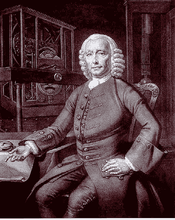

# 没有时钟，在海洋中航行是致命的

> 原文：<https://hackaday.com/2015/09/28/navigating-the-oceans-is-deadly-without-a-clock/>

这个周末我遇到了一个有趣的问题:如果没有现代技术，你如何在地球上建立你的东西方位置？答案取决于你所说的“现代”是什么意思，事实证明你只需要回到大约三个世纪前就能发现没有可靠的方法。改变这一切的技术是时钟；一个非常特殊的装置，尽管大气条件和运动不断变化，它仍能保持准确的时间。哈里森·H1 号的发明彻底改变了航海旅行。

我们应该感谢安迪·威尔让我谈到了这个话题。我刚刚读完他的精彩小说《火星人》,我可以肯定乔治·格雷夫斯(George Graves)对这部小说高质量的评价是完全正确的。在很大程度上，安迪列出了马克·瓦特尼面临的挑战，然后设计了一个解决方案。但当涉及到在火星表面绘制位置时，他只是顺便提到需要精确的时钟来确定经度。我一直以为一个[六分仪](https://en.wikipedia.org/wiki/Sextant)就足够了。但是，除非你有一个已知的地标，否则这只能确定你的纬度(北/南位置)。

### 看太阳

如果你站着不动，你可以画出太阳每天在天空中的位置。如果你从那一点向西移动，太阳将在同一时间在天空中更低，因为你的新位置需要更长的时间向地平线移动。了解这一点并结合六分仪读数，可以让你很容易地计算出你的准确位置。但是你需要一个非常精确的时钟来进行第一次测量。

![One of the earliest Pendulum clocks built in 1657 [Source: Rob Koopman CC-BY-SA]](img/fe2f89e134e258c3b673af4f936fe65a.png)

1657 年建造的最早的摆钟之一【来源:[罗布·库普曼 CC-BY-SA](https://www.flickr.com/photos/koopmanrob/3775343287/)

摆钟是一种非常精确的计时方法。它是在 1656 年由克里斯蒂安·惠更斯发明的，但是你不能把它带上船。钟所在的船的摇摆扰乱了正常的摆动，使钟失去了作用。再加上该装置在海上必须承受的条件(温度、湿度、盐水等的变化)，它对航行毫无价值。那么他们做了什么？[航位推算](https://en.wikipedia.org/wiki/Dead_reckoning#Marine_navigation)。没错，测量(真的估计)旅行的速度，并结合六分仪读数在地图上绘制出来。由此产生的导航系统使水手偏离了数百英里的航线，是造成海上死亡的最大因素之一。

### 约翰·哈里森；传奇

John Harrison

这家伙就是我们要找的人。你不得不同情这样一个人，他花了 31 年的时间试图解决一个真正重要的问题，用他的发明扼杀了这个问题，而他的成就仅仅得到了一点点认可。

他于 1730 年首次尝试航海计时器，并于 1736 年制造出了海瑞森·H1 号，并进行了试航。这不是第一个为船设计的时钟，但它确实克服了早期设计面临的问题。

首先，你可以通过使用水平摆轮来消除钟摆的许多问题。人们已经尝试过摆轮，但被证明是不精确的，特别是因为温度的变化会影响系统中使用的金属弹簧。

H1 使用了一种新颖的方法来解决几乎所有的问题。在其中，哈里森实现了一个双光束系统。这两个被安装在一个垂直的位置，枢轴在中间，重物在两端。它们彼此反向摆动，两端都有弹簧，将它们拉向计时器的中心点，然后再将它们推出。这种动量的持续转移不受船舶运动或大气条件变化的影响。

你可以看到左边展示的 H1 复制品的顶部重量。这是从[中截取的一个很短的视频片段](https://www.youtube.com/watch?v=Veb8xBNW5V4)，展示了格林威治皇家天文台的时钟。看一看，你就会对这个设备有多大有所了解。

尽管 H1 在很多情况下都表现得非常好，但它仍然容易受到离心力的影响，而且测试也比较零散。他对设计进行了两次改进，到 1759 年建造 H3 时，设计中加入了更多的配重来克服这一弱点。

但最终整个设计被废弃，这是一个巨大的飞跃，成为机械表的标准。最终的解决方案是回到水平摆轮和弹簧上。哈里森通过使用双金属弹簧解决了温度波动影响精度的问题，双金属弹簧可以在变暖或变冷时调节自身的张力。他还提高了摆轮的速度以提高性能。这是在 1761 年完工的 H4 实现的。

但别忘了我提到过他的发现有些边缘化。促使他解决这个问题的一个因素是英国政府提供的经度奖励。H4 有资格获得 2 万英镑(按现代价值计算为 280 万英镑)的最高奖，因为它实现了纵向误差小于 30 分钟的精度。负责确定获胜者的经度委员会声称，他必须制作多份《H4》。在 H4 的第一份副本被证明是可靠的大约 36 年后，他最终得到了全额奖励。迟到总比不到好，尽管当时 80 岁的哈里森对此可能并不乐观。

### 我们仍然用时钟来导航

如果我们能够以某种方式向哈里森解释今天的导航实践，那么知道哈里森的反应将会非常有趣。显然，我们没有用 H4 号来为我们的远洋船只导航。现代船简直不可思议。他们拥有高度先进的导航和控制系统。他们甚至包括自动海盗探测器(arg！).但是船只、汽车和你的智能手机都在使用极其精确的时钟来精确定位你的全球位置。

全球定位系统 GPS 利用时间在卫星之间进行三角测量。GPS 系统中有 24 颗卫星[，每颗卫星有 4 个原子钟源](http://science.nasa.gov/science-news/science-at-nasa/2002/08apr_atomicclock/)(铷或铯)。GPS 接收器锁定卫星，接收来自每颗卫星的啁啾声，其中包括来自其时钟标准的时间戳。如果你还不知道这是如何工作的，你需要看看格蕾丝·赫柏对[一纳秒有多远的解释。当你谈论从轨道卫星到地球的距离时，光速发挥了重要作用。计算每颗卫星的时间戳彼此之间的差异，你就可以在三维空间中对你的位置进行三角测量:纬度、经度和海拔。](http://hackaday.com/2012/02/27/visualizing-a-nanosecond/)

我们已经远远超过了哈里森·H4 号，但是时钟的准确性对于我们寻找道路从未如此重要。