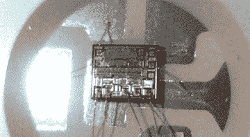

# Neato Botvac 激光雷达修复包括多汁的图片和一个工具黑客

> 原文：<https://hackaday.com/2015/09/28/neato-botvac-lidar-repair-includes-juicy-pics-and-a-tool-hack/>

这似乎是我们的第二天性，也是我们黑客不同于大众的一个方面…有时我们绝对坚持要买已经坏了的东西。这就是我们加入[Anton] [的地方，他正在逆向工程、调试和修理一个坏掉的 Neato Botvac 的激光雷达系统](http://blog.avrnoob.com/2015/08/neato-botvac-lidar-repair-part-1-ir.html)，所有这些都是以成本的一小部分来清洁地板的名义。

现在保持头脑清醒，因为在这一过程中[Anton]在他的修理中有太熟悉的一点，在他制作完成工作所需的专用工具时，他将原始项目搁置。很难说哪个更令人印象深刻:将笔记本电脑网络摄像头变成能够清晰查看焊线的摄像头(等等！)它们附着在硅片上的位置，或者他(是的，我们在做比较…成员？)直接回去解决原来的问题。[Anton]确实把这个项目分成了两篇独立的博客文章，第一篇链接到了上面，直到第二篇文章他才修复了原来的问题。也许有一点范围蔓延，这是分开的博客条目的原因？无论如何，[安东]做了很好的工作，记录了这个过程，以及他所说的一些“有趣的图片”，休息后你可以看到其中的一些。

我们已经有一段时间没有看到[Neato hack](http://hackaday.com/2011/08/30/dustbin-computer-lets-you-clean-and-prototype-with-a-neato-xv-11/)(这里有双关语，我们下面的评论者肯定会用它来擦地板)。另一方面，激光雷达最近在[警方激光雷达拆除](https://hackaday.com/2015/07/20/police-lidar-tear-down/)和[另一篇与【安东】维修](http://hackaday.com/2014/08/04/a-mechanically-scanned-lidar-for-autonomous-robots/)更直接相关的帖子中有所涉及。

  Bond wire porn [![[Anton] notes the connections between PCBs seem to be the same on both models.](img/d7615eae29c623611b870398e12a4d1a.png "neato lidar pcb connection compare")](https://hackaday.com/2015/09/28/neato-botvac-lidar-repair-includes-juicy-pics-and-a-tool-hack/neato-lidar-pcb-connection-compare/) [Anton] notes the connections between PCBs seem to be the same on both models.