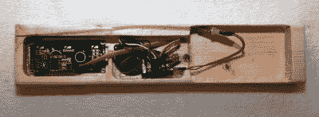

# 需要一个外壳？试试贴有墨粉转移标签的废木头

> 原文：<https://hackaday.com/2016/11/18/need-an-enclosure-try-scrap-wood-with-toner-transfer-labels/>

这个看起来很实用的设备采用了一种不同寻常的方法来解决许多项目面临的问题:围栏。[Jan Mrázek]为一个特殊的夜晚活动创造了一个他称之为 [Morse Thing](http://blog.honzamrazek.cz/2016/09/morse-thing/) 的装置，并使用了一个看起来不起眼的 2×4 木板作为围栏。该设备是一个使用莫尔斯电码的简单拼图，旨在安装在栏杆上，因此[Jan]为 LCD 和按钮铣出必要的空间和孔，然后通过[墨粉转移](http://hackaday.com/2016/09/12/take-your-pcbs-from-good-to-great-toner-transfer/)将标签直接贴在木头上——这是一种常用于制造 PCB 的方法，也有助于创建干净、清晰的标签。

还有一个黑客在设备里等着。该装置使用嵌入外壳的便携式电源组作为电源。然而，电力银行不断自动关闭自己。该设备的功率消耗仅为大约 20ma；这似乎低于电力银行的“我正在使用”阈值。[Jan]他原本打算禁用自动关闭功能，但随着最后期限的临近，他转而采用了一种快速而肮脏的方法:简单地添加一个电阻，将功耗增加到 100 mA，这足以让电源组保持打开。有足够的电量让设备在整个事件中持续运行，一切都很好。

定制外壳是一种需要反复解决的问题。其中一些解决方案比其他解决方案更不寻常，就像一个由所有材料制成的外壳一样。