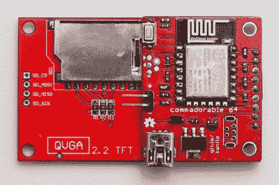

# 呆子诱饵:ESP8266 + ILI9341 屏幕

> 原文：<https://hackaday.com/2016/08/17/nerd-bait-esp8266-ili9341-screen/>

为了纪念我自己，我们将称之为*埃利奥特定律*:“当任何两个有趣的零件在易贝变得足够便宜时，就会有人为它们制作一个接口 PCB。”

[Johan Kanflo]的最新作品也是如此:在 ILI9341 彩色显示器的背面安装 ESP8266 模块的 PCB，带有用户按钮、电源和辅助 MOSFET。屏幕四美元，ESP8266 模块四美元，零件和 PCB 上到处都是几美元，你就有了[一个支持互联网的全彩色 320×240 图形显示器](http://johan.kanflo.com/the-commadorable-64/)。这太棒了，这完全符合埃利奥特定律。

然而，我们几乎不能原谅[约翰]的极端极客诱饵。将 *cuuuute* 小屏幕贴在一个冲锋队乐高玩具旁边已经是不择手段了，但显示一个 Commodore-64 启动屏幕，必须是完全正确的字体和颜色组合，近乎病态的情绪操纵。你在玩弄我们的心，[坎弗洛]！

我们喜欢像他的[ESP8266-和-RFM69 混搭](https://hackaday.com/2016/07/15/two-great-radios-taste-great-together/)和他的[挖空了苹果电脑的飞机观察者小发明](https://hackaday.com/2015/12/31/art-for-planespotters/)这样的项目，所以我们倾向于原谅。此外，我们还在为我们的第一个定律命名，我们想知道下一个是哪两个易贝部分。