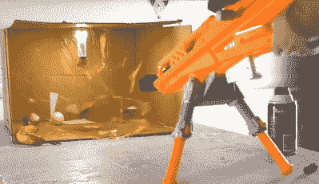

# Nerf 爆能枪使用丙烷动力更上一层楼

> 原文：<https://hackaday.com/2018/04/21/nerf-blaster-goes-next-level-with-propane-power/>

那里不缺少 Nerf 枪模型。从简单的升级弹簧到移除空气限制器，在一场 Nerf 战争中胜过对手的诱惑告诉了很多人！

彼得·斯里波尔不满足于如此简陋的改装，他决定让他的爆破手见识一下丙烷的威力。

[Peter]在用一些焊接的铜管制造一个新的燃烧室之前，完全去掉了现有的点火装置。他在一些 3D 打印的支架上添加了丙烷罐和阀门，并替换了枪管，以产生一些强烈的火力。

为了点燃燃烧室中的燃料，一些泰瑟枪电路产生了跳跃内部火花间隙所需的电压，而触发器后面的附加开关启动了整个过程。在尝试了不同的点火方法后，[Peter]最终发现，将火花定位在燃烧室的中心为高效燃烧和不震耳欲聋的体积提供了最佳解决方案。

虽然在燃烧过程中高度依赖于燃烧室中的气体量，但飞镖的速度能够达到最大 220 fps 这是一个惊人的 150 英里/小时！

接下来是所有加强版 Nerf 枪的必选序列:慢动作消灭各种食物和饮料容器。为了获得更多的冲击力，一些定制的 Nerf 飞镖被 3D 打印出来，其中包括一个带有可怕的钉子枪头的飞镖。

我们强烈建议不要接受任何基于 Nerf 的战争提议，但是你可以看看他疯狂的飞机冒险或者去年冬天的 T2 空中雪橇。

 [https://www.youtube.com/embed/8CrWvnssQpQ?version=3&rel=1&showsearch=0&showinfo=1&iv_load_policy=1&fs=1&hl=en-US&autohide=2&wmode=transparent](https://www.youtube.com/embed/8CrWvnssQpQ?version=3&rel=1&showsearch=0&showinfo=1&iv_load_policy=1&fs=1&hl=en-US&autohide=2&wmode=transparent)

