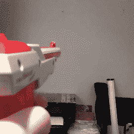

# NES 光枪发射可怕的激光效果

> 原文：<https://hackaday.com/2016/08/31/nes-light-gun-fires-awesome-laser-effect/>

[Seb Lee-Delisle]的 NES lightgun 让我们停顿了一下，因为[效果太酷了](https://twitter.com/seb_ly/status/770731396826529792)我们一开始不太明白[他是怎么做到的](https://twitter.com/seb_ly/status/770749188040757249)。当他扣动扳机时，就会爆发出科幻小说训练我们所期待的光束，然后在另一端爆发出精确的激光，烟雾从枪管的一端缓缓流出。这是硬件和诡计的杰作。

Demo video posted by [@seb_ly](https://twitter.com/seb_ly/status/770749188040757249)

这把枪本身是一个被掏空的任天堂配件。看起来 gun 的附加部分包括两个 LED 灯条，一个激光模块(巧妙地以两个圆形散热器为中心)，一个电子烟的 vape 模块，一个微型鼓风机和一个小风扇。当他扣动扳机时，一连串的事情发生了:绿色的光通过发光二极管从侧面照射下来，vape 模块在发动机的推动下形成了一阵烟雾。最后，当发光二极管完成它们的行程时，激光发射，产生幻觉。

更令人印象深刻的是，照相机、电脑和 4W 激光器正在等待和观察。当他们看到枪开火时，他们估计它的位置和角度。然后，他们在激光照射的墙壁上画出一道激光旭日。非常酷！[Seb]以用高功率激光做不可思议的事情而闻名。在四月份的贝尔格莱德会议上，他就自己的作品做了一个精彩的演讲。休息之后请继续关注。

那么他对这个激光发射器有什么计划呢？[激光猎鸭](https://twitter.com/seb_ly/status/770356207626383360)有人吗？他在一个月内有一个名为 [*的展览，这个建筑将作为*](http://theoldmarket.com/shows/hacked-on-classics/)*[布莱顿数字节](http://brightondigitalfestival.co.uk/)的一部分。*

 [https://www.youtube.com/embed/3gYJIEdqfQ4?version=3&rel=1&showsearch=0&showinfo=1&iv_load_policy=1&fs=1&hl=en-US&autohide=2&wmode=transparent](https://www.youtube.com/embed/3gYJIEdqfQ4?version=3&rel=1&showsearch=0&showinfo=1&iv_load_policy=1&fs=1&hl=en-US&autohide=2&wmode=transparent)

