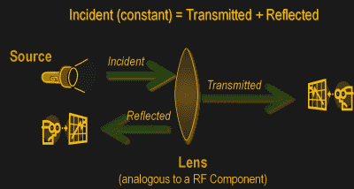
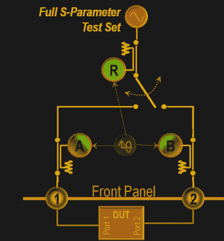
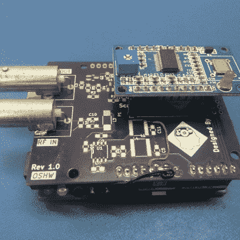
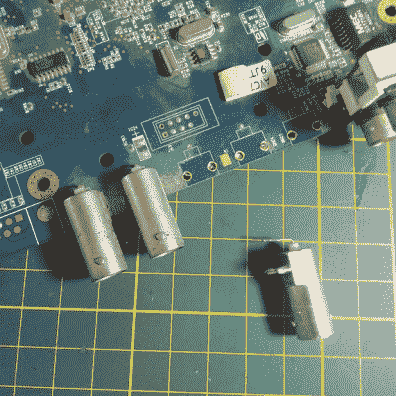
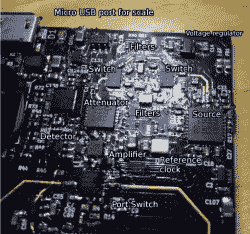
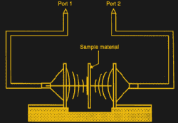
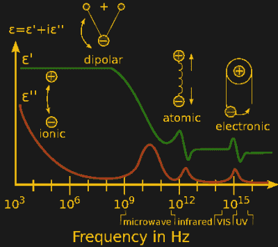
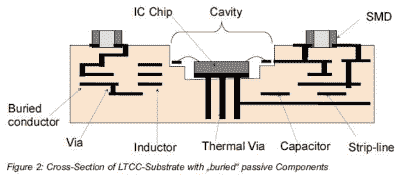

# 网络分析仪:电气类

> 原文：<https://hackaday.com/2017/09/22/network-analysers-the-electrical-kind/>

在过去的几年里，仪器仪表取得了突飞猛进的发展，然而，作为现代设备基础的基本分析技术仍然保持不变。网络分析仪是一种工具，它允许我们表征 RF 网络，如滤波器、混频器、天线，甚至用于微波电子的新材料，如千兆赫范围内的陶瓷电容器和谐振器。在这篇文章中，我简要地讨论了网络分析仪，以及 DIY 运动是如何帮助降低这种设备的成本的。我还将分享一些现有的项目，这些项目可能有助于您构建自己的项目，以及一些使用网络分析器的用例。让我们开始吧。

# 网络分析基础

 作为一个[概念模型](http://www.ni.com/white-paper/11640/en/)，想象一下光线射到透镜上，大部分光线穿过，但一部分被反射回来。

这同样适用于电气/RF 网络，其中发射到设备中的 RF 能量可能会被衰减一点，在一定程度上被传输，其中一些会被反射回来。这种分析给出了衰减系数和反射系数，解释了被测设备(DUT)的行为。

当然，这可能还不够，我们可能还需要关于信号之间相位关系的信息。这种仪器被称为矢量网络分析仪，有助于测量 DUT 的[散射参数或 S 参数。](http://labrf.av.it.pt/Data/Manuais%20&%20Tutoriais/40b%20-%20VNA%20-%20ZVB20/CD/documents/Help_Files/WebHelp_ZVT/System_Overview/Measurement_Parameters/S-Parameters.htm)

散射矩阵根据下面的线性方程将入射波 a1、a2 链接到出射波 b1、b2。

该等式表明，S 参数表示为矩阵 S，其中和表示 DUT 的输出和输入端口号。

这完全表征了网络的衰减、反射以及插入损耗。s 参数在电磁场理论和传输线理论中有更详细的解释，但是可以说，这些测量将用于推导 DUT 的特性并为其生成数学模型。

# 一般建筑

 如前所述，一个简单的网络分析仪就是一个信号发生器连接和一个频谱分析仪结合在一起工作。信号发生器将被配置为输出已知频率的信号，并且频谱分析仪将被用于检测另一端的信号。然后，频率将被改变到另一个频率，并且重复该过程，使得系统扫描一系列频率，并且输出可以被制成表格或者绘制在图表上。为了获得反射功率，需要一个微波元件，如 magic-T 或定向耦合器，但所有这些通常都内置在现代 vna 中。

在实验室级 VNA 中，我们有两个或四个端口连接 DUT，软件会为您完成所有其他工作。唯一的缺点是这些仪器非常非常昂贵，并且价格根据射频频率范围或射频波段覆盖范围而变化。

# DIY 标量网络分析仪

让我们把事情简化一点。假设我有一个简单的滤波器，我想确定其特性，在这种情况下，对于我的特定应用，相位可能不是必需的。我只想获得电路的频率衰减图，以便正确使用。在这种情况下，DIY 方法是最好的，我想强调一下针对初学者的 Hackaday.io 项目。这个想法很简单，就是利用 ADI 公司的 AD9851 来产生所需的信号。

使用 [AD8307 对数放大器](http://www.analog.com/media/en/technical-documentation/data-sheets/AD8307.pdf)将接收信号功率电平转换成电压(数据手册，PDF)。该电压由微控制器读取，在这种情况下，结果用 Python 脚本绘制。这种设计的另一个限制是 70 MHz 的上限，尽管它可能适用于许多刚开始参与此类项目的人。

为了寻求一个简单的实验，我从易贝购买了一些 AD9850 模块、运算放大器和其他小工具，并用 KiCAD 制作了一个 PCB。我在 Arduino UNO shield 布局中构建了这个项目，因为我的意图是在 Arduino 上测试它，然后升级到也是廉价购买的 STM32 Nucleo。我的修订版 1.0 有一些基本的错误，所以它仍然是一项正在进行中的工作，但我相信它会像上述项目一样工作。请随意探索并为自己制作一个。我的在下面显示为 OshPark 紫色。

    

我确实从我放在周围的旧 DVR 板上抢救出了连接器，所以我建议你用你打算在你的构建中使用的任何东西来替换那个足迹。

# 更严肃的项目

如果你更喜欢 RF 电路，想要一个[更严肃的项目](http://hforsten.com/cheap-homemade-30-mhz-6-ghz-vector-network-analyzer.html)，那么【Henrik Forstén】有另一款产品，工作频率从 30 Mhz 一直到 6 Ghz。这里的不同之处在于，他的设计使用了大量的规划以及特定的射频芯片来完成这项工作。

AD985x 由 MAX2871 取代，检波器由 LMH2110 取代。所有的文件都可以在 GitHub 上找到，以满足我们的实验乐趣，尽管这可能不是每个人都喜欢的。不过，如果你对这种东西有点兴趣，一定要去看看网站上提供的所有好信息。

# 矢量网络分析仪

除了幅度测量值，矢量网络分析仪还能够生成相位关系。这使我们能够为被测元件生成复杂的数学模型，并有助于识别电容和电感特性。除了上述在 DIY 领域的应用，vna 也是分析材料介电特性的重要工具。在研究环境中使用陶瓷等材料时，一种简单的方法是将银浆涂在相反的面上，然后使用网络分析仪测量各种参数。这种方法通常被称为电容法，用于测量复介电常数。

对于电磁波需要波导的较高频率，传输/反射方法是首选。在这种方法中，被测材料被放置在波导管内，终端和 DUT 之间没有电接触。这种方法通常称为透射/反射线法，通常在实验室中使用。

 还可以扩展到自由空间测量，其中使用喇叭天线，DUT 悬浮在自由空间中。这允许在不影响仪器或天线的情况下加热或冷却材料，通常用于材料的温度分析。

# 材料的测量方法

一旦从实验中获得 S 参数，该数据就可以转换成介电特性。一些[转换方法](https://cdn.rohde-schwarz.com/pws/dl_downloads/dl_application/00aps_undefined/RAC-0607-0019_1_5E.pdf) (PDF)有:

*   梁君诺-罗斯-韦尔法，
*   NIST 迭代法，
*   新非迭代方法，
*   短线法。

 最常用的评估参数是介电常数，或者更具体地说是复相对磁导率(μ-r)。实数部分是介电常数，它是存储在材料中的来自外部电场的能量的量度。虚部是损耗因子，是由于外场造成的能量损失量。介电常数通常随频率而变化，这意味着同一电解电容在所有频率下的表现并不相同。

已经进行了大量研究来创造在更高频率下表现良好的新材料。今天，有各种各样的材料被用来制造这些装置，研究包括对所涉及的材料进行表征。

另一个重要术语是损耗角正切(tan),是两者之比。如果你对这个主题感兴趣，那么我推荐你阅读上面链接的罗德与施瓦茨公司的应用笔记，以及这里的论文和这里的[。](http://www.sciencedirect.com/science/article/pii/S1434841106000379)

注意:我没有试图讨论像腔扰动这样的方法，尽管它可能会引起一些人的兴趣，并且可以单独进行探索。查看是德科技 (PDF)的这篇应用笔记，了解有关该主题的更多信息。

# 关于 VSWR 的一个小笔记

为了完成这篇文章，我要谈一谈 VSWR，它与天线和无线电设置的关系比材料和 VNA 更大。在业余无线电设置中使用的标量网络分析仪用于测量许多东西，包括电压驻波比或 VSWR。该参数是输入天线或射频线路的能量与因不完美匹配而反弹回来的能量之比。因此，本质上，驻波比(SWR)是衡量 RF 功率从电源通过传输线传输到负载的效率。理想情况下，在天线处将所有信号转换为 RF 能量或 EM 波，但是，实际上，如果放大器和天线的阻抗不匹配，某些部分将会反射回来，就像我们在开始部分讨论的那样。标量网络分析仪可以测量这些以及不同频率下的阻抗。在这些情况下，RF 耦合器有助于减少失配并提高性能。

# 接下来呢？

其目的是简要解释网络分析仪及其应用。您可以扩展这篇文章，深入研究无线电和天线、RF 仪器仪表，或者研究高频应用的微波材料。对于处理这类材料的人来说，VNA 是必不可少的，因为它可以完成繁重的分析工作，并以非常直观的方式呈现结果。

我们正在转向具有低温度系数的陶瓷，即介电常数在整个温度范围内保持不变，以及 LTCC 或低温共烧陶瓷。LTCC 允许我们将元件层叠在一起，实现高密度电子制造。所有这些都需要分析，这要归功于先进仪器和数学算法的结合。