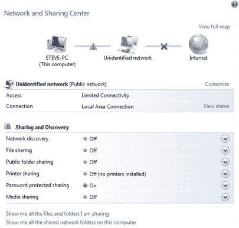
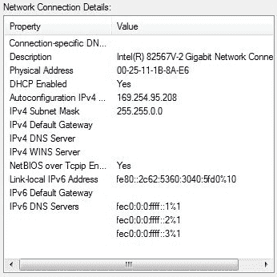
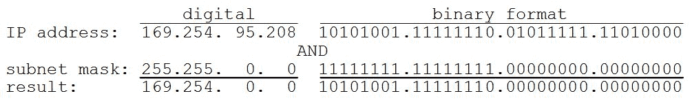
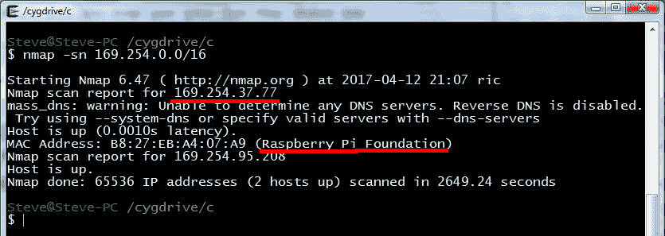
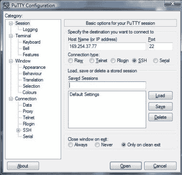
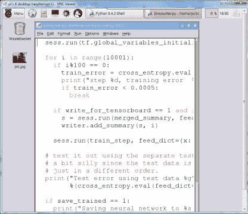
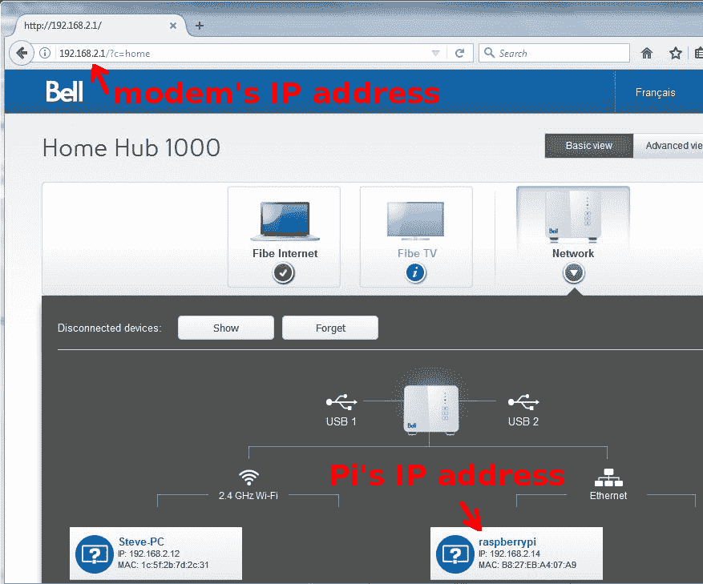
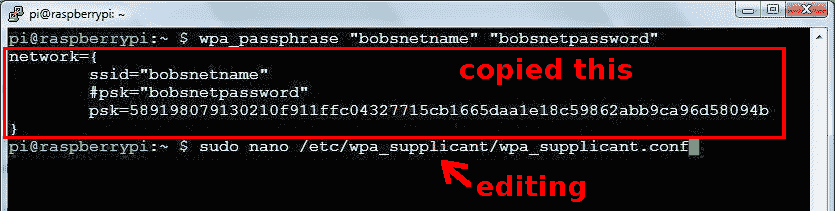
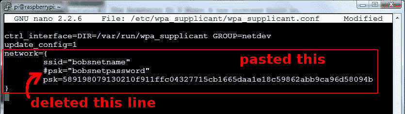
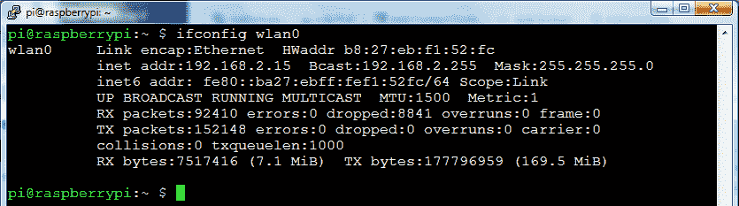

# 网络:把尾巴别在无头的树莓派上

> 原文：<https://hackaday.com/2017/04/18/networking-pin-the-tail-on-the-headless-raspberry-pi/>

在用我的 [BB-8 droid](http://hackaday.com/2016/11/30/my-diy-bb-8-problems-solutions-lessons-learned/) 试水之后，我渴望更深入地了解机器人技术，于是我买了一台树莓 Pi 3 Model B。第一步是连接它。虽然它内置了 802.11n 无线网络，但我起初没有无线接入点，尽管我最终得到了一个。这意味着我通过不同的方式找到它，并用我的台式电脑连接到它。肯定还有其他人想做同样的事情，所以让我们来看看用来直接或间接地将 Pi 连接到计算机的秘密咒语。

为什么从我的台式计算机连接到 Pi？毕竟还有黑客经常用来制作 [Pi 笔记本电脑](http://hackaday.com/2017/02/12/raspberry-pi-laptop-uses-the-official-touchscreen/)和 [Pi 平板电脑](http://hackaday.com/2014/01/10/raspberry-pi-tablet-the-pipad/)的小型显示器和键盘。由于我打算在各种机器人中嵌入 Pi，我认为没有必要为它购买单独的显示器和键盘，但我确实有点想这样做。

我的台式机显示器使用 VGA 连接器，但我随 Pi 一起购买的 VGA 转 HDMI 适配器不工作。此外，我的台式机的老式 KeyTronic 键盘使用 PS/2 连接器，因此也无法使用。虽然 PS/2 转 USB 适配器确实存在，但我的研究表明，我需要一个有 USB 智能的适配器，因为我的键盘早于 USB，并且没有自己的电子设备。(但它确实有甜美、深沉的触感按键！)我的 Pi 将保持无头状态，我将通过从我的台式计算机连接到它来对它进行编程。

## 通过以太网电缆直接连接

我家的调制解调器也是老式的，没有无线。它也只有一个以太网端口。这意味着我可以将我的台式电脑连接到调制解调器或 Raspberry Pi，但不能同时连接两者。因此，在打开 Pi 的包装时，将它连接到我的电脑的唯一方法是从调制解调器上拔下以太网电缆，然后将其插入 Pi。这意味着在使用 Pi 时不能访问互联网，这不太理想，但足以看到 Pi 是否工作。

但是为了让我的计算机与 Pi 对话，我需要 Pi 的 IP 地址。对于那些不熟悉 IP 地址的人来说，它们由 4 个数字组成，范围从 0 到 255，用点分隔。例如:

```
169.254.95.208

```

它实际上是一个 32 位的数字，但它是为了可读性而这样写的。

 [](https://hackaday.com/2017/04/18/networking-pin-the-tail-on-the-headless-raspberry-pi/network_and_sharing_center_box/) Network and Sharing Center in Windows [](https://hackaday.com/2017/04/18/networking-pin-the-tail-on-the-headless-raspberry-pi/ip_address_and_subnet_mask_window/) IP address and subnet mask

转到桌面上的 Windows 控制面板，然后转到网络和共享中心，我可以看到网络现在已经存在。

点击查看状态并深入了解，我发现了一些有用的信息。第一个是台式计算机的 IP 地址 169.254.95.208。IPv4 告诉我它使用的是互联网协议版本 4。 [IPv6](https://en.wikipedia.org/wiki/IPv6) 中的 IP 地址至少有所不同，它们的长度是原来的四倍。

此外，IPv4 子网掩码 255.255.0.0 的存在告诉我，在两台机器之间已经形成了一个子网。一个[子网](https://en.wikipedia.org/wiki/Subnetwork)是组成一个较小网络的一组机器，它们可能是也可能不是一个较大网络的一部分。它们的 IP 地址都以相同的二进制值开始，尽管它们在开头有多少位是相同的。你怎么知道哪些位是通用的？



Using the subnet mask

这就是子网掩码的由来。要找出是哪些位，请使用子网掩码，并与该子网上一台机器的 IP 地址进行按位 and 运算。如图所示，在我的例子中，结果是 169.254.0.0，这意味着 Pi 的 IP 地址必须以 169.254 开头。子网掩码的另一种写法是用 [CIDR 符号](https://en.wikipedia.org/wiki/Classless_Inter-Domain_Routing#CIDR_notation)。在 CIDR 记法中，IP 地址后面跟一个/号，然后是共享位数。在这种情况下，它将是 169.254.0.0/16。最后两个数字是零，但不一定是零，因为 16 告诉你要保留什么。这个 CIDR 符号很快就会派上用场。

虽然 169.254 是共享的，但剩下的两个数还有 65，536 (256×256)种可能的组合。为了扫描网络，浏览所有可能的数字组合，我使用了 nmap，可从 nmap.org 下载。



‘nmap -sn’ scan results

如快照所示，我在一个 [cygwin](https://www.cygwin.com) 窗口中运行它，尽管也有可用的 GUI 版本。我使用了下面的命令行。

```
nmap -sn 169.254.0.0/16

```

请注意，子网掩码是使用 CIDR 符号给出的。您在快照中看到的关于 Raspberry Pi 的部分在大约 10 分钟后出现，这意味着从 169.254.0.0 扫描到 169 . 254 . 37 . 77(Pi 的 IP 地址)需要这么长时间。尽管这正是我想要的，但我还是让它继续运行，整个扫描花了 44 分多钟。在那段时间里，它还找到了我的台式电脑，也就是它进行扫描的主机。如果 Pi 的 IP 地址是 169.254.255.255，那么在找到它之前需要整整 44 分钟。

在关机期间，Pi 的 IP 地址仍然是 169.254.37.77，因此没有必要再次扫描。

## 启动终端和 VNC 桌面

 [](https://hackaday.com/2017/04/18/networking-pin-the-tail-on-the-headless-raspberry-pi/putty_for_direct_connection/) PuTTY for SSH terminal [](https://hackaday.com/2017/04/18/networking-pin-the-tail-on-the-headless-raspberry-pi/vnc_desktop_on_raspberry_pi_full/) VNC desktop

现在我已经连接好了，我需要一个终端运行一个安全 shell (SSH)到桌面计算机上的 Pi。安装终端只是简单地下载流行的 [PuTTY](http://www.chiark.greenend.org.uk/~sgtatham/putty/) 程序并运行它。在会话部分，我填写了 Pi 的 IP 地址 port 22，并确保选择了 SSH。这将打开一个带有登录提示的终端窗口。默认用户名为`pi`，密码为`raspberry`。当然，我做的第一件事是运行`passwd`实用程序来更改密码。

或者，你可以使用 [VNC](https://www.realvnc.com) 得到一个图形终端。这是一个运行在桌面计算机窗口中的图形桌面，但实际上是一个进入 Pi 的终端。

## 使用无线路由器通过以太网连接

拿到 Pi 后没多久，我就决定换成无线路由器/光纤调制解调器组合。作为奖励，这次升级还包括多个以太网端口。我设置我的台式电脑使用无线，但我还不能为 Pi 做同样的事情。我必须在 Pi 上做一些配置来设置无线，所以我必须首先使用以太网连接。

[](https://hackaday.com/wp-content/uploads/2017/04/router_network_information_in_a_browser_firefox_an.jpg)

Router network information in a browser

用以太网连接到路由器比上面提到的直接连接方法简单得多，因为不需要扫描。一旦我用以太网电缆连接了 Pi，我就在我的台式电脑上打开一个浏览器，在浏览器顶部的 URL 栏中输入路由器的 IP 地址。这是一个类似 192.168.1.1 或 192.168.2.1 的地址，但前面有 http://，尽管有些浏览器不需要 [http://](http://) 。查看您的路由器/调制解调器手册。

你所看到的取决于你的调制解调器，但是我的在底部显示了一个网络图，Pi 的 IP 地址是 192.168.2.14。这样，我就能够使用 PuTTY 调出一个终端，如上所述。

如果您想在 Pi 和调制解调器之间继续使用以太网，那就完成了。但是我想无线化，这样我的机器人就可以不用拖着以太网电缆到处走了。现在我有了一个到 Pi 的终端，我可以继续下一步了。

## 无线连接

Raspberry Pi 3 Model B 具有内置无线功能，但如果你有一个没有无线功能的版本，那么你也可以购买一个无线加密狗，插入 Pi 的 USB 端口之一。在您可以无线连接到 headless Pi 之前，您仍然需要首先使用上述方法之一连接到它，并在 Pi 上进行一些配置。

我打开一个终端，如上所述登录。我需要将我的无线网络名称和网络密码放入配置文件`/etc/wpa_supplicant/wpa_supplicant.conf`。但是出于安全考虑，我不希望密码是明文。



Using wpa_passphrase and editing wpa_supplicant.conf



Editing wpa_supplicant.conf

所以我运行`wpa_passphrase "bobsnetname" "bobsnetpassword"`并高亮显示输出，在这个终端中，它将高亮显示的文本复制到剪贴板。`"bobsnetname"`和`"bobsnetpassword"`当然是虚构的。

然后我编辑了`/etc/wpa_supplicant/wpa_supplicant.conf`并通过右键点击从剪贴板中粘贴。粘贴的文本仍然包含一行明文密码。它被注释掉了，但仍然可见，所以我删除了它。

保存并退出编辑器后，我断开了以太网电缆。在文件被更改后，一个名为`wpa-supplicant`的运行程序应该只需要几秒钟就能注意到它，并让无线网络开始工作。所以等了几秒钟后，我跑了`ping google.com`。成功了。Pi 是无线连接的。

如果不是这样，我可以通过运行`sudo wpa_cli reconfigure`手动重启它。这也报告了接口名称，在我的例子中是`wlan0`。



Running ‘ifconfig wlan0’

为了进一步测试它，并获得 Pi 的 IP 地址，我运行`ifconfig wlan0`并在`inet addr`旁边寻找 IP 地址。它就在那里，用它我可以连接到 Pi 并开始给机器人编程。

这些是我在连接到我的树莓 Pi 时的经历，但是我们知道 Hackaday 上有许多树莓 Pi 用户。你用过哪些方法，发现过哪些陷阱，有哪些走出陷阱的小技巧？请在评论中告诉我们，以免其他人也陷入其中。