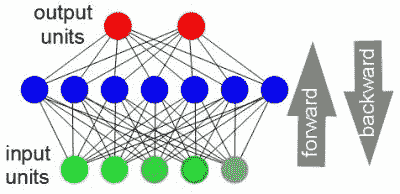
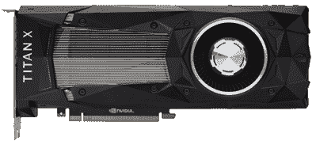
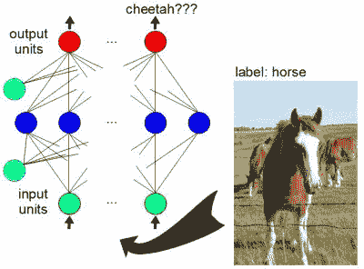

# 神经网络:你很容易就学会了

> 原文：<https://hackaday.com/2017/04/24/neural-networks-youve-got-it-so-easy/>

随着越来越多的黑客、学生、研究人员和企业参与进来，神经网络现在风靡一时。上一次复兴是在 80 年代和 90 年代，当时几乎没有万维网，神经网络工具也很少。当前的复苏始于 2006 年左右。从黑客的角度来看，当时有哪些工具和其他资源可用，现在有哪些可用，我们对未来有什么期望？对我来说，树莓 Pi 上的 GPU 会很好。

## 80 年代和 90 年代

Neural network 80s/90s books and mags

对于正在阅读这篇文章的年轻人来说，他们想知道在万维网出现之前，我们这些老家伙是如何做到的，纸质杂志在让我们了解新事物方面发挥了很大的作用。因此，正是《科学美国人》杂志 1992 年 9 月关于心智和大脑的特刊让我接触到了神经网络，包括生物和人工神经网络。

那时候，你可以选择从头开始编写自己的神经网络，或者从别人那里订购源代码，你会收到邮寄过来的软盘。我甚至从那期《科学美国人》的业余科学家专栏里订购了一张软盘。你也可以买一个神经网络库，它会为你做所有低级复杂的数学运算。多伦多大学也有一个名为 Xerion 的免费模拟器。

留意书店的科学版块确实找到了关于这个主题的偶尔书籍。经典之作是鲁梅尔哈特、麦克莱兰等人写的两卷本《并行分布式处理的探索》。我最喜欢的一本是[神经计算和自组织映射:导论](https://www.amazon.com/Neural-Computation-Self-Organizing-Maps-Introduction/dp/0201554429)，如果你对控制机器人手臂的神经网络感兴趣，这本书会很有用。

你也可以参加一些短期课程和会议。我在 1994 年参加的会议是一个为期两天的免费会议，由当时多伦多大学的杰弗里·辛顿主持，他当时和现在都是这个领域的领导者。当时最负盛名的年度会议是[神经信息处理系统](https://nips.cc/)会议，直到今天仍然势头强劲。

最后，我记得在图书馆里搜寻发表的论文。我那段时间的会议论文、课程讲义、影印文章和手写笔记大约有 3 英寸厚。

然后事情变得相对平静。虽然神经网络已经在一些应用中找到了用途，但它们没有达到宣传的效果，并且从世界的角度来看，在有限的研究社区之外，它们不再重要。随着逐渐的改进和一些突破，事情保持平静，然后最终在 2006 年左右，它们再次在世界上爆发。

## 礼物来了

我们在这里重点关注工具，但简单来说，这些突破主要是:

*   训练深度超过三层或四层的网络的新技术，现在称为深度神经网络
*   使用图形处理器(图形处理器)加速训练
*   包含大量样本的训练数据的可用性

## 神经网络框架

现在有许多神经网络库，通常称为框架，可以通过各种许可证免费下载，其中许多是开源框架。大多数更流行的允许你在 GPU 上运行你的神经网络，并且足够灵活以支持大多数类型的网络。

以下是大部分比较受欢迎的。除了 FNN，他们都有 GPU 支持。

[TensorFlow](https://www.tensorflow.org/)

语言:Python，C++正在开发中

TensorFlow 是谷歌最新的神经网络框架。它是为在多台机器和 GPU 上分布网络而设计的。它可以被认为是一个低级的，提供了很大的灵活性，但也比像 Keras 和 TFLearn 这样的高级工具有更长的学习曲线，这两个工具将在下面讨论。然而，他们正致力于生产一个集成在 TensorFlow 中的 Keras 版本。

我们已经在 Hackaday 上的一次黑客攻击中看到过这个[锤子和啤酒瓶识别机器人](http://hackaday.com/2016/10/09/tensorflow-robot-recognizes-objects/)，甚至还有[介绍使用 TensorFlow](http://hackaday.com/2017/04/11/introduction-to-tensorflow/) 。

[theno](https://github.com/Theano/)

语言:Python

这是一个开源库，用于进行涉及多维数组的高效数值计算。它来自蒙特利尔大学，在 Windows、Linux 和 OS-X 上运行。Theano 已经存在很长时间了，0.1 [于 2009 年](https://github.com/Theano/Theano/blob/master/HISTORY.txt)发布。

[咖啡](http://caffe.berkeleyvision.org/)

语言:命令行、Python 和 MATLAB

Caffe 是由伯克利人工智能研究和社区贡献者开发的。模型可以在纯文本文件中定义，然后使用命令行工具进行处理。还有 Python 和 MATLAB 接口。[例如](http://shengshuyang.github.io/A-step-by-step-guide-to-Caffe.html)，你可以在一个纯文本文件中定义你的模型，在另一个名为 solver 的纯文本文件中给出如何训练它的细节，然后将这些传递给 caffe 命令行工具，它将训练一个神经网络。然后，您可以使用 Python 程序加载这个经过训练的网络，并使用它来做一些事情，例如图像分类。

[CNT](https://github.com/Microsoft/CNTK/wiki)

语言:Python、C++、C#

这是微软认知工具包(CNTK)，运行在 Windows 和 Linux 上。他们目前正在开发一个可用于 Keras 的版本。

[Keras](https://keras.io/)

语言:Python

Keras 用 Python 编写，在底层使用 TensorFlow 或 Theano，使得使用这些框架更容易。也有支持 CNTK 的[计划。将 Keras 集成到 TensorFlow 中的工作正在进行中](https://github.com/Microsoft/CNTK/issues/797)将产生一个单独的仅支持 TensorFlow 的 Keras 版本。

[TF 学习](http://tflearn.org/)

语言:Python

和 Keras 一样，这是一个构建在 TensorFlow 之上的高级库。

[发现](http://leenissen.dk/fann/wp/ (on GitHub) https://github.com/libfann/fann)

语言:支持超过 15 种语言，不支持 GPU

这是一个用 c 写的高级开源库，仅限于全连接和稀疏连接的神经网络。然而，它多年来一直很流行，甚至被包含在 Linux 发行版中。最近在 Hackaday 的[中，一个机器人使用](http://hackaday.com/2016/12/11/train-your-robot-to-walk-with-a-neural-network/)[强化学习](https://en.wikipedia.org/wiki/Reinforcement_learning)学会了走路，这是一种经常使用神经网络的机器学习技术。

[火炬](http://torch.ch/)

语言:卢阿语

用 c 写的开源库，有意思的是，他们在自己网站的首页上说 Torch 是可嵌入的，有到 iOS 的端口，还有 Andoid 和 [FPGA 后端](https://github.com/clementfarabet/neuflow)。

[指针](http://pytorch.org/)

语言:Python

PyTorch 相对较新，他们的网站上说它处于早期测试版，但似乎有很多人对它感兴趣。它运行在 Linux 和 OS-X 上，底层使用 Torch。

毫无疑问，我还错过了其他人。如果你有不在这里的特别喜欢的，请在评论中告诉我们。

你应该用哪一个？除非编程语言或操作系统是一个问题，那么另一个要记住的因素是你的技能水平。如果你对数学感到不舒服，或者不想深入挖掘神经网络的细微差别，那么选择一个高级的。在这种情况下，远离 TensorFlow，在那里你必须学习比 Kera、TFLearn 或其他高级 API 更多的 API。强调数学功能的框架通常需要你做更多的工作来创建网络。另一个因素是你是否会做基础研究。一个高级框架可能不允许您访问足够多的内部结构来开始构建疯狂的网络，可能具有跨越多层或层内的连接，并且数据向四面八方流动。

## 在线服务

你正在寻找一个神经网络可以提供给你的黑客的东西，但是不想花时间去学习神经网络的复杂性？为此，将你的黑客连接到互联网上就可以获得服务。

我们已经看到无数的例子利用[亚马逊的 Alexa](http://hackaday.com/2015/08/04/amazons-ai-escapes-its-hardware-prison/) 进行语音识别。谷歌也有它的[云机器学习服务](https://cloud.google.com/products/machine-learning/)，包括视觉和语音。它的视觉服务已经在这里显示了，使用树莓 Pi 的[糖果分类](http://hackaday.com/2016/10/31/sort-your-candy-with-a-raspberry-pi-and-google-cloud-vision/)和[读取人类情感](http://hackaday.com/2016/11/17/raspberry-pi-robot-that-reads-your-emotions/)。这款 [Wekinator](http://www.wekinator.org/) 针对的是艺术家和音乐家，我们已经看到它们被用来训练神经网络[对各种手势做出反应，以在家里开关东西](http://hackaday.com/2017/01/26/objectifier-director-of-domestic-technology/)，以及[制作虚拟世界中最小的小提琴](http://hackaday.com/2016/06/15/worlds-tiniest-violin-using-radar-and-machine-learning/)。别忘了，微软也有它的[认知服务 API](https://www.microsoft.com/cognitive-services)，包括:视觉、语音、语言等。

## GPU 和 TPU

Iterating through a neural network

训练神经网络需要通过神经网络进行迭代，向前然后向后，每次都提高网络的准确性。在某种程度上，你能做的迭代越多，当你停止时，最终的精度就越好。迭代的次数可能是数百甚至数千次。对于 20 世纪 80 年代和 90 年代的计算机，实现足够的迭代可能会花费不可接受的时间。根据文章[神经网络中的深度学习:概述](https://arxiv.org/pdf/1404.7828.pdf)，在 2004 年，一个完全连接的神经网络的 GPU 速度提高了 20 倍。在 2006 年，[卷积神经网络](http://cs231n.github.io/convolutional-networks/)实现了 4 倍的增长。到 2010 年，当比较 CPU 和 GPU 上的训练时，增长速度快了 50 倍。因此，精确度要高得多。

Nvidia Titan Xp graphics card. Image Credit: Nvidia

GPU 有什么帮助？训练神经网络的很大一部分涉及矩阵乘法，这在 GPU 上比在 CPU 上快得多。Nvidia 是制造显卡和 GPU 的领导者，它创建了一个名为 [CUDA](https://en.wikipedia.org/wiki/CUDA) 的 API，神经网络软件使用它来利用 GPU。我们指出这一点是因为你会经常看到术语 CUDA。随着深度学习的传播，Nvidia 增加了更多的 API，包括 [CuDNN](https://developer.nvidia.com/cudnn) (深度神经网络的 CUDA)，一个经过微调的神经网络原语库，以及另一个你会看到的术语。

Nvidia 也有自己的单板计算机 [Jetson TX2](http://hackaday.com/2017/03/14/hands-on-nvidia-jetson-tx2-fast-processing-for-embedded-devices/) ，旨在成为自动驾驶汽车、自拍无人机等的大脑。然而，正如我们的[Brian Benchoff]所指出的，这个价位对于普通黑客来说有点高。

谷歌也一直在以其[张量处理单元(TPU)](https://www.extremetech.com/computing/247199-googles-dedicated-tensorflow-processor-tpu-makes-hash-intel-nvidia-inference-workloads) 的形式研究自己的硬件加速。你可能已经注意到了上面 Google 框架的名字 TensorFlow 的相似之处。TensorFlow 大量使用张量(想想软件中的单维和多维数组)。根据[谷歌关于 TPU](https://drive.google.com/file/d/0Bx4hafXDDq2EMzRNcy1vSUxtcEk/view) 的论文，它是为神经网络的推理阶段而设计的。推理不是指训练神经网络，而是指在训练后使用神经网络。我们还没有看到任何框架使用它，但这是需要记住的。

## 使用他人的硬件

您是否有一个需要花费很长时间来训练的神经网络，但是没有支持的 GPU，或者不想占用您的资源？在这种情况下，你可以在通过互联网访问的其他机器上使用硬件。其中一个是 FloydHub，对个人来说，每小时只需几美分，不需要每月付费。另一个是[亚马逊 EC2](https://aws.amazon.com/ec2/) 。

## 资料组

Training neural network with labeled data

我们说过，神经网络的突破之一是包含大量样本的训练数据的可用性，样本数以万计。使用[监督训练](https://en.wikipedia.org/wiki/Supervised_learning)算法训练神经网络，包括在网络的输入端提供数据，同时告诉它预期的输出应该是什么。在这种情况下，数据也必须被标记。如果你给网络的输入一个马的图像，它的输出说它看起来像猎豹，那么它需要知道误差很大，需要更多的训练。预期的输出称为标签，数据称为“标签数据”。

许多这样的数据集可在线用于培训目的。 [MNIST](http://yann.lecun.com/exdb/mnist/) 就是用于手写字符识别的一个例子。 [ImageNet](http://www.image-net.org/) 和 [CIFAR](https://www.cs.toronto.edu/~kriz/cifar.html) 是两个不同的标注图像数据集。维基百科页面上列出了更多。上面列出的许多框架都有包含必要数据集的教程。

这并不是说你绝对需要一个大的数据集来获得可观的精确度。我们之前提到的使用 FNN 框架的[行走机器人](http://hackaday.com/2016/12/11/train-your-robot-to-walk-with-a-neural-network/)使用伺服电机位置作为其训练数据。

## 其他资源

与 80 年代和 90 年代不同，虽然你仍然可以买到关于神经网络的纸质书，但网上有很多。我喜欢的两本在线书籍是麻省理工出版社出版的《深度学习》和《T2 神经网络和深度学习》。上面列出的框架都有教程帮助入门。此外，无论你搜索什么主题，都有无数的其他网站和 YouTube 视频。我发现 YouTube 上录制的讲座和会议视频非常有用。

## 未来

Raspberry Pi 7 with GPU

毫无疑问，未来将会出现更多的框架。

我们早就在市场上看到了专门的神经芯片和电路板，但没有一个找到大市场，甚至在 90 年代也没有。然而，这些并不是专门为真正的增长领域设计的，即每个人都在工作的神经网络软件。GPU 确实服务于这个市场。随着具有数百万个图像和语音处理、语言等连接的神经网络进入越来越小的消费设备，对更多 GPU 或针对该软件定制的处理器的需求将有望成为 Raspberry Pi 或 Arduino 板上的新组件。尽管有可能处理仍然是一种在线服务。编辑:原来树莓 Pi 上有 GPU 看下面的评论。但这并不意味着上述所有框架都会利用它。比如 TensorFlow 只支持 Nvidia CUDA 卡。但是您仍然可以使用 GPU 来定制自己的神经网络代码。各种链接也在评论中。

已经有来自 TPU 等 ASICs 的 GPU 竞争，我们可能会看到更多这样的竞争，可能会将 GPU 从神经网络中完全驱逐出去。

至于我们新的计算机霸主，神经网络作为我们日常生活的一部分这次将留在这里，但人工通用智能的炒作很可能会平息，直到有人取得重大突破，再次出现在舞台上，但这次是真的。

在此期间，您使用过哪种神经网络框架，为什么？还是自己写的？你想看看有什么工具不见了吗？请在下面的评论中告诉我们。