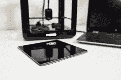
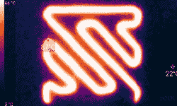
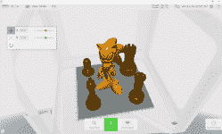

# 新款 3D 打印机 M3D Pro 登陆 Kickstarter

> 原文：<https://hackaday.com/2016/08/18/new-3d-printer-m3d-pro-hits-kickstarter/>

M3D 刚刚在 Kickstarter 上推出了[他们的第二台 3D 打印机。M3D Pro 比其前身 M3D Micro 提供了更多专业功能，M3D Micro 仍然是最便宜的 3D 打印机之一。尽管价格高达 499 美元，但该活动在几个小时内就达到了 10 万美元的筹资目标。](https://www.kickstarter.com/projects/m3d/m3d-pro-feature-packed-3d-printer-for-improved-rel)

M3D Pro 以钢化玻璃加热打印床、191 x 178 x 178 毫米(7.5 x 7 x 7 英寸)的更大体积和可承受 270 摄氏度的全金属热台吸引了高级用户。80 毫米/秒的打印速度和 150 毫米/秒的移动速度，Pro 明显快于 [Micro](https://printm3d.com/themicro/) 。本机支持从内存独立打印、自动调平、并在灯丝不足或断电后恢复打印。M3D 还自信地在所有 M3D Pro 产品中包含两年保修。

坦率地说，这听起来像是一笔好交易，如果 M3D 没有成功推出类似的产品，它会给我们敲响警钟。M3D 甚至不需要你购买芯片灯丝盒。一台看起来很棒、具有完全集成的软件解决方案且价格合理的高规格打印机可能正是许多犹豫不决的买家一直在等待的全能无忧套装。

但是，M3D 中的 M 也代表营销。随着 M3D 宣传 Pro 具有“Pro 传感器网络”，通过“使手机能够提供导航导航的相同系统”提供“所有运动轴上的完整传感器反馈”，我们不知何故无法帮助保持我们对打印质量的期望，就像他们对 M3D Micro 的期望一样。我们的读者能理解这一点吗？请在评论中告诉我们！